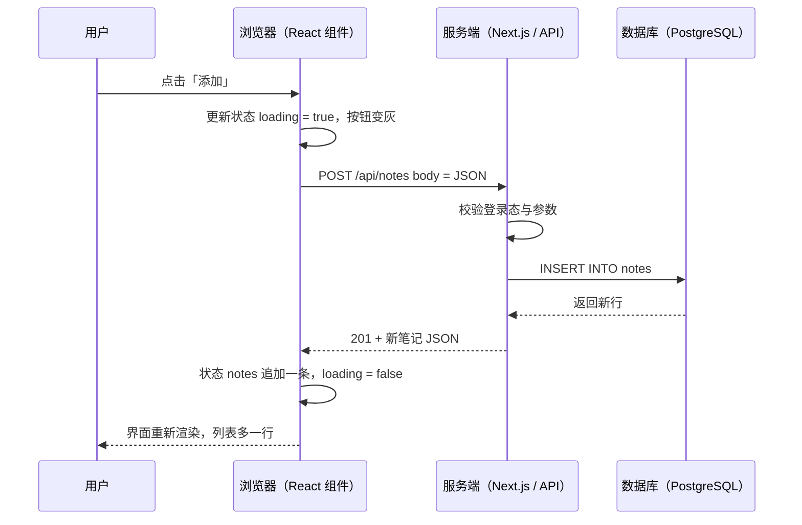
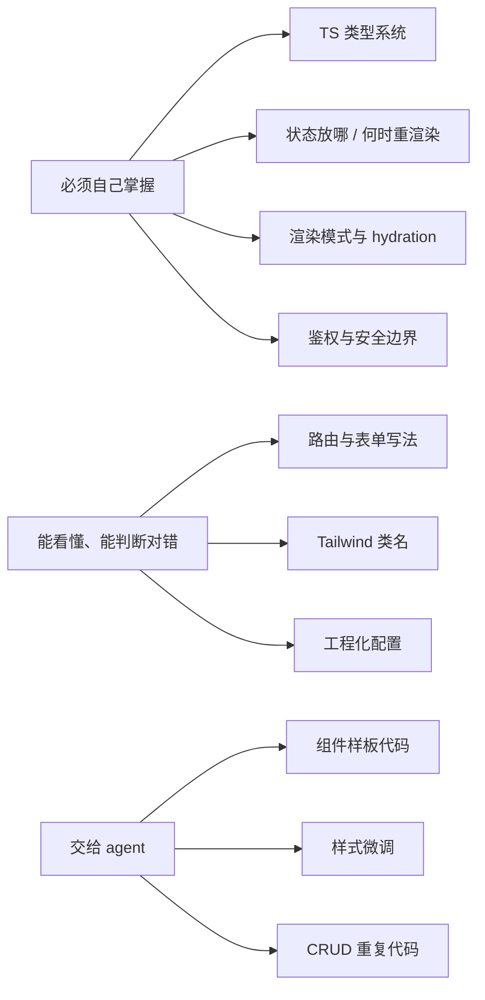
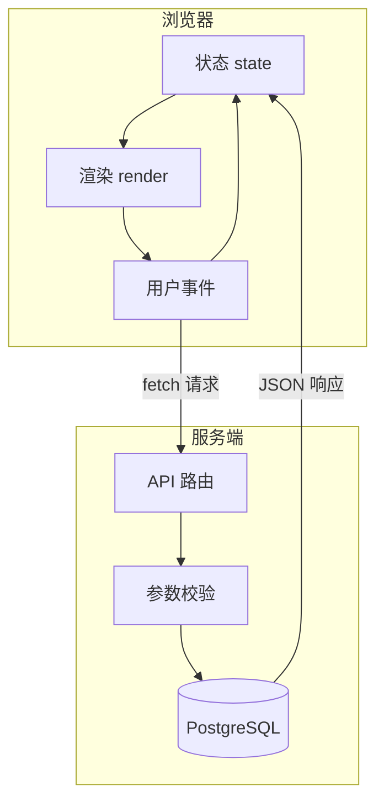

# 第 1 章　全栈地图：一次点击的完整旅程

> **本章导读**
>
> - 建议用时：90 分钟（阅读 40 分钟 + 实战 50 分钟）
> - 前置知识：会一点 HTML / CSS / JS，会写后端接口（Go / Java 均可）
> - 读完你能回答：
>   1. 「全栈」到底多了哪些职责，跟「后端会写点页面」差在哪？
>   2. 用户点一下按钮，请求经过了哪些环节、每一环归谁管？
>   3. 为什么本课程选 React + TS + Next.js + Tailwind/shadcn，而不是别的？
>   4. 在 AI 写代码的时代，哪些东西必须自己会，哪些可以交给 agent？

---

## 【积木 1-1】全栈到底「全」在哪

很多后端同学对全栈的第一印象是：「后端顺手写几个页面」。这个理解只对了一半。

打个比方：后端工程师像**厨房里的主厨**，负责把菜做对、做稳、做得快；全栈工程师像**开一家小馆子的老板兼主厨**——菜要做，菜单怎么排、客人坐哪、上菜顺序、结账出错怎么办，都得管。

| 维度 | 后端工程师 | 全栈工程师 |
|---|---|---|
| 交付物 | 接口、服务 | **一个能用的功能**（页面 + 接口 + 数据 + 上线） |
| 关注的「状态」 | 数据库里的数据 | 数据库数据 **+ 浏览器里的界面状态**（loading、弹窗开关、表单草稿） |
| 出错时 | 返回错误码 | 错误码 **+ 用户看到什么提示、能不能重试** |
| 安全边界 | 接口鉴权 | 接口鉴权 **+ 前端不泄露密钥、防 XSS、按钮权限与接口权限对齐** |
| 性能 | QPS、延迟 | 后端延迟 **+ 首屏时间、包体积、渲染卡顿** |

一句话：**全栈的单位是「功能」，不是「代码」。** 你要能把「用户管理」这件事从表结构一路做到线上可点。

---

## 【积木 1-2】一次点击的完整旅程

假设用户在 CloudNote（本课程贯穿的笔记应用）里点了「添加笔记」。从手指按下到列表里多出一行，发生了这些事：



把它拆成四段，你会发现**后端只占中间一段**：

| 段 | 发生在哪 | 你要懂的东西 | 课程章节 |
|---|---|---|---|
| ① 交互与状态 | 浏览器 | 事件、状态、渲染 | 第 5-9 章 |
| ② 网络 | 浏览器 ↔ 服务端 | HTTP、fetch、Cookie、CORS | 第 1、14 章 |
| ③ 业务与数据 | 服务端 | API 设计、校验、ORM、事务 | 第 13 章（你的主场） |
| ④ 回到界面 | 浏览器 | 乐观更新、错误提示、缓存失效 | 第 9 章 |

后端同学最容易低估的是 ① 和 ④：**数据回来了，界面不一定对。** 比如新增成功了但列表没刷新、关掉弹窗再打开表单里还是上次的内容——这些全是「界面状态」管理的问题，而不是接口问题。

---

## 【积木 1-3】技术栈为什么这样选

| 层 | 本课程选择 | 一句话解释 | 主要替代品 |
|---|---|---|---|
| 语言 | **TypeScript** | 给 JS 加上类型，前后端共享一份数据契约 | 纯 JS（新项目已很少用） |
| UI 框架 | **React** | 组件化 + 「界面 = 状态的函数」 | Vue、Svelte |
| 全栈框架 | **Next.js**（App Router） | 在 React 之上补齐路由、服务端渲染、后端接口 | Nuxt（Vue）、Remix |
| 样式 | **Tailwind CSS** | 用类名写样式，不用来回切 CSS 文件 | CSS Modules |
| 组件库 | **shadcn/ui** | 组件源码直接复制进项目，可改可控 | Ant Design、MUI |
| 数据库 | **PostgreSQL** + Drizzle ORM | 最主流的开源关系库 + 类型安全 ORM | MySQL + Prisma |
| 测试 | Vitest + Playwright | 单元测试 + 浏览器端到端测试 | Jest + Cypress |

为什么是这套组合，三个硬理由：

1. **用的人最多。** Stack Overflow 2025 调查里 React 的专业开发者使用率 44.7%，远高于 Angular（18.2%）和 Vue（17.6%）；State of JS 2025 里 48% 的受访者项目是 100% TypeScript，纯 JS 只剩 6%。
2. **AI 写得最好。** 训练数据里 React + Tailwind + shadcn 的代码最多，v0 这类 AI 生成 UI 的工具默认就产出这套。你用 agent 写代码时，这条路最顺。
3. **招聘最认。** 腾讯、字节 TRAE 的全栈 JD 普遍写「熟练掌握 React/Vue 至少一个并了解原理」，海外 AI 产品类全栈岗位几乎清一色 React + Next.js + TS。

> **一个高频误解：React 和 Next.js 是二选一？**
> 不是。React 只管「怎么把状态画成界面」，它不管路由、不管服务端、不管怎么打包。Next.js 是**建在 React 之上**的框架，把这些补齐了。关系类似 Go 的 `net/http` 和 Gin：先懂底层，再用框架。所以本课程先单独学 React（第 5-9 章），再上 Next.js（第 11 章起）。

---

## 【积木 1-4】你已经有的积木 vs 要补的积木

你不是从零开始。很多后端概念在前端都有「同构体」：

| 你熟悉的后端概念 | 前端 / TS 里的对应物 | 差异点 |
|---|---|---|
| Go 的 `struct` | TS 的 `type` / `interface` | TS 类型只在编译期存在，运行时会被擦掉（第 2 章） |
| Go 的 interface 隐式实现 | TS 的**结构化类型** | 两者都是「长得像就算」，你会很快适应 |
| goroutine + channel | Promise + `async/await` + 事件循环 | JS 是单线程，「并发」靠事件循环排队（第 3 章） |
| 参数校验（validator） | **Zod** | 前端校验只是体验，后端校验才是安全边界（第 4 章） |
| 请求处理函数 | React 组件 | 组件不是「被调一次」，而是**状态一变就被重新调用**（第 5 章） |
| 进程内缓存 | TanStack Query 的服务端状态缓存 | 前端缓存要考虑「什么时候过期、什么时候重拉」（第 9 章） |
| 中间件 | Next.js middleware / 布局 | 可以跑在服务端也可以影响渲染（第 11 章） |

**真正全新、需要专门补的只有三块**：界面状态管理、渲染模式（代码在服务端还是浏览器执行）、浏览器端的安全与性能。这也是本课程投入最多篇幅的地方。

---

## 【积木 1-5】AI 时代的学习原则：三档深度

我们给每个知识点贴一个标签，决定学到什么深度：



判断标准很简单：**出了 bug，AI 修不好、你也看不懂的东西，必须自己会。** 渲染模式、状态管理、安全就是典型——它们的 bug 不报错、难复现，AI 只能一遍遍猜。

本课程和 AI 协作的三条规矩：

1. **第 2-8 章尽量手写。** 研究表明，把 AI 当家教有助于学习，把它当答案机会损害学习（新手会产生「懂了的错觉」）。这几章是打地基，慢一点没关系。
2. **第 9 章起允许 AI 生成初版，但每一行你都要能解释。** 解释不了的代码不合进去。
3. **多让 AI 审查，少让 AI 改写。** 例如：「检查这个组件的状态是否重复、异常态是否完整，只列问题，不要改代码。」

---

## 【积木 1-6】环境搭建

只需要三样东西：Node.js、包管理器、编辑器。

```bash
# 1. 检查 Node 版本，要求 >= 22.18（本课程实战代码依赖它「直接运行 .ts」的能力）
node -v

# 2. 启用 pnpm（Node 自带的 corepack 负责管理包管理器版本，不用全局安装）
corepack enable pnpm
pnpm -v

# 3. 克隆课程仓库
git clone git@github.com:evaevable/tslearn.git
cd tslearn
```

| 命令 | 改变了什么 |
|---|---|
| `node -v` | 什么也不改，只是确认版本。低于 22.18 请用 nvm / fnm 升级 |
| `corepack enable pnpm` | 在 Node 安装目录下放一个 `pnpm` 启动器，之后按项目里声明的版本自动下载 |
| `git clone` | 把课程代码拉到本地 |

为什么用 pnpm 而不是 npm？它把依赖存在全局统一目录再硬链接到项目里，装得快、省磁盘，而且严格禁止「用了没声明的依赖」，能提前暴露问题。npm 也完全可以，命令几乎一样。

VS Code 推荐装三个插件：**ESLint**（代码规范）、**Tailwind CSS IntelliSense**（类名补全，第 10 章用）、**Pretty TypeScript Errors**（把 TS 报错格式化得人能看懂）。

---

## 【积木 1-7】实战：零依赖跑通一次完整旅程

先不用任何框架，用 Node 原生 `http` 模块 + 一个纯 HTML 页面，亲手走一遍积木 1-2 的那张时序图。代码在 [`code/ch01-request-journey/`](../code/ch01-request-journey/)：

```
code/ch01-request-journey/
├── package.json        # "type": "module"，声明这是 ES 模块项目
├── server.ts           # 后端：GET/POST /api/notes + 返回页面
└── public/index.html   # 前端：原生 JS 手动维护 state 并 render
```

```bash
cd code/ch01-request-journey
node server.ts
# 输出：CloudNote ch01 已启动：http://localhost:3000
```

Node 22.18 起可以**直接运行 `.ts` 文件**：它会把类型注解擦掉再执行（只擦不检查，类型检查要靠编辑器或 `tsc`，第 4 章讲）。所以这里一个依赖都不用装。

用 curl 先把后端测一遍（你作为后端工程师最熟的动作）：

```bash
curl -s localhost:3000/api/notes
# {"records":[{"id":1,"title":"学会 TypeScript 类型系统",...}],"total":2}

curl -s -X POST -H 'Content-Type: application/json' \
  -d '{"title":"hello"}' -w ' %{http_code}\n' localhost:3000/api/notes
# {"id":3,"title":"hello",...} 201

curl -s -X POST -d '{"title":""}' -w ' %{http_code}\n' localhost:3000/api/notes
# {"error":"title 必须是非空字符串"} 422
```

然后打开浏览器访问 `http://localhost:3000`，**按 F12 打开 DevTools 切到 Network 面板**，完成下面四个观察任务：

| 任务 | 操作 | 你应该看到 |
|---|---|---|
| 1 | 刷新页面 | 两个请求：`/`（HTML 文档）和 `/api/notes`（fetch，约 600ms） |
| 2 | 加载期间盯着页面 | 显示「加载中...」——这就是 loading 状态 |
| 3 | 输入空格后点添加 | Network 里 POST 返回 422，页面显示红色错误提示 |
| 4 | 输入 `<b>粗体</b>` 后添加 | 页面原样显示尖括号，而不是变成粗体——`escapeHtml` 挡住了 XSS |

重点读 `index.html` 里的这段：

```js
const state = { notes: [], loading: false, error: '' }

function render() {
  // 根据 state 把整个界面重画一遍
}

// 每次改 state 之后，都必须手动调用 render()
state.loading = true; state.error = ''; render()
```

这就是本章埋下的伏笔：**界面是状态的函数，但原生 JS 里「状态变了要记得重画」全靠你自觉。** 页面一复杂，某个地方忘了调 `render()`，界面就和数据对不上。第 5 章的 React 会把这件事自动化——你只管改状态，React 负责重画。

**动手练习：**

1. 在 `server.ts` 里加一个 `DELETE /api/notes/:id` 接口，并在页面每行后面加一个删除按钮。（提示：用 `url.pathname.match(/^\/api\/notes\/(\d+)$/)` 取 id）
2. 故意删掉删除成功后的 `render()` 调用，观察「数据删了、界面没变」的 bug。
3. 直接双击 `public/index.html` 用 `file://` 打开，看 Console 里报什么错，想想为什么。（答案在第 14 章 CORS 一节）

---

## 【本章小结】

三句话：

1. 全栈的交付单位是**一个能用的功能**，比后端多出的是**界面状态、浏览器网络与安全、上线交付**三块。
2. 一次点击分四段：交互与状态 → 网络 → 业务与数据 → 回到界面；后端只占中间一段，最容易出 bug 的是首尾两段。
3. 选 React + TS + Next.js + Tailwind/shadcn 是因为**用户最多、AI 支持最好、招聘最认**；学习时按「自己掌握 / 能判断 / 交给 agent」三档分配精力。



**自测题：**

1. 用你自己的话说出「后端工程师」和「全栈工程师」交付物的区别。（积木 1-1）
2. 「新增成功但列表没刷新」属于时序图的哪一段问题？为什么不是接口的问题？（积木 1-2）
3. React 和 Next.js 是什么关系？用一个 Go 生态的类比说明。（积木 1-3）
4. Go 的 goroutine 在 JS 里有对应物吗？最大的不同是什么？（积木 1-4）
5. 为什么「渲染模式」被划进「必须自己掌握」，而「样式微调」可以交给 agent？（积木 1-5）
6. `node server.ts` 能直接跑 TS，它会帮你做类型检查吗？（积木 1-7）
7. 实战里前端已经不允许提交空标题了吗？如果没有，后端的 422 校验为什么仍然必要？（积木 1-7）
8. 原生 JS 版本里，导致「界面和数据不一致」的根本原因是什么？（积木 1-7）

---

## 【下一章预告】

第 2 章《TypeScript 类型系统：给 JS 装上编译期护栏》。我们会把本章 `server.ts` 里的 `type Note` 讲透：TS 的类型到底存在于哪里、为什么说它是「结构化类型」（跟 Go interface 很像）、`unknown` 和 `any` 的本质区别，以及实战中为什么 `payload` 要先声明成 `unknown` 再一步步收窄。

*学完本章，回到对话里说一句「继续」，我就开讲第 2 章。*
