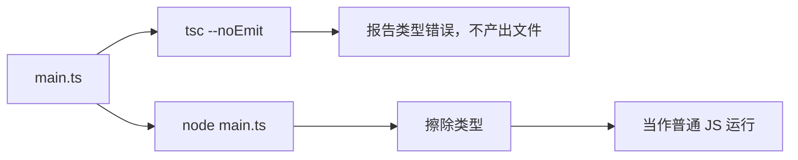
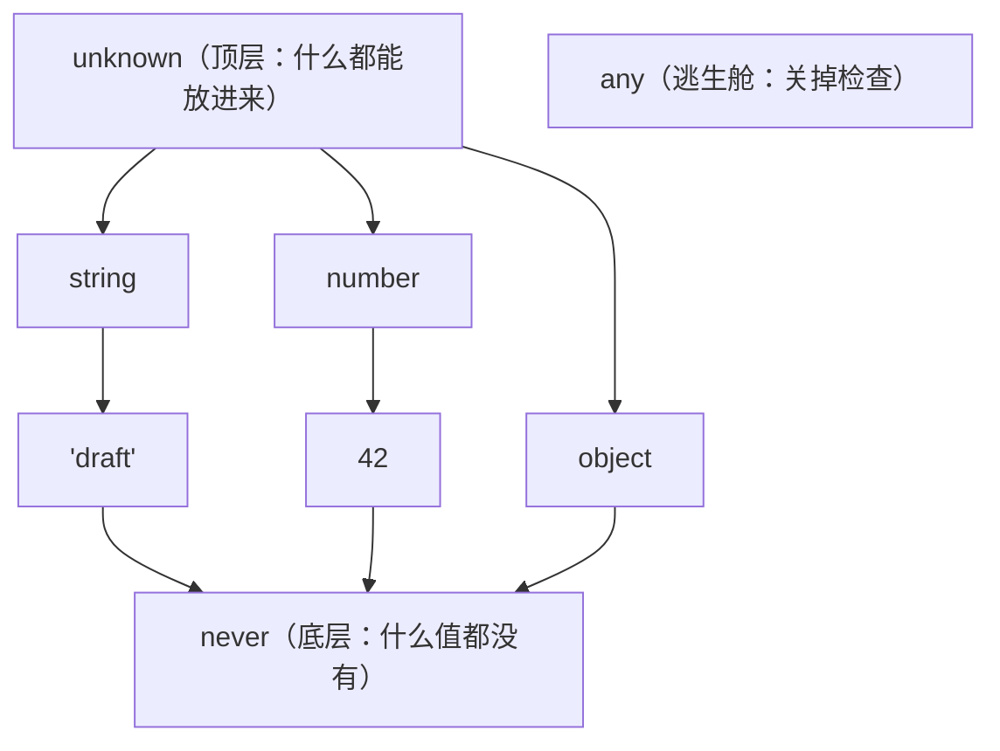
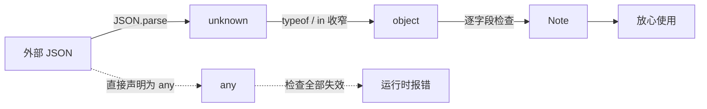

# 第 2 章　TypeScript 类型系统：给 JS 装上编译期护栏

> **本章导读**
>
> - 建议用时：120 分钟（阅读 60 分钟 + 实战 60 分钟）
> - 前置知识：第 1 章；会 JS 基本语法；了解 Go 的 struct 和 interface 更好
> - 读完你能回答：
>   1. TS 的类型存在于哪里？为什么 `node x.ts` 跑得起来却不报类型错误？
>   2. `type` 和 `interface` 有什么区别，该用哪个？
>   3. 什么叫「结构化类型」，它和 Go interface 的隐式实现有什么像和不像？
>   4. `any`、`unknown`、`never` 分别是什么，为什么处理外部数据要用 `unknown`？

---

## 【积木 2-1】类型只活在编译期

先记住本章最重要的一句话：**TypeScript 的类型在运行时不存在。**

第 1 章我们用 `node server.ts` 直接跑了 TS 文件。Node 做的事情非常朴素：**把类型注解擦掉，剩下的就是普通 JS**。你可以亲眼看看它擦完的样子：

```bash
node -e "import('node:module').then(m => console.log(JSON.stringify(
  m.stripTypeScriptTypes('const n: number = add(1, 2)'))))"
# "const n         = add(1, 2)"
```

`: number` 被替换成了等长的空格（这样报错行列号不会错位），其它一个字都没改。这叫**类型擦除**（type erasure）。

这和 Go 很不一样：

| | Go | TypeScript |
|---|---|---|
| 类型在运行时存在吗 | 存在，可以 `reflect.TypeOf(x)` | **不存在**，只剩普通 JS 值 |
| 类型错误能编译吗 | 不能，`go build` 直接失败 | 能跑。类型检查和运行是**两件独立的事** |
| 能在运行时判断「x 是不是某个 struct」吗 | 能，类型断言 `x.(T)` | 不能，只能检查字段（积木 2-7） |
| 外部 JSON 进来 | `json.Unmarshal` 按 struct 解析，类型不对会报错 | `JSON.parse` 返回什么都有可能，**类型是你声称的，不是验证过的** |

最后一行是后端同学最容易踩的坑：你写 `const note: Note = await res.json()`，TS 完全相信你，但如果接口实际返回的字段名变了，**编译期一声不吭，运行时才炸**。这就是为什么第 4 章要引入 Zod 做运行时校验。

---

## 【积木 2-2】两个工具分工：node 负责跑，tsc 负责查

既然 node 不检查类型，谁来检查？答案是 **tsc**（TypeScript Compiler）。



| 工具 | 做什么 | 什么时候用 |
|---|---|---|
| `node x.ts` | 擦类型、运行 | 开发时跑脚本、跑服务 |
| `tsc --noEmit` | 只做类型检查，不生成 JS | 提交前、CI 里 |
| 编辑器（VS Code） | 背后跑的也是 TS 语言服务，实时标红 | 写代码的每一秒 |

**一个冷知识：** 2026 年 7 月发布的 **TypeScript 7.0 把编译器用 Go 重写了**（项目代号 Corsa），类型检查语义和 6.0 完全一致，但大型项目速度约快 10 倍。微软选 Go 而不是 Rust 的理由是：原来的 TS 编译器代码风格（大量函数 + 数据结构、少用类）能几乎逐文件平移到 Go。所以你现在 `pnpm add -D typescript` 装到的 `tsc`，本质上是一个 Go 二进制。

TS 7 同时把一批「好习惯」变成了默认值：`strict: true` 默认开启，`target: es5` 等老选项直接移除。本课程的 tsconfig 在第 4 章逐项讲。

---

## 【积木 2-3】基础类型与类型推断

TS 的基础类型就是 JS 的值类型加上一些组合方式：

```ts
const title: string = 'hello'
const count: number = 42 // 没有 int / float 之分，全是 number
const done: boolean = false
const ids: number[] = [1, 2, 3] // 数组，等价写法 Array<number>
const pair: [string, number] = ['age', 18] // 元组：固定长度、每一位类型固定
const maybe: string | undefined = undefined // 联合类型，积木 2-6 细讲
```

但实际写代码时，**大多数类型注解都不用写**，TS 会推断：

```ts
const title = 'hello' // 推断为 'hello'（字面量类型）
let count = 42 // 推断为 number
const ids = [1, 2, 3] // 推断为 number[]
function double(n: number) { return n * 2 } // 返回值推断为 number
```

经验法则：**函数参数必须写类型，其它能推断就别写。** 这和 Go 的 `:=` 是一个思路。

### 一个高频误解：`let` 和 `const` 推断出的类型不一样

```ts
let s1 = 'draft' // string —— let 以后还可能被赋成别的字符串
const s2 = 'draft' // 'draft' —— const 永远不会变，所以类型就是这个字面量本身
```

这个差别在下一块讲联合类型时非常关键：`s2` 能赋给 `'draft' | 'published'` 类型的变量，`s1` 不能。实战代码里有现场演示。

---

## 【积木 2-4】给对象建模：type、interface、可选与只读

这是 CloudNote 的核心模型（`code/ch02-ts-basics/src/model.ts`）：

```ts
export type Tag = {
  readonly id: number
  name: string
}

export interface Note {
  readonly id: number // 只读：创建后不允许改
  title: string
  content: string
  status: NoteStatus
  tags: Tag[]
  createdAt: string // JSON 里没有 Date 类型，传输时就是字符串
  summary?: string // 可选：AI 摘要可能还没生成
}
```

和 Go struct 对照一下：

| Go | TypeScript | 说明 |
|---|---|---|
| `type Note struct { Title string }` | `type Note = { title: string }` 或 `interface Note { title: string }` | 两种写法都行 |
| 指针字段 `Summary *string` 表示可能为空 | `summary?: string` | 类型自动变成 `string \| undefined` |
| 没有原生只读字段 | `readonly id: number` | 只在编译期拦截赋值，运行时照样能改 |
| 嵌入 `struct { Base }` | `interface Note extends Base {}` 或 `type Note = Base & {...}` | 继承 / 交叉 |
| 零值：`""`、`0`、`nil` | **没有零值**，没赋值就是 `undefined` | 所有字段必须显式给值，除非标了 `?` |

### `type` 还是 `interface`？

| | `type` | `interface` |
|---|---|---|
| 描述对象 | 可以 | 可以 |
| 描述联合类型 `'a' \| 'b'` | **可以** | 不行 |
| 同名声明自动合并 | 不行 | 可以（一般用不到，主要给库作者扩展全局类型） |
| 报错信息 | 有时会把类型展开 | 显示接口名，更短 |

**本课程的约定：描述对象形状两者都行，团队统一即可；需要联合类型、工具类型时只能用 `type`。** 不必在这上面纠结，React 社区两种都很常见。

---

## 【积木 2-5】结构化类型：长得像就算

TS 判断「A 能不能当 B 用」，只看**结构**（有没有这些字段、字段类型对不对），不看名字。

```ts
type HasTitle = { title: string }
function shout(x: HasTitle) { return x.title.toUpperCase() }

const book = { title: 'go in action', isbn: '978-1617291784' }
shout(note) // Note 有 title: string，可以
shout(book) // book 也有 title: string，也可以
```

`book` 从没声明过自己「是 HasTitle」，但照样能传。Go 程序员应该很亲切——**这和 Go interface 的隐式实现是同一个哲学**：

| | Go interface | TS 结构化类型 |
|---|---|---|
| 需要显式声明「我实现了它」吗 | 不需要 | 不需要 |
| 比较的是什么 | **方法集** | **所有属性和方法** |
| 适用范围 | 只有 interface 类型 | **所有类型**，包括普通对象、函数 |

### 一个高频误解：「多余属性检查」不是结构化类型失效了

```ts
shout({ title: 'literal', isbn: '123' })
// error TS2353: Object literal may only specify known properties,
//   and 'isbn' does not exist in type 'HasTitle'.
```

奇怪，刚才 `book` 也有 `isbn` 却能传，为什么直接写对象字面量就报错？

因为这是一条**专门针对对象字面量的额外规则**：你当场手写一个对象传进去，多写的字段几乎一定是拼错了（比如把 `title` 写成 `titel`，同时漏了 `title` 会报另一个错，但多出来的 `titel` 就靠这条规则抓）。而 `book` 是一个已存在的变量，它可能在别处有用，多几个字段很正常，所以放行。

记住：**变量传入看结构，字面量传入额外查多余字段。**

---

## 【积木 2-6】联合类型、字面量类型与穷尽检查

笔记有三种状态。Go 里你会写一组常量；在 TS 里最地道的写法是**字面量联合类型**：

```ts
export const NOTE_STATUSES = ['draft', 'published', 'archived'] as const
export type NoteStatus = (typeof NOTE_STATUSES)[number] // 'draft' | 'published' | 'archived'
```

拆开看这两行：

| 写法 | 含义 |
|---|---|
| `as const` | 告诉 TS 这个数组不会变，把每个元素推断成字面量，整体是只读元组 |
| `typeof NOTE_STATUSES` | 在类型位置取一个**值**的类型（这里的 `typeof` 是类型操作符，不是 JS 的 `typeof`） |
| `[number]` | 「用任意数字下标取元素」得到的类型，即所有元素类型的联合 |

为什么不用 `enum`？因为 **enum 不是可擦除语法**——它会生成运行时代码，`node x.ts` 直接跑不了。TS 7 推荐开启 `erasableSyntaxOnly`，把 enum、namespace 这类语法统统禁掉。`as const` 数组的好处是**一份定义，两种用途**：类型用来编译期约束，数组本身运行时还能遍历、做校验。

### 用 `never` 做穷尽检查

```ts
function describeStatus(status: NoteStatus): string {
  switch (status) {
    case 'draft': return '草稿'
    case 'published': return '已发布'
    case 'archived': return '已归档'
    default: {
      const unreachable: never = status // 三种都处理完了，这里 status 只能是 never
      return unreachable
    }
  }
}
```

TS 会跟着 `switch` 一路**收窄**（narrowing）：每处理一个 case，就从联合类型里减掉一个。到 `default` 时什么都不剩了，类型是 `never`。

这个写法的价值在于**以后**：有人往 `NOTE_STATUSES` 里加了 `'deleted'`，却忘了改 `describeStatus`，tsc 会立刻报：

```
error TS2322: Type '"deleted"' is not assignable to type 'never'.
```

Go 的 switch 没有这种保障，漏写一个 case 只能靠 code review。这是 TS 类型系统比 Go 更强的地方之一。

---

## 【积木 2-7】any、unknown、never：三兄弟



| 类型 | 能把什么赋给它 | 拿到它能做什么 | 何时用 |
|---|---|---|---|
| `any` | 任何东西 | **任何操作，TS 全部放行** | 几乎不用；迁移老代码时临时用 |
| `unknown` | 任何东西 | **什么都不能做，必须先收窄** | 外部数据：JSON、用户输入、`catch` 的错误 |
| `never` | 什么都不能 | — | 穷尽检查；永远不会返回的函数（抛异常） |

对比一下 `any` 和 `unknown` 处理同一份 JSON：

```ts
const anyData: any = JSON.parse('{"note":{"title":"hi"}}')
anyData.user.name // tsc 不吭声，运行时 TypeError

const unknownData: unknown = JSON.parse('{"note":{"title":"hi"}}')
unknownData.user // error TS18046: 'unknownData' is of type 'unknown'.
```

`any` 是**传染的**：`anyData.user` 也是 any，`anyData.user.name` 还是 any，一路关掉检查。一个 any 混进来，下游所有类型保护都失效。

`unknown` 则逼你**一步步证明**数据长什么样，这就是实战里 `parseNote` 的写法：

```ts
function parseNote(input: unknown): Note | null {
  if (typeof input !== 'object' || input === null) return null // unknown -> object
  if (!('id' in input) || typeof input.id !== 'number') return null // 确认 id 存在且是 number
  if (!('title' in input) || typeof input.title !== 'string') return null
  if (!('status' in input) || typeof input.status !== 'string') return null
  if (!isNoteStatus(input.status)) return null // string -> NoteStatus
  // 走到这里，TS 已经知道每个字段的确切类型
  ...
}
```

每一个 `if` 都在**收窄**类型。这段代码很啰嗦，对吧？第 4 章的 Zod 会把它缩成一行 schema——但你得先理解它在背后做的正是这件事。

---

## 【积木 2-8】实战：给 CloudNote 建模

代码在 [`code/ch02-ts-basics/`](../code/ch02-ts-basics/)：

```
code/ch02-ts-basics/
├── package.json        # 唯一依赖：typescript（只用来做类型检查）
├── tsconfig.json       # strict + erasableSyntaxOnly，第 4 章逐项讲
└── src/
    ├── model.ts        # Note / Tag / NoteStatus 数据模型
    ├── main.ts         # 穷尽检查、unknown 收窄、结构化类型、字面量推断
    └── erasure-demo.ts # 亲眼看类型擦除：类型错了照样跑
```

### 第一步：不装依赖，直接跑

```bash
cd code/ch02-ts-basics
node src/main.ts
```

实际输出：

```
== 1. 格式化笔记 ==
[已发布] #1 Learn TypeScript  #ts #基础
    摘要：讲清楚类型擦除与结构化类型
[草稿] #2 React 心智模型  无标签
    摘要：（尚未生成）

== 2. 解析外部 JSON（unknown 收窄） ==
通过  -> [已归档] #3 来自接口  无标签
拒绝  <- {"id":"4","title":"id 是字符串","status":"draft"}
拒绝  <- {"id":5,"title":"状态非法","status":"deleted"}
拒绝  <- [1,2,3]

== 3. 结构化类型 ==
LEARN TYPESCRIPT
GO IN ACTION
LITERAL

== 4. 字面量类型推断 ==
const 推断出的字面量可以当 NoteStatus 用： draft | let 版本运行时也是： draft
```

注意第 3 节最后一行 `LITERAL`：那一行在 TS 眼里是错的（多余属性），但 node 照样执行了。

### 第二步：亲眼看类型擦除

```bash
node src/erasure-demo.ts
```

```
1. add(1, "2") 的结果： 12 | 运行时类型： string
2. any 放行了 anyData.user.name，运行时炸了： Cannot read properties of undefined (reading 'name')
3. unknown 逼你先检查：没有 user 字段，安全跳过
4. 运行时 typeof p = object | 没有任何办法在运行时问"p 是不是 Point"
```

`add(1, '2')` 返回了字符串 `'12'`——一个声明返回 `number` 的函数返回了 string。**类型是承诺，不是保证**，只有 tsc 检查通过，这个承诺才有意义。

### 第三步：装上 tsc 做检查

```bash
corepack enable pnpm   # 第 1 章做过可跳过
pnpm install           # 只装 typescript 一个包
pnpm typecheck         # 等价于 tsc --noEmit
```

| 命令 | 改变了什么 |
|---|---|
| `pnpm install` | 按 `pnpm-lock.yaml` 锁定的版本把 typescript 7.0.2 装进 `node_modules/` |
| `pnpm typecheck` | 什么文件都不生成，只检查类型；没有输出、退出码 0 = 通过 |

现在应该是**零报错**。代码里那几处「错误」都标了 `// @ts-expect-error`——意思是「我知道下一行有类型错误，这是故意的」。如果下一行其实没错，tsc 反而会报错，所以这个注释本身也是被检查的。

### 第四步：动手把护栏撞一遍

逐个完成，每改一处跑一次 `pnpm typecheck`，再改回来：

| 练习 | 操作 | 预期报错 |
|---|---|---|
| 1 | 删掉 `erasure-demo.ts` 里 `add(1, '2')` 上方的 `@ts-expect-error` | `TS2345: Argument of type 'string' is not assignable to parameter of type 'number'.` |
| 2 | 在 `model.ts` 的 `NOTE_STATUSES` 里加一个 `'deleted'` | `TS2322: Type '"deleted"' is not assignable to type 'never'.`（指向 `describeStatus`） |
| 3 | 删掉 `main.ts` 第 4 节 `const bad` 上方的注释 | `TS2322: Type 'string' is not assignable to type '"archived" \| "draft" \| "published"'.`（TS 7 会把联合成员按固定顺序排列） |
| 4 | 在 `main.ts` 里给 `notes[0].id` 赋值 | `TS2540: Cannot assign to 'id' because it is a read-only property.` |
| 5 | 把 `parseNote` 里 `typeof input.id !== 'number'` 那行删掉 | `TS2322: Type 'unknown' is not assignable to type 'number'.`——只确认了字段存在，没确认类型 |

练习 2 是本章最值得体会的：**改了数据模型，编译器告诉你所有需要跟着改的地方。** 这正是全栈项目里「后端加了个字段，前端哪些页面要动」的答案——前提是前后端共享同一份类型。

---

## 【本章小结】

三句话：

1. **类型只活在编译期**：node 擦掉类型直接跑，tsc 负责检查；外部数据的类型是你「声称」的，不是验证过的。
2. TS 用**结构化类型**判断兼容性，和 Go interface 隐式实现同一个哲学；对象字面量额外做多余属性检查。
3. 用 `as const` + 字面量联合代替 enum，用 `never` 做穷尽检查；外部数据一律 `unknown` 起步、逐步收窄，远离 `any`。



**自测题：**

1. `node x.ts` 能运行有类型错误的代码吗？为什么？（积木 2-1）
2. `const note: Note = await res.json()` 有什么隐患？（积木 2-1）
3. tsc 和 node 分别负责什么？TypeScript 7.0 的编译器是用什么语言写的？（积木 2-2）
4. `let a = 'x'` 和 `const b = 'x'` 的类型分别是什么？（积木 2-3）
5. 只能用 `type` 不能用 `interface` 的场景是什么？（积木 2-4）
6. 为什么变量 `book` 能传给 `shout`，同样内容的对象字面量却报错？（积木 2-5）
7. 为什么本课程不用 `enum`？`as const` 数组比字面量联合多了什么好处？（积木 2-6）
8. `any` 和 `unknown` 都能接收任何值，本质区别是什么？（积木 2-7）

---

## 【下一章预告】

第 3 章《TS 进阶：泛型、类型收窄、工具类型与异步》。本章 `parseNote` 里那个 `value is NoteStatus` 是什么魔法？`Partial<Note>`、`Pick<Note, 'id' | 'title'>` 怎么从一个类型派生出「新增参数」「更新参数」「列表项」三种类型？Go 1.18 才有的泛型，在 TS 里怎么写？以及 Promise 和 `async/await` 在类型层面长什么样，和 goroutine 的思维差异在哪。

*学完本章，回到对话里说一句「继续」，我就开讲第 3 章。*
