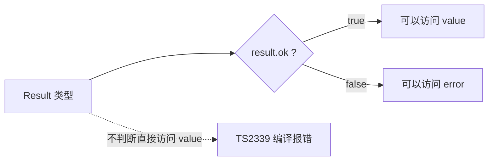
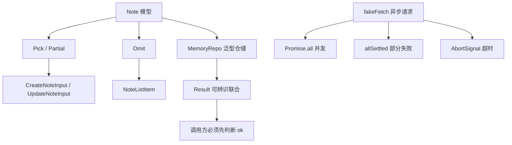

# 第 3 章　TS 进阶：泛型、类型收窄、工具类型与异步

> **本章导读**
>
> - 建议用时：150 分钟（阅读 70 分钟 + 实战 80 分钟）
> - 前置知识：第 2 章（类型擦除、联合类型、unknown 收窄）
> - 读完你能回答：
>   1. TS 泛型和 Go 1.18 泛型有什么异同？`K extends keyof T` 是什么意思？
>   2. 怎么用一个 `Note` 类型派生出「新增参数」「更新参数」「列表项」，而不是手写三遍？
>   3. 「可辨识联合」为什么比 Go 的 `(value, err)` 更难被忽略？
>   4. JS 没有 goroutine，那它怎么做并发？顺序 `await` 为什么可能慢 3 倍？

---

## 【积木 3-1】泛型：从 Go 泛型说起

泛型解决的问题和 Go 一样：**写一份代码，适配多种类型，还不丢类型信息。**

```go
// Go 1.18+
func First[T any](s []T) (T, bool) { ... }
type Page[T any] struct { Records []T; Total int }
```

```ts
// TypeScript
function first<T>(items: T[]): T | undefined { return items[0] }
type Page<T> = { records: T[]; total: number; page: number; pageSize: number }
```

| | Go | TypeScript |
|---|---|---|
| 类型参数写在哪 | 方括号 `[T any]` | 尖括号 `<T>` |
| 无约束 | `any`（必须写） | 什么都不写 |
| 有约束 | `[T interface{ GetID() int }]` | `<T extends { id: number }>` |
| 调用时传类型 | 通常推断，可写 `First[int](s)` | 通常推断，可写 `first<number>(s)` |
| 运行时存在吗 | 编译期展开 / 字典传递，运行时有类型 | **擦除**，运行时什么都没有（第 2 章） |

实战里的泛型仓储（`src/repo.ts`），一份代码服务任何「有 id 的实体」：

```ts
export class MemoryRepo<T extends { readonly id: number }> {
  #items: T[] = []
  get(id: number): T | undefined { return this.#items.find((x) => x.id === id) }
  list(page = 1, pageSize = 10): Page<T> { ... }
}

const repo = new MemoryRepo<Note>() // 之后 repo.get(1) 的类型就是 Note | undefined
```

`T extends { readonly id: number }` 读作「T 必须至少有一个 number 类型的 id」。这正是第 2 章的结构化类型：不要求 T 声明「我实现了什么」，只要长得满足就行。

`#items` 是 JS 原生的私有字段，运行时也访问不到。TS 自己还有个 `private` 关键字，但它只在编译期拦截、运行时照样能读。新代码推荐用 `#`。

---

## 【积木 3-2】keyof 与索引访问：让类型跟着参数走

看这个函数：从一组对象里取出某个字段。

```ts
function pluck<T, K extends keyof T>(items: T[], key: K): T[K][] {
  return items.map((item) => item[key])
}

pluck(notes, 'title') // 返回 string[]
pluck(notes, 'id') // 返回 number[]
pluck(notes, 'titel') // 编译报错：'titel' 不是 Note 的键
```

拆开三个零件：

| 写法 | 含义 | 对 Note 来说 |
|---|---|---|
| `keyof T` | T 所有键组成的联合类型 | `'id' \| 'title' \| 'content' \| 'status' \| ...` |
| `K extends keyof T` | K 必须是其中某一个键 | 传 `'title'` 时 K 就是 `'title'` |
| `T[K]` | 「T 的 K 字段」的类型（索引访问类型） | `Note['title']` 就是 `string` |

这种「参数决定返回类型」的能力 Go 泛型做不到——Go 没法用一个字符串参数去约束结构体字段。它在后面非常常用：TanStack Query 的查询键、表单库的字段名、Drizzle ORM 的列名，都靠这个机制做到拼错就报错。

---

## 【积木 3-3】类型收窄全家桶

第 2 章用 `typeof` 和 `in` 做过收窄。完整的工具箱如下：

| 手段 | 例子 | 收窄效果 |
|---|---|---|
| `typeof` | `typeof x === 'string'` | 原始类型 |
| 真值判断 | `if (note.summary)` | 去掉 `undefined` / `null` / `''` |
| 相等判断 | `if (status === 'draft')` | 字面量类型 |
| `in` | `'id' in input` | 对象有某字段 |
| `instanceof` | `e instanceof Error` | 类的实例 |
| 可辨识字段 | `if (result.ok)` | 联合类型的某个分支（积木 3-4） |
| **类型守卫** | `function isX(v): v is X` | 自定义规则 |
| **断言函数** | `function assert(c): asserts c` | 不满足就抛异常，之后的代码按满足处理 |

最后两个是自定义收窄，第 2 章的 `isNoteStatus` 就是类型守卫：

```ts
function isNonEmptyString(value: unknown): value is string {
  return typeof value === 'string' && value.trim() !== ''
}

function assert(condition: unknown, message: string): asserts condition {
  if (!condition) throw new Error(message)
}

assert(isNonEmptyString(input.title), 'title 不能为空')
// 这一行之后，TS 认为 input.title 一定是 string
```

### 一个高频误解：类型守卫是「被验证过的」吗？

不是。`value is string` 是**你对编译器的承诺**，TS 不检查函数体是否真的兑现了这个承诺。你写 `return true`，TS 也照单全收。所以类型守卫要写得朴素、可测试，复杂的校验交给第 4 章的 Zod。

### 另一个细节：`catch (e)` 里的 e 是 unknown

```ts
try { ... } catch (e) {
  console.log(e instanceof Error ? e.message : String(e))
}
```

JS 里 `throw` 后面可以跟任何东西（`throw 'oops'`、`throw 42`），所以 TS 把 `e` 定为 `unknown`，逼你先收窄。这和 Go 的 `error` 是接口、总有 `.Error()` 方法很不一样。

---

## 【积木 3-4】可辨识联合：比 (value, err) 更难忘记检查

**可辨识联合**（discriminated union）= 几个对象类型的联合，每个都带一个**字面量类型的公共字段**（「标签」），靠它区分分支。

```ts
export type Result<T, E = string> =
  | { ok: true; value: T }
  | { ok: false; error: E }
```

对比 Go：

```go
note, err := repo.Update(id, patch)
// 忘了写 if err != nil，编译照样通过，note 是零值
fmt.Println(note.Title)
```

```ts
const result = repo.update(id, patch)
console.log(result.value.title)
// error TS2339: Property 'value' does not exist on type 'Result<Note, "NOT_FOUND">'.
//   Property 'value' does not exist on type '{ ok: false; error: "NOT_FOUND"; }'.

if (!result.ok) return `失败：${result.error}` // 先处理失败分支
console.log(result.value.title) // 现在可以了
```

**不检查 `ok`，就根本拿不到 `value`。** 这是编译器强制的，不靠自觉。



同一个模式描述「事件」，就是实战里的 `NoteEvent`：

```ts
export type NoteEvent =
  | { type: 'created'; input: CreateNoteInput }
  | { type: 'updated'; id: number; patch: UpdateNoteInput }
  | { type: 'deleted'; id: number }
```

`switch (event.type)` 进入 `'updated'` 分支后，TS 知道 event 一定有 `id` 和 `patch`；配合第 2 章的 `never` 穷尽检查，新增一种事件却忘了处理会直接报错。**记住这个形状**：第 6 章 React 的 `useReducer`、第 16 章 AI SDK 的流式消息，用的都是它。

---

## 【积木 3-5】工具类型：一个模型派生出所有参数类型

后端最熟悉的场景：同一个实体，新增接口、更新接口、列表接口的参数各不相同。手写三遍类型，一旦 Note 加字段就要改三处，迟早漏。TS 的做法是**从 Note 派生**：

```ts
// 新增：title、content 必填，status 可选，其它字段由服务端生成
export type CreateNoteInput = Pick<Note, 'title' | 'content'> & Partial<Pick<Note, 'status'>>
// 更新：只能改这三个字段，每个都可选（PATCH 语义）
export type UpdateNoteInput = Partial<Pick<Note, 'title' | 'content' | 'status'>>
// 列表项：不要正文
export type NoteListItem = Omit<Note, 'content'>
```

常用工具类型速查：

| 工具类型 | 作用 | 典型场景 |
|---|---|---|
| `Partial<T>` | 所有字段变可选 | PATCH 更新参数 |
| `Required<T>` | 所有字段变必填 | 补全默认值之后的配置 |
| `Pick<T, K>` | 只保留某几个字段 | 新增参数、表单字段 |
| `Omit<T, K>` | 去掉某几个字段 | 列表项、去掉敏感字段 |
| `Readonly<T>` | 所有字段只读 | 不可变状态（React state） |
| `Record<K, V>` | 键为 K、值为 V 的对象 | `Record<NoteStatus, string>` 状态文案表 |
| `ReturnType<F>` | 函数的返回类型 | 复用别人函数的返回结构 |
| `Awaited<T>` | 解开 Promise | `Awaited<ReturnType<typeof fetchNotes>>` |

它们不是魔法，是用**映射类型**写出来的普通类型。比如 `Partial` 的实现只有一行：

```ts
type MyPartial<T> = { [K in keyof T]?: T[K] }
// 读作：遍历 T 的每个键 K，生成一个可选字段，类型是 T[K]
```

`keyof`、`T[K]` 正是积木 3-2 讲的零件。你不需要会写复杂的类型体操，但要**能读懂**库的类型定义——这属于第 1 章说的「能看懂、能判断」那一档。

### 一个高频误解：Omit 会把数据里的字段删掉吗？

不会。**工具类型只改类型，不碰数据**（第 2 章：类型运行时不存在）。`Omit<Note, 'content'>` 只是告诉编译器「我不打算用 content」，对象里的 content 原封不动，照样会被 `JSON.stringify` 发给前端。真要去掉，得在运行时动手：

```ts
function toListItem({ content: _content, ...rest }: Note): NoteListItem {
  return rest // 解构把 content 拿走，剩下的才真正不含正文
}
```

这条在第 14 章讲安全时会再出现：**用 Omit 把 `passwordHash` 从类型里去掉，不等于接口不会返回它。**

---

## 【积木 3-6】类型断言 as：你替编译器担保

泛型仓储的 `create` 里有一处特殊写法：

```ts
create(input: Omit<T, 'id'>): T {
  const item = { ...input, id: this.#nextId++ } as unknown as T
  ...
}
```

去掉 `as unknown as T`，tsc 报：

```
error TS2322: Type 'Omit<T, "id"> & { id: number; }' is not assignable to type 'T'.
  'Omit<T, "id"> & { id: number; }' is assignable to the constraint of type 'T',
  but 'T' could be instantiated with a different subtype of constraint '{ readonly id: number; }'.
```

翻译一下：「你拼出来的东西满足 `{ id: number }`，但 T 可能是某个更具体的类型（比如 `id` 只允许 `1 | 2 | 3`），我没法保证它就是 T。」编译器是对的——它只是不知道我们的 T 不会这么刁钻。

`as` 就是**你替编译器担保**。规矩有三条：

1. **能收窄就别断言**。收窄是证明，断言是声称。
2. 必须用的地方（像这种泛型拼装），**写一行注释说明理由**。
3. `as unknown as T`（双重断言）是最强的「闭嘴」，出现在业务代码里基本都是坏味道，在底层通用代码里偶尔可以接受。

**AI 生成代码时特别爱用 `as` 和 `any` 来消灭报错。** review 时看到它们，第一反应应该是问：这里为什么不能收窄？

---

## 【积木 3-7】异步：没有 goroutine 的并发

Go 的并发模型是「多个 goroutine 真并行跑，用 channel 通信」。JS 完全不同：**只有一个线程，靠事件循环排队。**


实战第一段的输出说明了顺序：

```
  1. 同步代码
  2. 同步代码
  3. 微任务：Promise.then
  4. 宏任务：setTimeout 0
```

`setTimeout(fn, 0)` 写在最前面，却最后执行：0 毫秒的意思是「尽快排进宏任务队列」，而不是「立刻执行」。

| | Go | JS |
|---|---|---|
| 并发单位 | goroutine（真并行） | Promise（单线程交替） |
| 等待结果 | channel 接收 / `wg.Wait()` | `await` |
| 适合 | CPU 密集 + IO 密集 | **IO 密集**（网络、文件、数据库） |
| CPU 密集任务 | 多核并行 | 会卡死整个线程，要用 Worker |

为什么单线程还能扛高并发？因为 Web 服务大部分时间在**等 IO**。等数据库返回的那段时间线程是空闲的，事件循环去处理别的请求。只要你不在主线程里做重计算，单线程就够用。

`async` 函数永远返回 `Promise<T>`。最常见的 bug 是**忘了 await**：

```ts
const u = fakeFetch('u', { name: 'x' }, 1)
console.log(u.name)
// error TS2339: Property 'name' does not exist on type 'Promise<{ name: string; }>'.
```

TS 在这里救了你：u 是一个「将来会有值的盒子」，不是值本身。

---

## 【积木 3-8】并发组合：all、allSettled 与超时取消

列表页要同时拉用户、笔记、标签三个接口，每个 300ms。

```ts
// 写法 A：顺序 await —— 每个都等上一个结束
const user = await fakeFetch('user', ..., 300)
const notes = await fakeFetch('notes', ..., 300)
const tags = await fakeFetch('tags', ..., 300)
// 约 900ms

// 写法 B：同时发出，一起等
const [user, notes, tags] = await Promise.all([fetchUser(), fetchNotes(), fetchTags()])
// 约 300ms，而且元组的每一位类型都被保留
```

三个请求互不依赖时，写法 A 白白慢了 3 倍。**这是 AI 生成代码里出现频率极高的性能问题**，因为顺序 await 读起来最自然。

四个组合器怎么选：

| 组合器 | 什么时候完成 | 有一个失败时 | 用途 |
|---|---|---|---|
| `Promise.all` | 全部成功 | **立刻整体失败**，其它结果拿不到 | 缺一不可的数据 |
| `Promise.allSettled` | 全部结束 | 各自报告成功或失败 | 页面上互不影响的模块 |
| `Promise.any` | 第一个成功 | 全部失败才失败 | 多个镜像源取最快的 |
| `Promise.race` | 第一个结束（成功或失败） | 看谁先 | 自己实现超时（现在更推荐 AbortSignal） |

`allSettled` 的返回值又是一个可辨识联合，标签是 `status`：

```ts
for (const r of settled) {
  r.status === 'fulfilled' ? r.value : r.reason // 收窄后才能分别访问
}
```

### 超时取消：AbortSignal 就是 JS 版的 context

```go
ctx, cancel := context.WithTimeout(ctx, 200*time.Millisecond)
defer cancel()
req, _ := http.NewRequestWithContext(ctx, "GET", url, nil)
```

```ts
await fetch(url, { signal: AbortSignal.timeout(200) })
// 超时抛出：TimeoutError: The operation was aborted due to timeout
```

| Go | JS |
|---|---|
| `context.Context` | `AbortSignal` |
| `context.WithTimeout` | `AbortSignal.timeout(ms)` |
| `cancel()` | `new AbortController()` 后调 `controller.abort()` |
| `<-ctx.Done()` | `signal.addEventListener('abort', ...)` |

原生 `fetch`、Node 的大多数 IO API 都接受 `signal`。第 7 章会用它解决 React 里「组件卸载了请求还在飞」的问题。

---

## 【积木 3-9】实战：泛型仓储 + 事件流 + 并发请求

代码在 [`code/ch03-ts-advanced/`](../code/ch03-ts-advanced/)：

```
code/ch03-ts-advanced/
├── package.json
├── tsconfig.json         # 与第 2 章相同
└── src/
    ├── model.ts          # Note + 派生的 Create/Update/ListItem + Page<T> + NoteEvent
    ├── result.ts         # Result<T, E> 可辨识联合
    ├── repo.ts           # MemoryRepo<T> 泛型仓储
    ├── main.ts           # 事件流、断言函数、pluck、工具类型把关
    └── async-demo.ts     # 事件循环、顺序 vs 并发、allSettled、超时取消
```

```bash
cd code/ch03-ts-advanced
pnpm install        # 只装 typescript
pnpm typecheck      # 无输出 = 通过
pnpm start          # 等价于 node src/main.ts
pnpm async          # 等价于 node src/async-demo.ts
```

`pnpm start` 的输出（时间戳每次不同）：

```
== 1. 事件流（可辨识联合 + Result） ==
新增 #1 学泛型
新增 #2 学工具类型
更新 #1 -> 学泛型 [published]
更新 #99 失败：NOT_FOUND
删除 #2

== 2. 断言函数拦截非法输入 ==
拦截： title 不能为空

== 3. 泛型分页 + 列表项去掉正文 ==
共 2 条： [
  { title: '学泛型', status: 'published', tags: [], createdAt: '...', id: 1 },
  { title: '第三条', status: 'draft', tags: [], createdAt: '...', id: 3 }
]

== 4. pluck：返回类型自动推导 ==
[ '学泛型', '第三条' ] [ 1, 3 ]

== 5. 工具类型拒绝不合法的参数 ==
这两行在 tsc 下都会报错，运行时只是普通对象： { id: 3 } { title: '缺正文' }
```

注意第 3 段：列表项里**真的没有 content**，因为 `toListItem` 在运行时解构掉了，不是靠 Omit。

`pnpm async` 的输出：

```
== 1. 事件循环顺序 ==
  1. 同步代码
  2. 同步代码
  3. 微任务：Promise.then
  4. 宏任务：setTimeout 0

== 2. 顺序 await vs Promise.all ==
  顺序 await：约 900ms
  Promise.all：约 300ms，user=lance，notes=3 条

== 3. Promise.all vs Promise.allSettled ==
  all： 推荐 失败 -> 整体失败，另外两个成功的结果拿不到
  allSettled： 成功 ok
  allSettled： 失败 推荐 失败
  allSettled： 成功 ok

== 4. AbortSignal.timeout 超时取消 ==
  取消原因： TimeoutError: The operation was aborted due to timeout
```

### 动手练习

每改一处跑一次 `pnpm typecheck`，看完报错再改回来。下表的报错信息都是实测结果：

| 练习 | 操作 | 预期报错 |
|---|---|---|
| 1 | 在 `model.ts` 的 `NoteEvent` 里加一个 `{ type: 'archived'; id: number }` | `TS2322: Type '{ type: "archived"; id: number; }' is not assignable to type 'never'.`（指向 `apply`） |
| 2 | 删掉 `main.ts` 里 `if (!result.ok) return ...` 那一行 | `TS2339: Property 'value' does not exist on type 'Result<Note, "NOT_FOUND">'.` |
| 3 | 删掉 `repo.ts` 里的 `as unknown as T` | `TS2322: Type 'Omit<T, "id"> & { id: number; }' is not assignable to type 'T'.` |
| 4 | 删掉 `main.ts` 第 5 段 `badPatch` 上方的注释 | `TS2353: ... 'id' does not exist in type 'Partial<Pick<Note, "content" \| "status" \| "title">>'.` |
| 5 | 在 `async-demo.ts` 里写一个没 await 的 `fakeFetch(...)` 并访问 `.name` | `TS2339: Property 'name' does not exist on type 'Promise<{ name: string; }>'.` |
| 6 | 给 `apply` 加上 `'archived'` 分支，让练习 1 的报错消失 | 无报错，`pnpm start` 正常 |
| 7 | 把 `async-demo.ts` 第 2 段的 `Promise.all` 改成 `Promise.allSettled`，观察 `user` 的类型怎么变了 | 需要先按 `status` 收窄才能拿到 `user.name` |

练习 1 和练习 6 合起来是本章最重要的体验：**加一种事件，编译器列出所有要跟着改的 switch。**

---

## 【本章小结】

三句话：

1. 泛型让一份代码适配多种类型；`K extends keyof T` + `T[K]` 能让返回类型跟着参数走，这是 Go 泛型做不到的。
2. 可辨识联合（`Result`、`NoteEvent`）让「不检查就拿不到值」成为编译期规则；工具类型从一个模型派生所有参数类型，但**只改类型、不改数据**。
3. JS 单线程靠事件循环做 IO 并发：互不依赖的请求用 `Promise.all` 并发，部分失败用 `allSettled`，超时用 `AbortSignal`（JS 版 context）。



**自测题：**

1. TS 的 `<T extends { id: number }>` 对应 Go 泛型的什么写法？两者在运行时有什么区别？（积木 3-1）
2. `pluck(notes, 'status')` 的返回类型是什么？是怎么算出来的？（积木 3-2）
3. 类型守卫 `value is string` 会被 TS 验证吗？这意味着什么？（积木 3-3）
4. 为什么 `catch (e)` 里的 e 是 unknown，而不是 Error？（积木 3-3）
5. 和 Go 的 `(value, err)` 相比，`Result` 可辨识联合强在哪里？（积木 3-4）
6. `Omit<User, 'passwordHash'>` 能保证接口不返回密码哈希吗？（积木 3-5）
7. 什么时候不得不用 `as`？review AI 代码时看到 `as` 应该问什么？（积木 3-6）
8. `setTimeout(fn, 0)` 和 `Promise.resolve().then(fn)` 谁先执行？为什么？（积木 3-7）
9. 三个互不依赖、各 300ms 的请求，顺序 await 和 `Promise.all` 分别要多久？（积木 3-8）
10. Go 的 `context.WithTimeout` 在 JS 里对应什么？（积木 3-8）

---

## 【下一章预告】

第 4 章《TS 工程化：tsconfig、模块、Zod 运行时校验》。第 2、3 章反复提到「类型是声称的，不是验证过的」，下一章彻底解决它：用 Zod 写一份 schema，**同时得到运行时校验和 TS 类型**，把第 2 章那个十几行的 `parseNote` 缩成一行。还会逐项讲本课程 tsconfig 里每个选项的含义（`strict`、`erasableSyntaxOnly`、`verbatimModuleSyntax`、`noUncheckedIndexedAccess`），以及 ES 模块的 `import` / `export` 规则，顺便解释前几章出现过的 `notes[0]!` 里那个感叹号。

*学完本章，回到对话里说一句「继续」，我就开讲第 4 章。*
