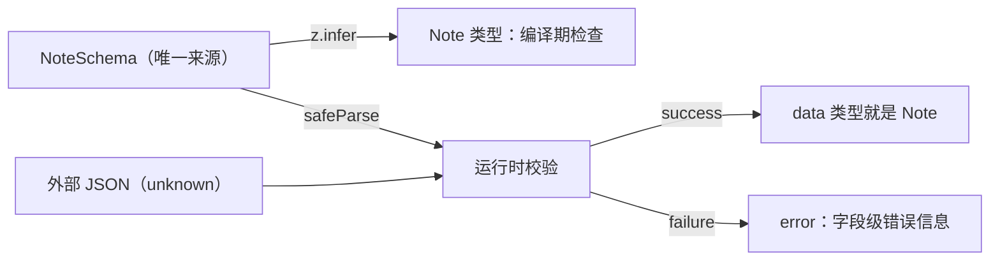
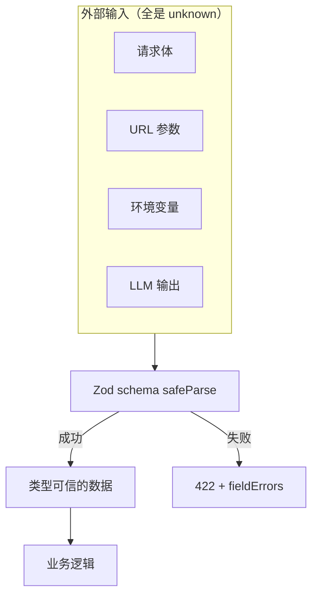

# 第 4 章　TS 工程化：tsconfig、模块与 Zod 运行时校验

> **本章导读**
>
> - 建议用时：120 分钟（阅读 50 分钟 + 实战 70 分钟）
> - 前置知识：第 2 章（类型擦除、unknown 收窄）、第 3 章（工具类型、可辨识联合）
> - 读完你能回答：
>   1. `package.json`、`tsconfig.json`、`pnpm-lock.yaml` 分别对应 Go 的什么？
>   2. tsconfig 里每个选项在防什么错？为什么只用到类型的导入必须写 `import type`？
>   3. 「类型是声称的，不是验证过的」这个问题，Zod 怎么解决？
>   4. PATCH 接口的 schema 为什么不能带默认值？

---

## 【积木 4-1】一个 TS 项目里的三份「户口本」

| TS 项目 | Go 项目 | 作用 |
|---|---|---|
| `package.json` | `go.mod` | 项目名、依赖列表、**脚本命令** |
| `pnpm-lock.yaml` | `go.sum` | 锁定每个依赖（含间接依赖）的确切版本，**必须提交** |
| `tsconfig.json` | 没有直接对应，接近 `go vet` + 编译参数 | 告诉 tsc 怎么检查、有多严格 |
| `node_modules/` | `$GOPATH/pkg/mod` | 下载下来的依赖，**不提交** |

本章实战的 `package.json`：

```json
{
  "type": "module",
  "scripts": {
    "start": "node src/main.ts",
    "server": "node src/server.ts",
    "typecheck": "tsc --noEmit"
  },
  "dependencies": { "zod": "^4.6.5" },
  "devDependencies": { "@types/node": "^22.20.5", "typescript": "^7.0.2" }
}
```

三个要点：

1. **`"type": "module"`**：声明这个项目用 ES 模块（`import` / `export`）。不写的话 Node 会按老的 CommonJS（`require`）处理 `.js` 文件。新项目一律写上。
2. **`dependencies` vs `devDependencies`**：运行时要用的放前者（zod 在服务端真实执行），只在开发时用的放后者（typescript 只做检查，@types/node 只提供类型）。部署时可以只装 `dependencies`，镜像更小。
3. **`scripts`**：项目自带的命令别名，`pnpm start` 就是 `node src/main.ts`。相当于很多 Go 项目里的 Makefile。

`^4.6.5` 的意思是「4.x.x 里不低于 4.6.5 的版本都行」（语义化版本，主版本号不变）。真正装哪个版本由 lockfile 决定，所以团队里每个人装到的完全一样。

---

## 【积木 4-2】tsconfig 逐项拆解

本课程的 tsconfig 只有十来行，每一行都在防一类错：

```jsonc
{
  "compilerOptions": {
    "target": "esnext",
    "module": "nodenext",
    "noEmit": true,
    "strict": true,
    "noUncheckedIndexedAccess": true,
    "allowImportingTsExtensions": true,
    "erasableSyntaxOnly": true,
    "verbatimModuleSyntax": true,
    "types": ["node"],
    "skipLibCheck": true
  },
  "include": ["src"]
}
```

| 选项 | 含义 | 不开会怎样 |
|---|---|---|
| `target` | 按哪个 JS 版本检查语法、生成代码 | 用了新语法却被当成错误 |
| `module: nodenext` | 按 Node 的规则解析 `import`（看 `"type"`、要求写扩展名） | 本地跑得通、Node 上跑不通 |
| `noEmit` | 只检查不生成 `.js` | 生成一堆没人用的产物 |
| `strict` | 打开一整组严格检查（见下表） | 大量隐式 `any`、空值不检查 |
| `noUncheckedIndexedAccess` | `arr[i]` 的类型带上 `\| undefined` | 数组越界在编译期发现不了（积木 4-4） |
| `allowImportingTsExtensions` | 允许 `import './x.ts'` | 只能写 `./x.js`，和 node 直接跑 `.ts` 冲突 |
| `erasableSyntaxOnly` | 禁止 enum、namespace 等需要生成代码的语法 | 写出 node 擦不掉的代码，一跑就报错 |
| `verbatimModuleSyntax` | 只用到类型的导入必须写 `import type` | 擦除后残留对「不存在的导出」的引用（积木 4-3） |
| `types: ["node"]` | 加载 `@types/node` 提供的全局类型（`process`、`Buffer`） | TS 7 默认是空数组，`process` 会报「找不到名称」 |
| `skipLibCheck` | 不检查 `node_modules` 里的 `.d.ts` | 别人的库类型有瑕疵也算你的错，还慢 |

`strict: true` 是一个开关组，主要包含：

| 子选项 | 防什么 |
|---|---|
| `strictNullChecks` | `null` / `undefined` 不能随便当成别的类型用（最重要的一条） |
| `noImplicitAny` | 参数没写类型又推断不出来时，不准默默变成 `any` |
| `strictFunctionTypes` | 函数参数类型兼容性按严格规则检查 |
| `useUnknownInCatchVariables` | `catch (e)` 的 e 是 `unknown`（第 3 章讲过） |

TS 7 已经把 `strict` 默认设为 `true`，本课程仍然显式写出来——**配置文件也是给人看的文档**。

> **一个高频误解：tsconfig 越严越好？**
> 不完全是。`exactOptionalPropertyTypes` 这类选项能区分「没有这个字段」和「字段值是 undefined」，很精确，但会让不少第三方库的类型报错，收益和成本不成比例。本课程的取舍是：`strict` + `noUncheckedIndexedAccess` 必开，其余按需。**新项目从严开始最便宜，老项目再往严里改很痛苦。**

---

## 【积木 4-3】ES 模块：import / export 的规矩

一个文件就是一个模块。只有 `export` 出去的东西，别的文件才能 `import`：

```ts
// src/lib/format.ts
import type { Note, NoteStatus } from '../schema.ts'

export function formatNote(note: Pick<Note, 'id' | 'title' | 'status'>): string { ... }

function internalHelper(): void {} // 没有 export，模块外看不见
```

| Go | ES 模块 |
|---|---|
| 一个**目录**是一个 package | 一个**文件**是一个模块 |
| 大写开头 = 导出 | 写了 `export` = 导出 |
| `import "github.com/x/y"` | `import { z } from 'zod'`（包名）或 `from './schema.ts'`（相对路径） |
| 包内文件互相可见 | 同目录的文件之间也必须显式 import |

### 本课程只用具名导出

```ts
export function formatNote() {} // 具名导出
import { formatNote } from './lib/format.ts' // 名字必须对得上

export default function () {} // 默认导出
import whatever from './lib/format.ts' // 导入时可以随便起名
```

默认导出允许导入方随意改名，项目一大，同一个函数在十个文件里叫十个名字，全局搜索和重构都很痛苦。具名导出则「拼错就报错」，编辑器自动补全也更准。（例外：第 11 章 Next.js 要求页面文件用 `export default`，那是框架约定，照做即可。）

### 为什么必须写 `import type`

假设 `format.ts` 写成普通导入：

```ts
import { Note, NoteStatus } from '../schema.ts' // Note 和 NoteStatus 都只是类型
```

开了 `verbatimModuleSyntax` 时 tsc 会报：

```
error TS1484: 'Note' is a type and must be imported using a type-only import
  when 'verbatimModuleSyntax' is enabled.
```

如果没开这个选项，tsc 不报错，但 **node 一跑就挂**：

```
SyntaxError: The requested module '../schema.ts' does not provide an export named 'Note'
```

原因还是第 2 章那句话：类型在运行时不存在。node 擦掉 `schema.ts` 里的 `export type Note`，运行时这个导出就没了；而 `import { Note }` 这一行**看起来像在导入一个值**，node 不知道该不该擦，只能保留，于是找不到。写成 `import type`，node 就知道整行可以删掉。

混合导入时可以单独标注某一个：

```ts
import { CreateNoteInputSchema, NoteSchema, type Note } from './schema.ts'
//        ↑ 运行时的值（schema 对象）            ↑ 只是类型
```

### 相对路径必须写扩展名

```ts
import { formatNote } from './lib/format'
// error TS2835: Relative import paths need explicit file extensions in ECMAScript imports
//   when '--moduleResolution' is 'node16' or 'nodenext'. Did you mean './lib/format.js'?
```

Node 的 ES 模块不会帮你猜扩展名。TS 提示你写 `.js`，那是传统流程（先编译成 `.js` 再运行）的写法；我们让 node 直接跑 `.ts`，所以写 `.ts`，`allowImportingTsExtensions` 就是为此开的。第 11 章起用 Next.js，打包工具会接管路径解析，届时可以不写扩展名。

---

## 【积木 4-4】noUncheckedIndexedAccess 与非空断言 `!`

第 2、3 章的代码里出现过 `notes[0]!`，现在解释它。

```ts
const notes: Note[] = []
const first = notes[0] // 开了 noUncheckedIndexedAccess：类型是 Note | undefined
first.title // error TS2532: Object is possibly 'undefined'.
```

不开这个选项时，TS 认为 `notes[0]` 一定是 `Note`，空数组也照样放行，运行时 `Cannot read properties of undefined`。Go 里数组越界会 panic，TS 默认连 panic 都没有，直接拿到 `undefined` 继续往下跑。

处理方式按推荐顺序：

| 写法 | 含义 | 何时用 |
|---|---|---|
| `if (first) { first.title }` | 收窄，真正检查过 | 首选 |
| `first?.title` | 可选链：是 undefined 就整体返回 undefined | 展示类代码 |
| `first?.title ?? '无标题'` | 再配一个默认值 | 展示类代码 |
| `notes[0]!.title` | **非空断言**：你保证它不是 undefined | 确定存在但 TS 推不出来 |

一个容易困惑的地方：就算写了 `notes.length > 0 ? notes[0].title : ...`，TS 依然报错——它不会把「长度大于 0」和「下标 0 存在」联系起来。这时用 `!` 是合理的，因为你确实检查过。

`!` 和第 3 章的 `as` 是一类东西：**担保，不是证明**。review 时看到 `!`，问一句「是谁保证它存在的」。

---

## 【积木 4-5】Zod：让「声称的类型」变成「验证过的类型」

第 2 章的 `parseNote` 用了十几行 `typeof` 和 `in` 来确认外部数据的形状。它能用，但有两个问题：**写起来累**；**类型和校验逻辑是两份**——改了 `Note` 类型忘了改校验，两边就悄悄不一致了。

Zod 的思路是：**只写一份 schema，类型从 schema 推导出来。**

```ts
import { z } from 'zod'

export const NoteSchema = z.object({
  id: z.number().int().positive(),
  title: z.string().trim().min(1, { error: '标题不能为空' }).max(100),
  content: z.string().max(10_000),
  status: z.enum(['draft', 'published', 'archived']),
  tags: z.array(TagSchema),
  createdAt: z.iso.datetime(),
  summary: z.string().optional(),
})

export type Note = z.infer<typeof NoteSchema> // 类型自动推导，不再手写
```



第 2 章的 `parseNote` 现在一行：

```ts
const parseNote = (input: unknown) => NoteSchema.safeParse(input)

const result = parseNote(input)
if (result.success) {
  result.data // 类型是 Note，而且这次是验证过的
} else {
  result.error // ZodError
}
```

`safeParse` 返回的是什么形状？`{ success: true, data } | { success: false, error }`——第 3 章的可辨识联合。不判断 `success` 就拿不到 `data`。

`parse`（不带 safe）校验失败时直接抛异常，适合「失败了就该崩」的场景，比如启动时校验配置（积木 4-8）。处理用户请求时一律用 `safeParse`。

**Zod 在全栈里的位置**：所有「从外面进来」的数据都该过一遍 schema——HTTP 请求体、URL 参数、环境变量、调用第三方接口的响应、`localStorage` 里读出来的东西、第 16 章 LLM 返回的结构化输出。

---

## 【积木 4-6】Zod 常用能力：清洗、默认值、转换

Zod 不只是「判断对不对」，它会**产出一份新数据**，过程中可以清洗和补全：

```ts
export const CreateNoteInputSchema = z.object({
  title, // 复用上面定义的 title 规则（含 trim）
  content: content.default(''),
  status: NoteStatusSchema.default('draft'),
})

CreateNoteInputSchema.parse({ title: '  前后有空格  ' })
// { title: '前后有空格', content: '', status: 'draft' }
```

| 能力 | 写法 | 效果 |
|---|---|---|
| 清洗 | `z.string().trim()` | 去掉首尾空格后再校验长度 |
| 默认值 | `.default('draft')` | 没传就补上 |
| 类型转换 | `z.coerce.number()` | `'3000'` 转成 `3000`（环境变量、URL 参数全是字符串） |
| 自定义规则 | `.refine((v) => ..., { error: '...' })` | 任意逻辑，比如「至少改一个字段」 |
| 可选 | `.optional()` | 允许 `undefined` |
| 派生 | `.pick()` / `.omit()` / `.partial()` / `.extend()` | 和第 3 章的工具类型一一对应 |

因为有清洗和默认值，**校验前和校验后的类型不一样**：

```ts
type CreateNoteInput = z.input<typeof CreateNoteInputSchema>
// { title: string; content?: string; status?: 'draft' | ... }   客户端可以发什么

type CreateNoteData = z.output<typeof CreateNoteInputSchema> // 等同 z.infer
// { title: string; content: string; status: 'draft' | ... }    校验后一定有什么
```

前端表单用 `input`，服务端拿到校验结果后用 `output`。

### 一个高频误解：PATCH 的 schema 可以直接 `.partial()` 一个带 default 的 schema

看起来很顺手：新增 schema 已经有了，加个 `.partial()` 不就是更新 schema？

```ts
const BadUpdate = z.object({ title, content: content.default(''), status }).partial()
BadUpdate.parse({ status: 'archived' })
// 实测结果：{"content":"","status":"archived"}
```

用户只想改状态，结果 `content` 被补成了空字符串。再 `Object.assign(note, data)`，**正文被清空了**。Zod 4 的规则是：字段即使被 `.partial()` 包成可选，缺失时 `default` 照样生效。

正确做法是 PATCH 用不带 default 的字段单独组装（实战 `schema.ts`）：

```ts
export const UpdateNoteInputSchema = z
  .object({ title, content, status: NoteStatusSchema }) // 这里的 content 没有 default
  .partial()
  .refine((v) => Object.keys(v).length > 0, { error: '至少要修改一个字段' })
```

这是那种「类型完全正确、测试不一定覆盖、上线才出事」的 bug。**AI 生成 CRUD 代码时非常喜欢复用 schema，这一条要重点审。**

---

## 【积木 4-7】错误信息：给人看的和给前端看的

同一个 `ZodError`，有两种常用的格式化方式：

```ts
z.prettifyError(result.error) // 给人看：日志、命令行
```

```
✖ Invalid input: expected number, received string
  → at id
✖ 标题不能为空
  → at title
✖ Invalid option: expected one of "draft"|"published"|"archived"
  → at status
✖ Invalid ISO datetime
  → at createdAt
```

```ts
z.flattenError(result.error) // 给前端：按字段归类
// { formErrors: [], fieldErrors: { title: ['标题不能为空'] } }
```

`fieldErrors` 的结构让前端可以把错误直接显示在对应输入框下面；`formErrors` 是不属于某个字段的整体错误（比如 `refine` 产生的「至少要修改一个字段」）。第 8 章做表单时会直接消费这个结构。

自定义错误文案用 `{ error: '...' }` 参数，没写的用 Zod 自带的英文提示。面向用户的字段最好都写上中文文案。

**全栈的真正收益在第 13 章**：同一份 schema，浏览器端用它做即时校验（体验），服务端用它做最终校验（安全），规则只写一次，永远一致。第 1 章说过「前端校验只是体验，后端校验才是安全边界」，现在两边终于可以共用同一份代码了。

---

## 【积木 4-8】启动时校验环境变量

环境变量是最容易被忽视的「外部输入」：它们永远是字符串，也可能根本没设。

```ts
// src/env.ts
const EnvSchema = z.object({
  PORT: z.coerce.number().int().min(1).max(65535).default(3000),
  NODE_ENV: z.enum(['development', 'production', 'test']).default('development'),
})

const parsed = EnvSchema.safeParse(process.env)
if (!parsed.success) {
  console.error('环境变量配置错误：\n' + z.prettifyError(parsed.error))
  process.exit(1)
}
export const env = parsed.data // { PORT: number; NODE_ENV: 'development' | ... }
```

```bash
PORT=abc node src/server.ts
# 环境变量配置错误：
# ✖ Invalid input: expected number, received NaN
#   → at PORT
```

**配错了立刻退出，而不是跑到第一个请求才炸。** 这对第 17 章的容器部署尤其重要：K8s 里 Pod 启动失败会立刻进 CrashLoopBackOff 并在事件里留下原因（k8s-study 第 11 章讲过），比跑起来后间歇性报错好排查得多。Go 里 `envconfig.Process` 失败就 `log.Fatal` 也是一样的道理。

之后所有代码都从 `env` 读配置，**不再直接碰 `process.env`**。

---

## 【积木 4-9】实战：用 Zod 重写第 1 章的服务端

代码在 [`code/ch04-ts-engineering/`](../code/ch04-ts-engineering/)：

```
code/ch04-ts-engineering/
├── package.json        # zod + typescript + @types/node
├── tsconfig.json       # 带逐行注释的完整配置
└── src/
    ├── schema.ts       # NoteSchema / CreateNoteInputSchema / UpdateNoteInputSchema + 推导类型
    ├── env.ts          # 环境变量校验
    ├── lib/format.ts   # 具名导出 + import type 示例
    ├── main.ts         # safeParse、错误格式化、默认值、PATCH 校验、下标访问
    └── server.ts       # 第 1 章的服务端，用 Zod 重写校验，新增 PATCH
```

```bash
cd code/ch04-ts-engineering
pnpm install
pnpm typecheck   # 无输出 = 通过
pnpm start
```

`pnpm start` 的输出：

```
== 1. safeParse：校验外部数据 ==
通过： [已发布] #1 学 Zod
拒绝：
✖ Invalid input: expected number, received string
  → at id
✖ 标题不能为空
  → at title
✖ Invalid option: expected one of "draft"|"published"|"archived"
  → at status
✖ Invalid ISO datetime
  → at createdAt

== 2. 给前端用的字段级错误 ==
{"title":["标题不能为空"]}

== 3. 清洗 + 默认值：input 和 output 不一样 ==
{ title: '前后有空格', content: '', status: 'draft' }

== 4. PATCH 校验：空对象被拒绝，不会被默认值污染 ==
{ status: 'archived' }
[ '至少要修改一个字段' ]

== 5. noUncheckedIndexedAccess：数组下标可能越界 ==
可选链 first?.title = undefined
空列表，不访问
非空断言 [草稿] #9 一定存在
```

再启动服务端，用 curl 测一遍（另开一个终端）：

```bash
pnpm server
# CloudNote ch04 已启动：http://localhost:3000（development）
```

```bash
c() { curl -s -w " %{http_code}\n" "$@"; }   # 小工具：打印响应体和状态码

c -X POST -d '{"title":"  hi  "}' localhost:3000/api/notes
# {"title":"hi","content":"","status":"draft","id":1,"tags":[],"createdAt":"..."} 201

c -X POST -d '{"title":"","status":"x"}' localhost:3000/api/notes
# {"error":{"title":["标题不能为空"],"status":["Invalid option: expected one of \"draft\"|\"published\"|\"archived\""]}} 422

c -X POST -d 'oops' localhost:3000/api/notes
# {"error":"Unexpected token 'o', \"oops\" is not valid JSON"} 400

c -X PATCH -d '{}' localhost:3000/api/notes/1
# {"error":{"formErrors":["至少要修改一个字段"],"fieldErrors":{}}} 422

c -X PATCH -d '{"status":"published"}' localhost:3000/api/notes/1
# {"title":"hi","content":"","status":"published","id":1,...} 200   content 没被清空

c -X PATCH -d '{"title":"x"}' localhost:3000/api/notes/9
# {"error":"NOT_FOUND"} 404
```

对比第 1 章 `server.ts` 里那段手写的 `typeof payload === 'object' && ...`：校验规则现在全部集中在 `schema.ts`，服务端代码只剩「解析、判断成功、使用」三步。

### 动手练习

每改一处跑一次 `pnpm typecheck`（练习 6 跑 `pnpm start`），看完再改回来。报错均为实测：

| 练习 | 操作 | 预期结果 |
|---|---|---|
| 1 | `lib/format.ts` 里把 `import type` 改成 `import` | `TS1484: 'Note' is a type and must be imported using a type-only import ...` |
| 2 | 接上一步，不跑 tsc 直接 `pnpm start` | `SyntaxError: The requested module '../schema.ts' does not provide an export named 'Note'` |
| 3 | `main.ts` 里把 `'./lib/format.ts'` 改成 `'./lib/format'` | `TS2835: Relative import paths need explicit file extensions ...` |
| 4 | 删掉 `main.ts` 第 5 段 `notes[0].title` 上方的注释 | `TS2532: Object is possibly 'undefined'.` |
| 5 | 在 `env.ts` 里写一个 `enum Color { Red }` | `TS1294: This syntax is not allowed when 'erasableSyntaxOnly' is enabled.` |
| 6 | 给 `NoteSchema` 加一个必填字段 `pinned: z.boolean()` | `server.ts` 报 `TS2741: Property 'pinned' is missing ...`——改了 schema，编译器告诉你哪里要跟着改 |
| 7 | 把 `UpdateNoteInputSchema` 里的 `content` 换成 `content.default('')`，再用 curl 只 PATCH `status` | 响应里 `content` 变成 `""`，正文被清空 |
| 8 | 用 `PORT=99999 pnpm server` 启动 | 启动失败：`✖ Too big: expected number to be <=65535  → at PORT` |

练习 6 和第 2 章练习 2 是同一个体验的升级版：那时只有类型跟着变，现在**运行时校验也跟着变了**，因为它们来自同一份 schema。

---

## 【本章小结】

三句话：

1. `package.json` / lockfile / tsconfig 分别对应 go.mod / go.sum / 编译检查参数；tsconfig 的每个选项都在防一类具体的错，`strict` + `noUncheckedIndexedAccess` 必开。
2. ES 模块里只用到类型的导入必须写 `import type`，否则 node 擦除后会找不到导出；相对路径要写扩展名；本课程只用具名导出。
3. Zod 用一份 schema 同时产出**运行时校验**和**编译期类型**，所有外部输入都该过一遍；PATCH schema 不能带 default，环境变量在启动时就校验。



**自测题：**

1. `dependencies` 和 `devDependencies` 怎么区分？typescript 应该放哪个？（积木 4-1）
2. 为什么 lockfile 必须提交？（积木 4-1）
3. TS 7 下不写 `"types": ["node"]`，用 `process.env` 会怎样？（积木 4-2）
4. 不开 `verbatimModuleSyntax`、又忘了写 `import type`，tsc 和 node 分别会怎样？（积木 4-3）
5. 为什么本课程不用 `export default`？什么情况下例外？（积木 4-3）
6. `notes[0]!` 里的 `!` 是什么？它和 `as` 有什么共同点？（积木 4-4）
7. `z.infer`、`z.input`、`z.output` 分别是什么？前端表单该用哪个？（积木 4-6）
8. 用带 default 的 schema 做 `.partial()` 来校验 PATCH，会出什么 bug？（积木 4-6）
9. `prettifyError` 和 `flattenError` 分别给谁用？（积木 4-7）
10. 为什么环境变量要在启动时校验，而不是用到时再读？（积木 4-8）

---

## 【下一章预告】

TS 篇到此结束。第 5 章《React 心智模型：UI = f(state)》正式进入 React。还记得第 1 章 `index.html` 里那个每改一次状态就必须手动调用的 `render()` 吗？React 就是把这件事自动化了。我们会用 Vite 起一个 React + TS 项目，把第 1 章的笔记页面改写成组件，讲清楚 JSX 到底是什么、组件为什么是函数、props 和 state 的分工，以及为什么 React 坚持「数据单向流动」。

*学完本章，回到对话里说一句「继续」，我就开讲第 5 章。*
