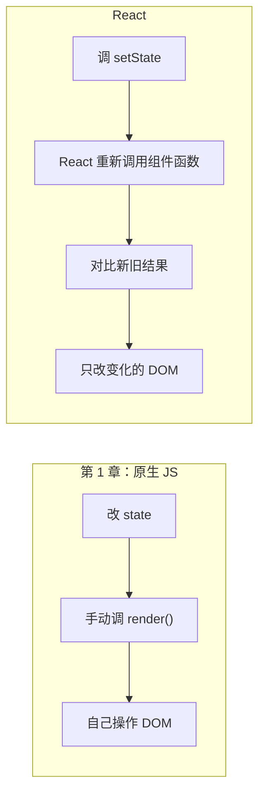
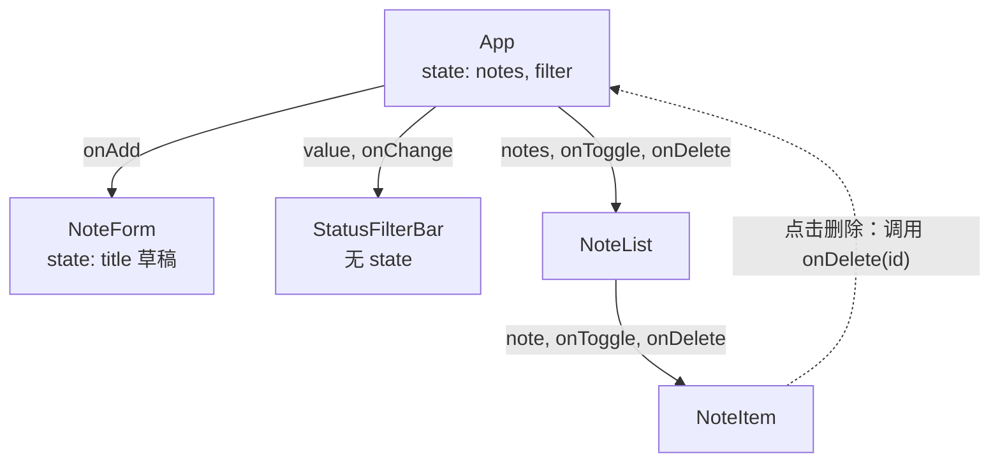
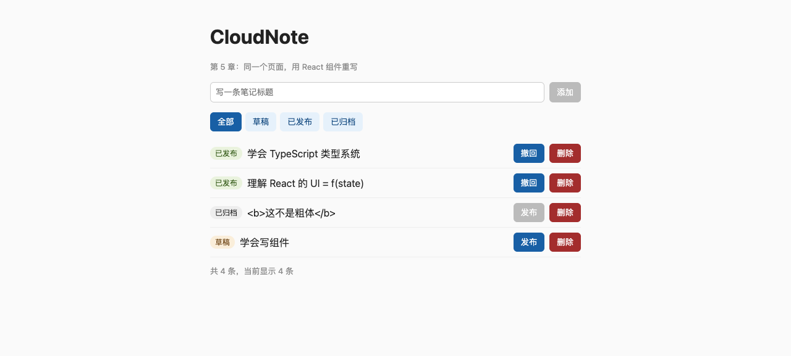
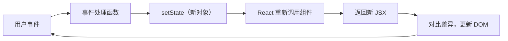

# 第 5 章　React 心智模型：UI = f(state)

> **本章导读**
>
> - 建议用时：150 分钟（阅读 60 分钟 + 实战 90 分钟）
> - 前置知识：第 1 章（原生 JS 手动 render 的笔记页）、第 2-4 章（TS 类型、模块）
> - 读完你能回答：
>   1. React 到底替你做了什么？「UI = f(state)」是什么意思？
>   2. JSX 是什么？浏览器为什么能运行它？
>   3. 组件为什么是一个函数？它什么时候会被调用？
>   4. props 和 state 怎么分工？为什么说数据「单向流动」？

---

## 【积木 5-1】从第 1 章的痛点说起

回到第 1 章 `index.html` 里那段代码：

```js
const state = { notes: [], loading: false, error: '' }

function render() {
  // 根据 state 把整个界面重画一遍
}

state.loading = true; state.error = ''; render() // 改完 state，必须记得调 render()
```

页面只有一个列表、一个表单时还好。等到有筛选、分页、弹窗、多个列表互相联动时，每个改 state 的地方都要记得调 `render()`，还要想清楚「这次改动影响了哪些 DOM」——漏一处，界面就和数据对不上。

React 的核心思想只有一句话：

> **UI = f(state)**：界面是状态的函数。你只管描述「某个状态下界面长什么样」，状态变了，React 负责算出要改哪些 DOM 并改掉。



用 Go 的视角理解：组件很像 `html/template` 里的一个模板函数——给数据、出界面。区别在于，模板渲染一次就结束了；React 组件是**活的**，数据一变它就会被重新调用一次，然后由 React 把差异「打补丁」到页面上。

---

## 【积木 5-2】用 Vite 起一个 React + TS 项目

浏览器不认识 TypeScript，也不认识 JSX，所以需要一个工具在开发时实时转换、在上线前打包。本课程用 **Vite**。

真实项目里一般这样创建（本章代码已经建好，不用再跑）：

```bash
pnpm create vite@latest my-app --template react-ts
```

本章实战的结构：

```
code/ch05-react-mental-model/
├── index.html              # 唯一的 HTML，只有一个 <div id="root">
├── vite.config.ts          # 加载 React 插件
├── tsconfig.json
├── package.json
└── src/
    ├── main.tsx            # 入口：把 <App /> 挂到 #root
    ├── App.tsx             # 根组件：持有 state
    ├── types.ts
    ├── index.css
    └── components/
        ├── NoteForm.tsx
        ├── StatusFilterBar.tsx
        └── NoteList.tsx
```

| 命令 | 做了什么 |
|---|---|
| `pnpm dev` | 启动开发服务器（默认 5173 端口），改代码后浏览器**局部热更新**，state 不丢 |
| `pnpm build` | 先 `tsc --noEmit` 检查类型，再把所有代码打包压缩到 `dist/` |
| `pnpm preview` | 用本地服务器预览 `dist/` 里的构建产物（默认 4173 端口） |

本章用到的版本（2026-10 实测）：React 19.3、Vite 8.3、@vitejs/plugin-react 6.1、TypeScript 7.0。

和第 4 章相比，tsconfig 只改了几行：

| 选项 | 第 4 章 | 本章 | 原因 |
|---|---|---|---|
| `module` | `nodenext` | `esnext` | 代码交给 Vite 打包，不是 Node 直接运行 |
| `moduleResolution` | 跟随 module | `bundler` | 按打包工具的规则解析，**import 不用写扩展名** |
| `jsx` | 无 | `react-jsx` | 允许写 JSX，并按 React 17+ 的新方式编译 |
| `types` | `["node"]` | `["vite/client"]` | 提供 `import './index.css'` 这类 Vite 特有写法的类型 |

注意 `pnpm build` 里的 `tsc --noEmit &&`：**Vite 和 node 一样只擦类型、不检查类型**（第 2 章），所以构建前必须单独跑一次 tsc，否则类型错误会被打包上线。

---

## 【积木 5-3】JSX：长得像 HTML 的函数调用

```tsx
export function Hello({ name }: { name: string }) {
  return <h1 className="title">你好，{name}</h1>
}
```

这不是 HTML，也不是字符串模板。用 tsc 把它编译一下，实际得到的是：

```js
import { jsxs as _jsxs } from "react/jsx-runtime";
export function Hello({ name }) {
    return _jsxs("h1", { className: "title", children: ["\u4F60\u597D\uFF0C", name] });
}
```

**JSX 只是函数调用的语法糖。** `<h1 ...>` 变成 `jsxs('h1', props)`，返回一个普通 JS 对象（叫「React 元素」），描述「这里应该有一个 h1，属性是这些，子节点是这些」。它不是真的 DOM 节点，创建成本很低，所以 React 敢每次都整份重新生成。

因为是函数调用，JSX 的规则都能推理出来：

| 规则 | 写法 | 原因 |
|---|---|---|
| 用 `className` 不用 `class` | `<div className="x">` | 它是 JS 对象的属性名，而 `class` 是 JS 关键字 |
| 只能有一个根元素 | `<>...</>`（Fragment）包起来 | 一个函数只能返回一个值 |
| `{}` 里放表达式 | `{notes.length}`、`{ok ? 'a' : 'b'}` | 它就是函数参数的一部分 |
| `{}` 里不能写语句 | 不能写 `if`、`for` | 参数里只能放表达式；要分支就用三元或提前 return |
| 事件用驼峰 | `onClick`、`onChange` | 对应 props 对象的属性名 |
| 自定义组件首字母大写 | `<NoteList />` | 小写会被当成 HTML 标签字符串 `'notelist'` |

### 自动转义：不再需要 escapeHtml

第 1 章为了防 XSS 手写了 `escapeHtml`。在 React 里：

```tsx
<span className="title">{note.title}</span>
```

`note.title` 是 `'<b>这不是粗体</b>'` 时，页面上显示的就是这串字符，不会变成粗体。因为 React 是用 `textContent` 而不是拼 `innerHTML` 来写文字的。**放进 `{}` 的字符串默认安全**；React 唯一绕过转义的入口叫 `dangerouslySetInnerHTML`，名字已经在警告你了（第 14 章讲它）。

---

## 【积木 5-4】组件是函数，每次渲染都会重新调用

```tsx
export function App() {
  const [notes, setNotes] = useState<Note[]>(initialNotes)
  const [filter, setFilter] = useState<StatusFilter>('all')
  const visibleNotes = filter === 'all' ? notes : notes.filter((n) => n.status === filter)
  return <main>...</main>
}
```

这个函数在下面几种情况会被 React 调用：

1. 第一次显示（首次渲染）
2. 它自己的 state 变了（调了 `setNotes` 或 `setFilter`）
3. 它的父组件重新渲染了（子组件默认跟着重新调用，第 6 章细讲）

每次调用，函数体从头跑一遍，`visibleNotes` 重新算一遍，返回一份新的 JSX。React 拿新旧两份结果做对比（叫 **reconciliation，协调**），只把真正变化的部分写进 DOM。

这带来一条硬性要求：**组件必须是纯函数**——同样的 props 和 state，必须返回同样的 JSX，而且不能在渲染过程中产生副作用（改全局变量、发请求、操作 DOM）。

| 允许在组件函数体里做 | 不允许在组件函数体里做 |
|---|---|
| 根据 props / state 计算 | 修改函数外的变量 |
| 定义事件处理函数 | 直接发网络请求（第 7 章讲放哪） |
| 调用 Hook（`useState` 等） | 直接改 DOM |

### 一个高频误解：开发环境里组件为什么被调用了两次？

`main.tsx` 里包了 `<StrictMode>`。开发环境下它会**故意把每个组件多调用一次**，如果两次结果不一样，说明组件不纯，问题会更早暴露。这只在开发环境发生，`pnpm build` 产物里没有这个行为。看到 `console.log` 打印两次不是 bug，别为了「去重」把 StrictMode 删掉。

---

## 【积木 5-5】state：会变的数据，以及「不可变更新」

```tsx
const [notes, setNotes] = useState<Note[]>(initialNotes)
```

| 部分 | 含义 |
|---|---|
| `notes` | **这一次渲染**时的值（只读快照） |
| `setNotes` | 告诉 React「下一次渲染用新值」，并安排一次重新渲染 |
| `initialNotes` | 只在首次渲染时使用，之后被忽略 |
| `useState<Note[]>` | 泛型参数（第 3 章），声明 state 的类型 |

### 必须产生新对象，不能原地改

```tsx
// 错误：原地修改
notes.push(newNote)
setNotes(notes) // 界面不会更新

// 正确：创建新数组
setNotes((prev) => [...prev, newNote])
```

为什么原地改不行？React 判断 state 有没有变，用的是 `Object.is(旧值, 新值)`——**比较的是引用，不是内容**。`push` 之后数组还是同一个对象，React 认为「没变」，直接跳过重新渲染。

这和 Go 很不一样：Go 里改 slice 元素是家常便饭。在 React 里要养成习惯——**把 state 当成只读的**，每次修改都返回新副本：

| 操作 | 不可变写法 |
|---|---|
| 新增 | `[...prev, item]` |
| 删除 | `prev.filter((n) => n.id !== id)` |
| 修改某一项 | `prev.map((n) => (n.id === id ? { ...n, status: 'published' } : n))` |
| 改对象的一个字段 | `{ ...prev, title: 'new' }` |

### 为什么用 `prev => ...` 而不是直接用 `notes`

```tsx
setNotes((prev) => [...prev, newNote]) // 更新函数：拿到的是最新值
setNotes([...notes, newNote]) // 直接用：拿到的是这次渲染时的快照
```

大多数时候两者结果一样。但如果一次事件里连续调用两次，后者第二次拿到的仍然是旧快照，第一次的修改会被覆盖。**新值依赖旧值时，一律用更新函数**，这样永远不会错。

---

## 【积木 5-6】props 与单向数据流

组件之间通过 **props** 传数据。props 就是 JSX 上的属性，在子组件里是函数参数：

```tsx
// App.tsx：父组件把数据和「改数据的函数」一起传下去
<NoteList notes={visibleNotes} onToggle={handleToggle} onDelete={handleDelete} />

// NoteList.tsx：子组件用类型声明自己需要什么
type NoteListProps = {
  notes: Note[]
  onToggle: (id: number) => void
  onDelete: (id: number) => void
}
export function NoteList({ notes, onToggle, onDelete }: NoteListProps) { ... }
```

| | props | state |
|---|---|---|
| 谁拥有 | 父组件 | 组件自己 |
| 能改吗 | **不能**，子组件只读 | 能，通过 setXxx |
| 变了会怎样 | 父组件重新渲染时传入新值 | 触发本组件重新渲染 |
| 类比 Go | 函数参数 | 结构体里的字段 |

本章实战的组件树和数据流向：



**数据向下流（props），事件向上报（回调函数）。** `NoteItem` 自己不能删笔记，它只能调用父组件给的 `onDelete`，真正改 state 的是 `App`。这就是**单向数据流**：任何一个数据只有一个主人，想知道它为什么变了，只需要去主人那里找。

### state 放在哪：谁用就放谁的「最近公共祖先」

- 输入框里还没提交的草稿 `title`：只有 `NoteForm` 用，放 `NoteForm` 里
- `notes`：表单要往里加、列表要显示、底部要统计条数，三方都用，放它们的公共祖先 `App`
- `filter`：筛选栏要高亮、列表要过滤，也放 `App`

这个把 state 往上挪到公共祖先的动作叫**状态提升**（lifting state up）。

### 能算出来的不要存

```tsx
const visibleNotes = filter === 'all' ? notes : notes.filter((n) => n.status === filter)
```

`visibleNotes` 完全可以从 `notes` 和 `filter` 算出来，所以它只是一个普通变量，**不是 state**。如果把它也存成 state，就得在每次改 notes、改 filter 时记得同步更新它——又回到了第 1 章「忘了调 render()」的老问题。**AI 生成的组件里，冗余 state 是最常见的问题之一**，review 时要专门看。

---

## 【积木 5-7】列表渲染与 key

```tsx
{notes.map((note) => (
  <NoteItem key={note.id} note={note} onToggle={onToggle} onDelete={onDelete} />
))}
```

`key` 告诉 React「这一项是谁」。重新渲染时，React 按 key 把新旧列表一一对上：key 相同的复用原来的 DOM，没见过的新建，消失的删掉。

为什么不能用数组下标当 key？想象删掉第一条笔记：

| | 删除前 | 删除后 |
|---|---|---|
| 下标 0 | 笔记 A | 笔记 B |
| 下标 1 | 笔记 B | 笔记 C |

用下标当 key，React 会认为「key=0 还在，只是内容从 A 变成了 B」，于是复用 A 的 DOM 和**组件内部的 state**。如果列表项里有输入框或展开状态，就会出现「删了第一行，第二行的输入内容却跑到了第一行」这种诡异 bug。

规则：**key 用数据本身的稳定 id**。忘了写 key，开发环境控制台会报警告：`Each child in a list should have a unique "key" prop.`

---

## 【积木 5-8】实战：用组件重写第 1 章的笔记页

代码在 [`code/ch05-react-mental-model/`](../code/ch05-react-mental-model/)。本章数据只存在内存里（刷新就回到初始状态），第 7 章起接第 4 章的后端 API。

```bash
cd code/ch05-react-mental-model
pnpm install
pnpm dev
# VITE v8.3.4  ready in xxx ms
# ➜  Local:   http://localhost:5173/
```

打开浏览器，你会看到这个页面（截图来自对构建产物的实际操作：新增了一条「学会写组件」，把第 2 条发布了）：



我用浏览器自动化把核心交互走了一遍，结果如下：

| 操作 | 底部统计 / 列表变化 |
|---|---|
| 初始 | 3 条笔记，「添加」按钮是灰的（输入为空） |
| 输入「学会写组件」并点添加 | 「共 4 条，当前显示 4 条」，输入框被清空 |
| 点第 2 条的「发布」 | 徽标变「已发布」，按钮变「撤回」 |
| 点筛选「草稿」 | 「共 4 条，当前显示 1 条」，只剩新加的那条 |
| 第 3 条标题 `<b>这不是粗体</b>` | 原样显示尖括号，没有变粗体 |

构建也验证一下：

```bash
pnpm build
# ✓ 20 modules transformed.
# dist/index.html                   0.49 kB │ gzip:  0.37 kB
# dist/assets/index-D5u2H234.css    0.93 kB │ gzip:  0.46 kB
# dist/assets/index-CcPU4CpT.js   222.03 kB │ gzip: 69.80 kB
# ✓ built in 304ms
```

222 KB 里绝大部分是 React 本身（gzip 后约 70 KB）。第 12 章讲服务端渲染时会回来讨论包体积。

### 对照阅读：第 1 章 vs 本章

| 关注点 | 第 1 章 `index.html` | 本章 |
|---|---|---|
| 改完数据刷新界面 | 手动 `render()` | 调 `setNotes`，React 自动重渲染 |
| 拼界面 | 字符串拼 `innerHTML` | JSX，有类型检查 |
| 防 XSS | 手写 `escapeHtml` | `{}` 默认转义 |
| 代码组织 | 一个文件、一个 render 函数 | 按职责拆成 4 个组件，各自声明 props 类型 |
| 状态 | 一个全局 `state` 对象 | 分散在需要它的组件里，每份有唯一主人 |

### 动手练习

本章开始**手写**比读代码重要得多。前 5 题请不借助 AI 完成：

| 练习 | 操作 | 预期结果 |
|---|---|---|
| 1 | `App.tsx` 里删掉传给 `NoteList` 的 `onDelete` | `TS2741: Property 'onDelete' is missing in type ... but required in type 'NoteListProps'.` |
| 2 | 给 `StatusFilterBar` 传 `value="pinned"` | `TS2322: Type '"pinned"' is not assignable to type 'StatusFilter'.` |
| 3 | 在 `NoteList` 的空列表分支里返回两个并列的 `<p>` | `TS2657: JSX expressions must have one parent element.`，用 `<>...</>` 包起来修好 |
| 4 | 把 `handleAdd` 改成 `notes.push(...)` 再 `setNotes(notes)` | 类型检查通过，但点「添加」界面毫无反应（积木 5-5） |
| 5 | 删掉 `NoteList` 里的 `key={note.id}` | 浏览器控制台出现 key 警告 |
| 6 | 新增一个「全部归档」按钮，把所有笔记状态改为 archived | 用 `map` + 展开运算符，一次 `setNotes` 完成 |
| 7 | 在 `App` 顶部加一行 `console.log('App render')`，分别点添加、筛选、输入文字 | 输入文字时 App **不会**打印——因为 `title` 是 NoteForm 自己的 state，只有 NoteForm 重渲染。开发环境每次打印两遍是 StrictMode |
| 8 | （可用 AI）让 AI 给列表加「按标题搜索」，然后审查：它有没有把过滤结果存成 state？ | 正确做法：只加一个 `keyword` state，过滤结果在渲染时派生 |

练习 7 是理解「哪些组件会重新渲染」的第一步，第 6 章会系统展开。

---

## 【本章小结】

三句话：

1. **UI = f(state)**：组件是纯函数，state 变了 React 重新调用它，对比新旧结果，只改变化的 DOM；JSX 只是 `jsx()` 函数调用的语法糖。
2. **state 只读、更新必须产生新对象**：React 用 `Object.is` 比较引用，原地修改不会触发渲染；新值依赖旧值时用 `prev => ...`。
3. **数据向下（props）、事件向上（回调）**：每份 state 只有一个主人，放在用到它的组件的最近公共祖先；能派生的数据不要存成 state。



**自测题：**

1. 用一句话解释「UI = f(state)」，它解决了第 1 章的什么问题？（积木 5-1）
2. 为什么 `pnpm build` 要先跑 `tsc --noEmit`？Vite 不检查类型吗？（积木 5-2）
3. `<h1 className="x">{name}</h1>` 编译后是什么？为什么用 `className` 而不是 `class`？（积木 5-3）
4. React 怎么防止 XSS？什么情况下会失效？（积木 5-3）
5. 组件函数在哪三种情况下会被调用？为什么要求它是纯函数？（积木 5-4）
6. 开发环境下组件被调用两次，是 bug 吗？（积木 5-4）
7. `notes.push(x); setNotes(notes)` 为什么不会更新界面？（积木 5-5）
8. props 和 state 的区别是什么？子组件想删除一条笔记，应该怎么做？（积木 5-6）
9. `visibleNotes` 为什么不存成 state？（积木 5-6）
10. 列表的 key 为什么不能用数组下标？（积木 5-7）

---

## 【下一章预告】

第 6 章《State 与渲染：什么时候重渲染，状态该放哪》。本章练习 7 已经让你看到「输入文字时 App 不渲染」。下一章把渲染机制讲透：父组件渲染时子组件为什么默认全部跟着渲染、state 更新为什么是「批量」且「异步」的、`setCount(count + 1)` 连写三次为什么只加 1；然后用 `useReducer` 把本章 `App` 里散落的三个 handle 函数收拢成一个 reducer——你会发现它就是第 3 章的可辨识联合 `NoteEvent`。最后聊聊 React Compiler 帮你自动做了哪些优化，以及什么时候还需要 `memo`。

*学完本章，回到对话里说一句「继续」，我就开讲第 6 章。*
