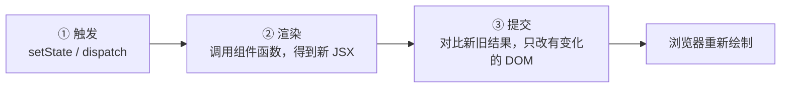
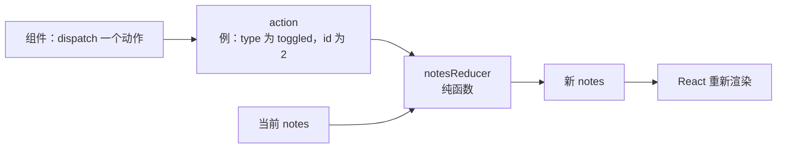
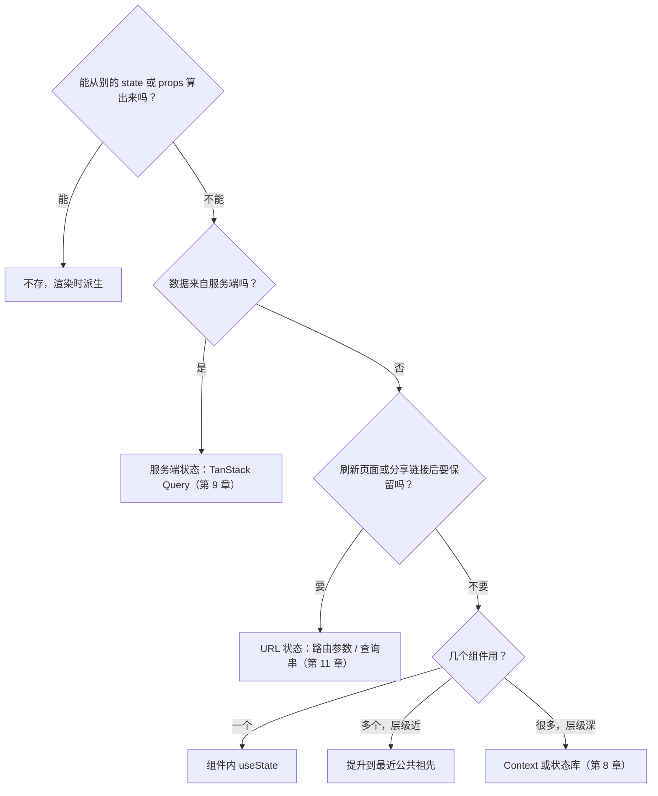
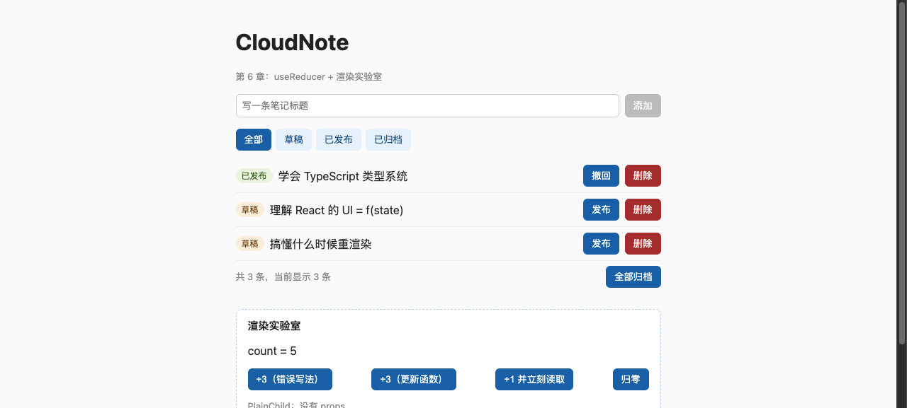
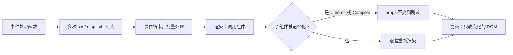

# 第 6 章　State 与渲染：什么时候重渲染，状态该放哪

> **本章导读**
>
> - 建议用时：150 分钟（阅读 60 分钟 + 实战 90 分钟）
> - 前置知识：第 5 章（组件是函数、useState、单向数据流）、第 3 章（可辨识联合）
> - 读完你能回答：
>   1. 「渲染」和「改 DOM」是一回事吗？什么会触发一次渲染？
>   2. 父组件渲染时，没有 props 的子组件会跟着渲染吗？
>   3. `setCount(count + 1)` 连写三次，为什么只加了 1？
>   4. 什么时候该用 `useReducer`？React Compiler 帮你做了什么，还需要手写 `memo` 吗？
>   5. 一份状态到底该放在哪？

---

## 【积木 6-1】渲染的三个阶段：触发、渲染、提交

第 5 章说「state 变了 React 重新调用组件」。精确地说，一次界面更新分三步：



| 阶段 | 做什么 | 成本 |
|---|---|---|
| 触发 | 记下「某个 state 要变成新值」，安排一次渲染 | 几乎为零 |
| 渲染 | **调用组件函数**，生成新的 React 元素树 | 取决于组件里算了多少东西 |
| 提交 | 新旧树对比后，只把差异写进 DOM | 取决于实际变化了多少 DOM |

**「渲染」只是调用函数，不等于改 DOM。** 一个组件渲染了 10 次，如果返回的 JSX 每次都一样，DOM 一次都不会被改。所以「组件渲染次数多」本身不一定是问题，组件里有昂贵计算、或者子树特别大时才值得优化。

本章的「渲染实验室」在每个组件函数开头打了一行 `console.log('[render] ...')`，你在控制台里看到的就是第 ② 步。

---

## 【积木 6-2】什么会触发渲染：父组件渲染，子组件全部跟着

触发一个组件重新渲染的原因只有两类：

1. **它自己的 state 变了**（包括 `useReducer` 的 state，以及第 8 章会讲的 context）
2. **它的父组件渲染了**

第二条很多人会误解。看实验室里的这个子组件：

```tsx
function PlainChild() {
  console.log('[render] PlainChild')
  return <p className="muted">PlainChild：没有 props</p>
}
```

它没有任何 props，也完全不依赖 `count`。但点一下父组件 `RenderLab` 的按钮，控制台是这样的（生产构建、实测）：

```
[render] RenderLab count=1
[render] PlainChild
```

**父组件渲染时，默认会把整棵子树都重新调用一遍，不管子组件的 props 有没有变。** React 默认不做「props 没变就跳过」的检查，因为大多数组件很便宜，检查本身也有成本。

### 一个高频误解：「props 变了才会重新渲染」

不对。props 变了的唯一来源就是父组件重新渲染，所以「props 变化」不是独立的触发原因。正确的说法是：**父组件渲染 → 子组件跟着渲染（无论 props 变没变）**。想让「props 没变就跳过」，需要 `memo` 或 React Compiler（积木 6-6）。

### 另一个推论：state 放得越高，波及范围越大

第 5 章练习 7 里，输入框文字变化时 `App` 不渲染，因为 `title` 是 `NoteForm` 自己的 state，只有 `NoteForm` 和它的子组件重新调用。如果把 `title` 提升到 `App`，每敲一个字整个页面都要重新渲染一遍。**state 放在「刚好够用」的位置**，既是正确性问题，也是性能问题。

---

## 【积木 6-3】state 是一张快照

实验室里的第三个按钮：

```tsx
function setThenRead() {
  setCount(count + 1)
  console.log(`[click] setCount 之后立刻读 count=${count}`)
}
```

count 当前是 4，点一下，实测输出：

```
[click] setCount 之后立刻读 count=4
[render] RenderLab count=5
```

`setCount` 之后马上读，**还是 4**。原因是：`count` 是这一次渲染时的一个**普通常量**，`setCount` 不会修改它，只是告诉 React「下次渲染时请用 5」。新的 5 要等组件下一次被调用时，`useState` 才会返回。

用 Go 来理解：每次渲染就像一次函数调用，`count` 是这次调用的局部变量。`setCount` 往一个队列里塞了一条「下次请用 5」的消息，当前这次调用里的局部变量当然不会变。

| 你以为 | 实际 |
|---|---|
| `setCount(5)` 像赋值语句，立刻生效 | 像发一条消息，下次渲染才生效 |
| `count` 是一个会变的变量 | `count` 是本次渲染的常量 |
| 想用新值就在 set 之后读 | 想用新值就先算出来存进局部变量：`const next = count + 1; setCount(next); use(next)` |

---

## 【积木 6-4】批量更新：三次 set，一次渲染

实验室的前两个按钮：

```tsx
function addThreeWrong() {
  setCount(count + 1)
  setCount(count + 1)
  setCount(count + 1)
}

function addThreeRight() {
  setCount((c) => c + 1)
  setCount((c) => c + 1)
  setCount((c) => c + 1)
}
```

从 0 开始，实测结果：

| 操作 | count 变化 | 控制台渲染日志 |
|---|---|---|
| 点「+3（错误写法）」 | 0 → **1** | `[render] RenderLab count=1` 一行 |
| 点「+3（更新函数）」 | 1 → **4** | `[render] RenderLab count=4` 一行 |

两个结论：

**一、一次事件里的多次 set 只触发一次渲染。** React 会把同一个事件处理函数里的所有更新攒起来，函数执行完再统一渲染，这叫**批量更新**（batching）。所以两个按钮都只看到一行渲染日志。React 18 起，`setTimeout`、Promise 回调里的多次 set 也会自动批量。

**二、错误写法只加了 1。** 结合积木 6-3：三行里的 `count` 都是这次渲染的快照 0，等于连续三次说「下次请用 1」。更新函数则不同，React 把三个函数排成队列，依次把上一步的结果传给下一步：`0 → 1 → 2 → 3`。

这就是第 5 章那条规矩的来由：**新值依赖旧值时，一律用 `prev => ...`。**

---

## 【积木 6-5】useReducer：把散落的修改逻辑收拢起来

第 5 章的 `App` 有三个 handle 函数，每个都在调用 `setNotes` 时自己实现一段修改逻辑。功能再多一点（全部归档、批量删除、重命名、置顶），这些逻辑就会散落在组件各处。

`useReducer` 的做法是：**组件只描述「发生了什么」，怎么改 state 集中在一个纯函数里。**

```ts
// src/notesReducer.ts
export type NoteAction =
  | { type: 'added'; title: string }
  | { type: 'toggled'; id: number }
  | { type: 'deleted'; id: number }
  | { type: 'archivedAll' }

export function notesReducer(notes: Note[], action: NoteAction): Note[] {
  switch (action.type) {
    case 'added': { ... return [...notes, newNote] }
    case 'toggled': return notes.map(...)
    case 'deleted': return notes.filter(...)
    case 'archivedAll': return notes.map(...)
    default: {
      const unreachable: never = action
      return unreachable
    }
  }
}
```

```tsx
// App.tsx
const [notes, dispatch] = useReducer(notesReducer, initialNotes)

<NoteForm onAdd={(title) => dispatch({ type: 'added', title })} />
<button onClick={() => dispatch({ type: 'archivedAll' })}>全部归档</button>
```

是不是很眼熟？`NoteAction` 就是第 3 章的可辨识联合 `NoteEvent`，`switch` + `never` 就是第 3 章的穷尽检查。加一种新动作却忘了处理，tsc 立刻报：

```
error TS2322: Type '{ type: "renamed"; id: number; title: string; }' is not assignable to type 'never'.
```

dispatch 一个不存在的动作，也会报：

```
error TS2322: Type '"remove"' is not assignable to type '"added" | "archivedAll" | "deleted" | "renamed" | "toggled"'.
```



### useState 还是 useReducer

| 情况 | 选择 |
|---|---|
| 一个独立的值（开关、输入框文字、当前页码） | `useState` |
| 一组相关的数据，有多种修改方式 | `useReducer` |
| 下一个 state 依赖多个字段的复杂规则 | `useReducer` |
| 想脱离 React 单独测试修改逻辑 | `useReducer`（reducer 是纯函数，第 15 章直接写单元测试） |

后端同学对这个模式应该很亲切：reducer 就是一个**状态机的转移函数**，action 就是事件，和「事件溯源」「命令处理器」是同一个思路。Redux 这类状态库的核心也是它，只是把 reducer 放到了组件树外面。

---

## 【积木 6-6】性能：memo、React Compiler 与「先别优化」

回到积木 6-2 的问题：`PlainChild` 明明什么都没变，却跟着父组件反复渲染。有三种处理方式。

### 方式一：手动 `memo`

```tsx
const MemoChild = memo(function MemoChild({ label }: { label: string }) {
  console.log('[render] MemoChild')
  return <p className="muted">MemoChild：{label}</p>
})
```

`memo` 包一层后，父组件渲染时 React 会先**浅比较**新旧 props（逐个属性 `Object.is`），全部相同就跳过这次渲染。实验室里点了三次按钮，控制台里 `MemoChild` 一行都没出现。

手动记忆化有三件套：

| API | 记住什么 | 作用 |
|---|---|---|
| `memo(Component)` | 组件的渲染结果 | props 没变就跳过渲染 |
| `useMemo(() => calc(), [deps])` | 一个计算结果 | 依赖没变就不重算 |
| `useCallback(fn, [deps])` | 一个函数的引用 | 依赖没变就返回同一个函数，避免让 memo 子组件的 props「看起来变了」 |

问题在于它们很难用对：传给 memo 组件的 props 里只要有一个每次渲染都新建的对象或箭头函数（比如 `onToggle={(id) => dispatch(...)}`），浅比较就永远不相等，memo 完全白包。于是要再套 `useCallback`，依赖数组写漏了又会读到旧值……这正是很多 React 代码难维护的原因。

### 方式二：React Compiler

**React Compiler** 在 2025 年 10 月发布了 1.0 稳定版。它在**构建时**分析你的组件，自动在合适的位置插入记忆化，效果相当于帮每个组件、每个计算、每个回调都写好了 `memo` / `useMemo` / `useCallback`，而且依赖关系由编译器推导，不会写漏。

本章实战提供了两种构建模式，同一份代码、同样的操作（点三个按钮），生产构建下的控制台实测对比：

| 普通构建 `pnpm build` | 开启 Compiler `pnpm build:compiler` |
|---|---|
| `[render] RenderLab count=1` | `[render] RenderLab count=1` |
| `[render] PlainChild` | （无） |
| `[render] RenderLab count=4` | `[render] RenderLab count=4` |
| `[render] PlainChild` | （无） |
| `[click] setCount 之后立刻读 count=4` | `[click] setCount 之后立刻读 count=4` |
| `[render] RenderLab count=5` | `[render] RenderLab count=5` |
| `[render] PlainChild` | （无） |

开启 Compiler 后，**没有手写任何 memo**，`PlainChild` 也不再跟着渲染了。批量更新、state 快照这些语义完全不变——编译器只做优化，不改变行为。

在 Vite 8 + @vitejs/plugin-react 6 里开启的方式（`vite.config.ts`）：

```ts
import react, { reactCompilerPreset } from '@vitejs/plugin-react'
import babel from '@rolldown/plugin-babel'

export default defineConfig({
  plugins: [react(), babel({ presets: [reactCompilerPreset()] })],
})
```

需要额外安装 `@rolldown/plugin-babel`、`@babel/core`、`babel-plugin-react-compiler` 三个开发依赖。插件还提供了一个用 Rust 实现的 `react({ compiler: true })` 选项，目前官方标注为实验性，本课程先用稳定的 Babel 版本。第 11 章的 Next.js 里开启方式更简单，一行配置。

**Compiler 的前提是你的组件遵守第 5 章的规矩**：纯函数、不原地修改 state 和 props。遇到违反规则的组件，编译器会跳过它（保持原样运行，不会出错，只是不优化）。所以写规范的代码，本身就是在为性能铺路。

### 方式三：什么都不做

积木 6-1 说过：渲染只是调用函数，大多数组件调用一次只要零点几毫秒。**在真的感到卡顿、并且用 React DevTools 的 Profiler 确认是渲染导致的之前，不要手动优化。** 本课程后续的约定是：开启 React Compiler，业务代码里不手写 `memo` / `useMemo` / `useCallback`，除非 Profiler 证明需要。

> AI 生成的 React 代码常常到处是 `useCallback` 和 `useMemo`（训练数据里大量是 Compiler 出现之前的代码）。review 时如果项目已开 Compiler，这些通常可以删掉；没开的话，至少检查依赖数组有没有漏写。

---

## 【积木 6-7】状态该放哪：一张决策图

到这里你已经见过好几种「放状态」的位置了。后面的章节还会再加几种。先把全景图放在这里，以后遇到新的数据就照着走一遍：



对照 CloudNote：

| 数据 | 放哪 | 理由 |
|---|---|---|
| 当前显示的笔记 `visibleNotes` | 不存 | 从 notes + filter 派生 |
| 笔记列表 `notes` | 现在在 App；第 9 章改为服务端状态 | 真实数据在数据库里 |
| 筛选条件 `filter` | 现在在 App；第 11 章改为 URL 查询串 `?status=draft` | 刷新后应该保留、链接应该能分享 |
| 输入框草稿 `title` | NoteForm 内部 | 只有它用 |
| 当前登录用户 | Context（第 14 章） | 几乎每个组件都可能用到 |

最常见的错误是**把服务端数据当成普通 state**：用 `useState` 存接口返回的列表，再用一堆 `useEffect` 手动同步、手动刷新、手动处理 loading。第 7 章会先让你亲手体会这种写法有多麻烦，第 9 章再用 TanStack Query 彻底解决。

---

## 【积木 6-8】实战：useReducer 重构 + 渲染实验室

代码在 [`code/ch06-state-rendering/`](../code/ch06-state-rendering/)，在第 5 章的基础上改动：

```
code/ch06-state-rendering/
├── vite.config.ts             # 新增 compiler 模式
├── package.json               # 新增 dev:compiler / build:compiler 脚本和 Compiler 依赖
└── src/
    ├── notesReducer.ts        # 新增：NoteAction + notesReducer + initialNotes
    ├── App.tsx                # 改为 useReducer，新增「全部归档」
    └── components/
        └── RenderLab.tsx      # 新增：批量更新、快照、memo 演示
```

```bash
cd code/ch06-state-rendering
pnpm install
pnpm dev               # 普通模式，打开浏览器控制台
pnpm dev:compiler      # 开启 React Compiler，对比控制台日志
```

开发模式下每行日志会出现两遍（第 5 章讲过的 StrictMode）。想看最干净的日志，用生产构建：

```bash
pnpm build && pnpm preview                  # 普通构建
pnpm build:compiler && pnpm preview         # Compiler 构建
```

两种构建都实测通过；Compiler 构建的产物里能找到 14 处 `memo_cache_sentinel`（编译器插入的缓存标记），普通构建里只有 React 自身的 1 处。



浏览器自动化验证的结果：

| 操作 | 结果 |
|---|---|
| 添加「useReducer 收拢状态逻辑」 | 「共 4 条，当前显示 4 条」 |
| 点「全部归档」 | 4 条全部变为「已归档」，一次 dispatch 完成 |
| 实验室 +3（错误写法） | count 0 → 1 |
| 实验室 +3（更新函数） | count 1 → 4 |
| 实验室 +1 并立刻读取 | 界面 4 → 5，控制台打印的却是 4 |
| 普通构建 vs Compiler 构建 | PlainChild 每次都渲染 vs 一次都不渲染 |

### 动手练习

| 练习 | 操作 | 预期结果 |
|---|---|---|
| 1 | 给 `NoteAction` 加 `{ type: 'renamed'; id: number; title: string }` | `TS2322: ... is not assignable to type 'never'.`，然后在 reducer 里补上处理 |
| 2 | 把 `App.tsx` 里的 `'deleted'` 改成 `'remove'` | `TS2322: Type '"remove"' is not assignable to type '"added" \| "archivedAll" \| ...'` |
| 3 | 预测「+1 并立刻读取」连点 3 次，界面和控制台分别显示什么，再实际验证 | 界面每次 +1，控制台每次打印点击前的值 |
| 4 | 把 `RenderLab` 里的 `PlainChild` 用 `memo` 包起来，在普通模式下观察 | 它也不再跟着渲染了 |
| 5 | 给 `MemoChild` 加一个 prop `onClick={() => {}}`，普通模式下观察 | memo 失效，每次都渲染——每次渲染都新建了一个函数，浅比较不相等 |
| 6 | 练习 5 的代码切到 `pnpm dev:compiler` | MemoChild 又不渲染了：编译器自动缓存了那个箭头函数 |
| 7 | 把 `NoteForm` 的 `title` 提升到 `App`（通过 props 传下去），在 App 里加 `console.log` 后打字 | 每敲一个字整个 App 都渲染，体会「state 放太高」的代价，然后改回去 |
| 8 | （可用 AI）让 AI 实现「批量删除选中的笔记」，审查：它是新增一个 action，还是在组件里直接改数组？ | 应该新增 `{ type: 'deletedMany'; ids: number[] }` |

练习 5 和练习 6 合起来，你就理解了为什么手动记忆化难用、Compiler 为什么有价值。

---

## 【本章小结】

三句话：

1. 一次更新分**触发、渲染、提交**三步，渲染只是调用组件函数；父组件渲染时子组件默认全部跟着渲染，与 props 是否变化无关。
2. **state 是快照、更新是批量的**：set 之后同一函数内读到的还是旧值，同一事件里多次 set 只渲染一次，依赖旧值必须用更新函数。
3. 修改逻辑多了用 **useReducer** 收拢（就是可辨识联合 + 穷尽检查）；性能交给 **React Compiler**，不要提前手写 memo；state 放在哪按决策图走。



**自测题：**

1. 组件渲染了，DOM 就一定会被修改吗？（积木 6-1）
2. 触发组件重新渲染的两类原因是什么？「props 变了」算不算第三类？（积木 6-2）
3. 为什么说 state 放得越高，渲染的波及范围越大？（积木 6-2）
4. `setCount(count + 1)` 之后立刻 `console.log(count)`，打印的是新值还是旧值？为什么？（积木 6-3）
5. 三次 `setCount(count + 1)` 和三次 `setCount(c => c + 1)` 结果分别是什么？各渲染几次？（积木 6-4）
6. `useReducer` 的 reducer 为什么必须是纯函数？它和第 3 章的什么概念是同一个东西？（积木 6-5）
7. 给 memo 组件传一个内联箭头函数，为什么 memo 会失效？（积木 6-6）
8. React Compiler 做了什么？它会改变批量更新的行为吗？（积木 6-6）
9. 「当前筛选条件」应该放在组件 state 里还是 URL 里？为什么？（积木 6-7）

---

## 【下一章预告】

第 7 章《副作用：你可能不需要 useEffect》。到目前为止笔记数据都写死在内存里，下一章要接上第 4 章写的后端 API。你会第一次用到 `useEffect`：组件挂载时拉数据、切换筛选时重新拉、组件卸载时用第 3 章的 `AbortController` 取消还在飞的请求，并处理竞态问题（先发的请求后返回，覆盖了新数据）。然后讲 React 官方文档里最重要的一篇——「你可能不需要 Effect」：很多 AI 和老代码习惯用 effect 做的事（同步派生数据、响应事件、重置状态），其实都有更简单、更正确的写法。

*学完本章，回到对话里说一句「继续」，我就开讲第 7 章。*
