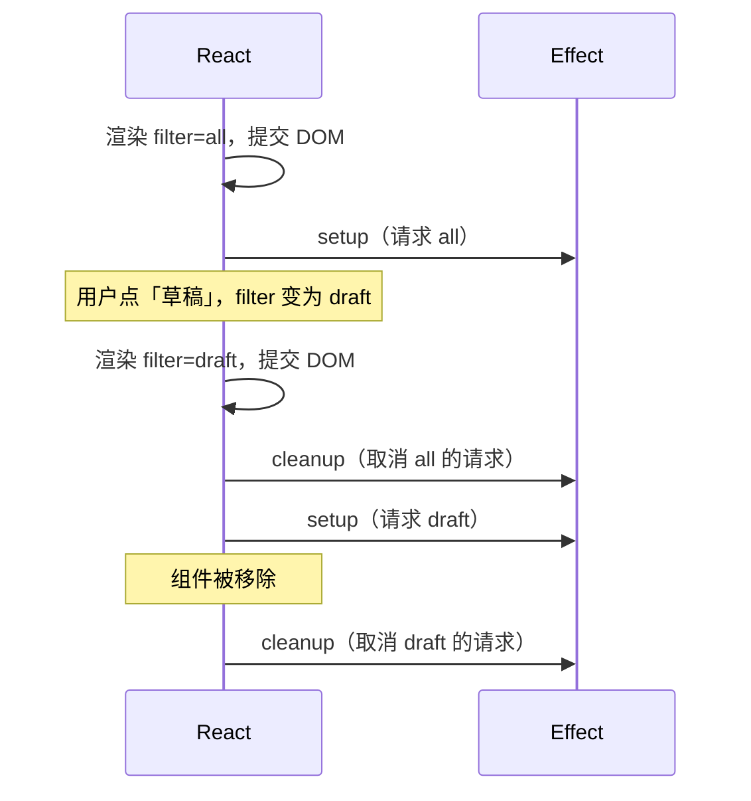
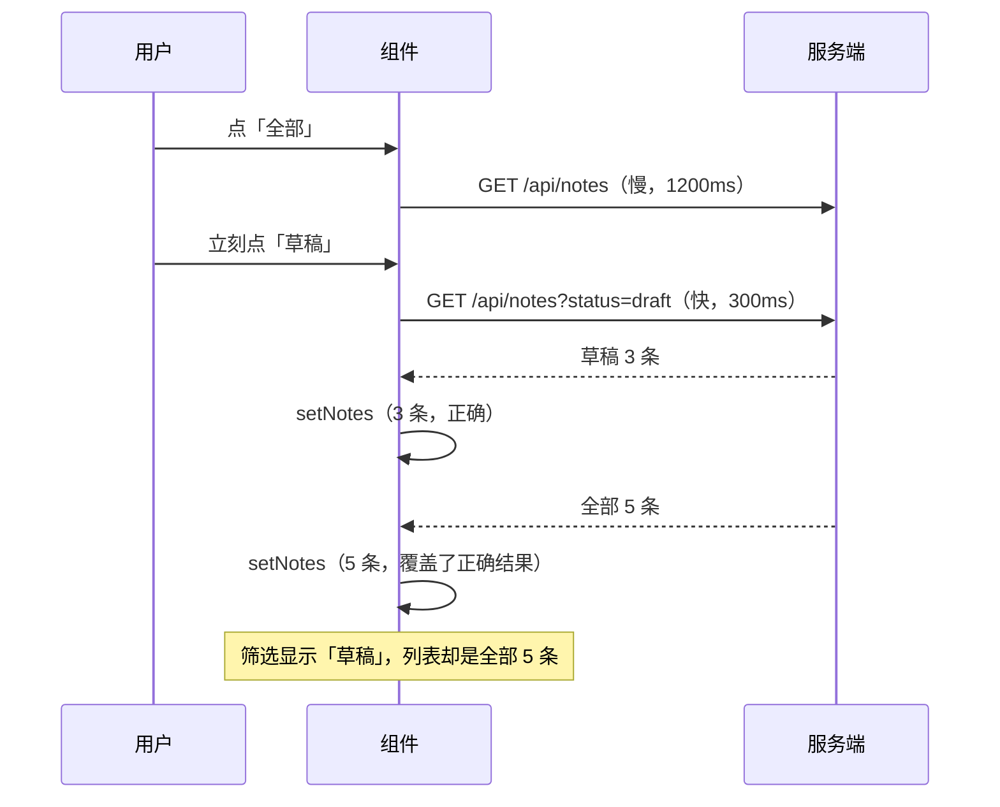
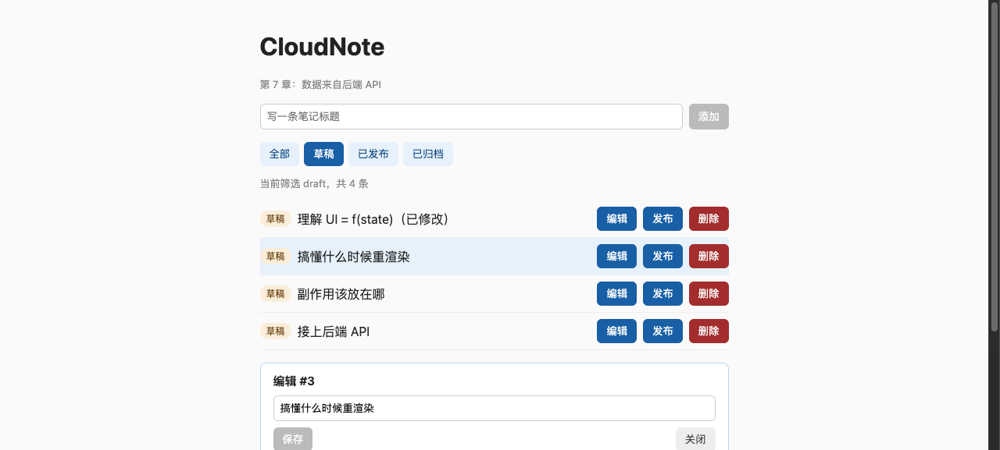
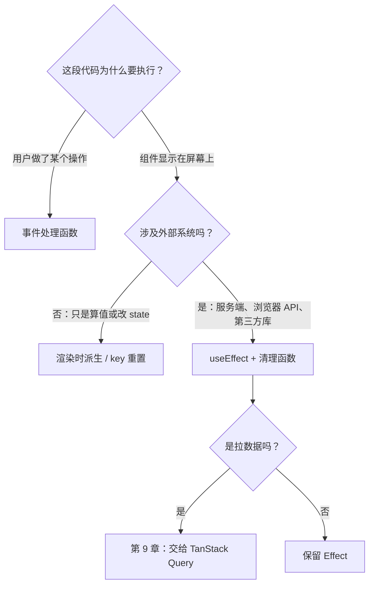

# 第 7 章　副作用：你可能不需要 useEffect

> **本章导读**
>
> - 建议用时：150 分钟（阅读 60 分钟 + 实战 90 分钟）
> - 前置知识：第 3 章（Promise、AbortSignal）、第 4 章（Zod、后端 API）、第 5-6 章（组件是纯函数、state 是快照）
> - 读完你能回答：
>   1. 组件必须是纯函数，那发请求、改标题这种「副作用」该放哪？
>   2. `useEffect` 的 setup、cleanup、依赖数组分别在什么时候起作用？
>   3. 快速切换筛选时，为什么列表会显示错的数据？清理函数怎么解决它？
>   4. 哪些场景 AI 和老代码爱用 Effect，其实根本不需要？

---

## 【积木 7-1】副作用放在哪：两个合法位置

第 5 章立过规矩：组件函数体必须是纯的，不能发请求、不能改外部变量。但应用总得和外界打交道——拉数据、写数据、改页面标题、连 WebSocket。这些和「根据 state 算出 JSX」无关的事，统称**副作用**（side effect）。

React 里副作用只有两个合法位置：

| 位置 | 由什么引起 | 例子 |
|---|---|---|
| **事件处理函数** | 用户的某个具体操作 | 点「添加」发 POST、点「删除」发 DELETE、提交表单 |
| **Effect**（`useEffect`） | 组件**显示在屏幕上**这件事本身 | 页面一打开就要拉列表、标签页标题要跟着条数变、进入聊天页就要连上 WebSocket |

判断方法只有一个问题：**这件事是因为用户「做了什么」才发生的，还是因为组件「在这里」就要发生？**

- 「用户点了保存，所以要发 PATCH」→ 事件处理函数
- 「列表在屏幕上，所以它的数据要和服务端保持一致」→ Effect

React 官方对 Effect 的定义是：**让组件与外部系统保持同步**。外部系统指 React 管不到的东西：服务端、浏览器 API（`document.title`、`localStorage`、定时器）、第三方库。如果你要做的事不涉及任何外部系统，那它多半不该写成 Effect（积木 7-7）。

---

## 【积木 7-2】useEffect 的三个零件

```tsx
useEffect(() => {
  // ① setup：组件渲染到屏幕之后执行
  const controller = new AbortController()
  fetchNotes(filter, controller.signal).then(setNotes)

  // ② cleanup：下一次 setup 之前、或组件卸载时执行
  return () => controller.abort()
}, [filter]) // ③ 依赖数组：这些值变了，才重新执行 cleanup + setup
```



**时机**：Effect 在 DOM 提交**之后**才运行（第 6 章的三阶段之后），所以它不会阻塞首屏绘制，但也意味着第一次渲染时数据一定还没有——你必须处理「加载中」这个状态。

**依赖数组**的三种写法：

| 写法 | 什么时候重新执行 | 用途 |
|---|---|---|
| `[filter, version]` | 任一依赖变化（用 `Object.is` 比较） | 最常见 |
| `[]` | 只在挂载时执行一次，卸载时清理 | 只依赖常量的同步 |
| 不写 | **每次渲染都执行** | 几乎不用 |

依赖数组不是「你想让它什么时候跑」的开关，而是**如实声明 Effect 里用到了哪些会变的值**。Effect 里读了 `filter` 却不写进依赖，筛选变了它也不会重跑，读到的永远是旧值。`eslint-plugin-react-hooks` 的 `exhaustive-deps` 规则专门检查这个，第 18 章配置 lint 时会开启。

用 Go 类比：Effect 有点像带 `defer` 的 goroutine——启动时做事，`defer` 里收尾；依赖变化相当于 `cancel()` 掉旧的 context、再起一个新的。

---

## 【积木 7-3】接上后端：Vite 代理与 API 层

本章前端第一次连真实后端。后端是第 4 章 `server.ts` 的扩展版（`code/ch07-effects/server/server.ts`），新增了按状态筛选、DELETE，以及**人为延迟**：

| 请求 | 延迟 | 为什么 |
|---|---|---|
| `GET /api/notes`（全量） | 1200ms | 模拟慢查询，用来复现竞态 |
| `GET /api/notes?status=draft` | 300ms | 带筛选，走索引，很快 |

### 开发代理：让浏览器以为是同源

前端跑在 5173，后端跑在 3000。浏览器直接从 5173 的页面请求 3000，属于**跨域**，会被同源策略拦下（第 1 章练习 3 的伏笔，第 14 章细讲 CORS）。开发阶段最省事的办法是让 Vite 当一层反向代理：

```ts
// vite.config.ts
server: {
  proxy: { '/api': 'http://localhost:3000' },
}
```

浏览器请求 `http://localhost:5173/api/notes`，Vite 在服务端把它转发给 3000，再把响应原样带回。浏览器眼里始终是同源请求。这和你在 Nginx 里写 `location /api { proxy_pass ...; }` 是一回事，上线时也正是这么部署的（第 17 章）。

### API 层：组件不直接写 fetch

```ts
// src/api.ts
const NoteListSchema = z.object({ records: z.array(NoteSchema), total: z.number() })

export async function fetchNotes(status: StatusFilter, signal?: AbortSignal): Promise<Note[]> {
  const query = status === 'all' ? '' : `?status=${status}`
  const data = await request(`/api/notes${query}`, { signal })
  return NoteListSchema.parse(data).records
}
```

三个要点：

1. **集中**：URL 拼接、请求头、错误转换都在一个地方，组件只调 `fetchNotes(filter)`。
2. **响应也要校验**：第 4 章说过所有外部数据都该过 schema。接口响应同样是外部数据——后端改了字段名，这里立刻报错，而不是渲染出一堆 `undefined`。
3. **前后端共用 schema**：`NoteSchema` 直接从 `../server/schema.ts` 导入，同一份规则两边用。第 13 章 Next.js 会把这件事做得更彻底。

`fetch` 有一个后端同学常踩的坑：**HTTP 404、500 不会让 fetch 抛异常**，只有网络断了才抛。所以 `request` 里要自己检查 `res.ok` 并抛出 `ApiError`。

> 加了 Zod 后，构建产物从第 6 章的 223 KB 涨到 311 KB（gzip 96 KB）。对内部后台无所谓；对首屏敏感的页面，Zod 提供了体积更小的 `zod/mini`，第 12 章讨论包体积时再展开。

---

## 【积木 7-4】用 Effect 拉数据：三态缺一不可

```tsx
const [notes, setNotes] = useState<Note[]>([])
const [loading, setLoading] = useState(true)
const [error, setError] = useState('')

useEffect(() => {
  const controller = new AbortController()
  setLoading(true)
  setError('')

  fetchNotes(filter, controller.signal)
    .then((data) => {
      if (controller.signal.aborted) return
      setNotes(data)
      setLoading(false)
    })
    .catch((e: unknown) => {
      if (controller.signal.aborted) return
      setError(e instanceof Error ? e.message : String(e))
      setLoading(false)
    })

  return () => controller.abort()
}, [filter, version])
```

一个异步数据至少有三种状态：**加载中、成功、失败**。AI 生成的代码最常漏掉的就是后两种之外的那个——只写了成功分支，接口一慢页面就是一片空白，接口一挂就静默失败。第 1 章说的「后端同学最容易低估首尾两段」，指的就是这里。

几个细节：

- **为什么 Effect 的回调不直接写成 `async`？** `useEffect(async () => {...})` 会返回一个 Promise，而 React 要求返回值要么是清理函数、要么什么都没有。所以在内部调用异步函数，用 `.then` 或者在里面再定义一个 `async function` 调用它。
- **`version` 是什么？** 写操作成功后 `setVersion(v => v + 1)`，依赖变了，Effect 重跑，列表重新拉取。这是没有数据请求库时最朴素的「刷新」手段。
- **为什么判断 `aborted` 后直接 return？** 被取消的请求会以 `AbortError` 进入 catch，它不是真正的错误，不应该显示给用户；也不能 `setLoading(false)`，因为新的请求还在加载。

---

## 【积木 7-5】竞态：先发的请求后回来

这是本章最重要的一块。设想没有清理函数：



两个请求谁先回来，取决于网络和服务端，**不取决于谁先发出**。后回来的旧请求把新结果覆盖了，这就是**竞态**（race condition）。

本章实战的「竞态实验室」可以一键复现。下面是浏览器自动化实测的控制台日志：

**勾选「关闭清理函数」后**，点「全部」再立刻点「草稿」：

```
[effect] 开始请求 status=all
[effect] 开始请求 status=draft
[effect] 请求完成 status=draft，3 条
[effect] 请求完成 status=all，5 条
```

页面显示「当前筛选 draft，共 5 条」，列表里混着已发布和已归档的笔记——**bug 复现**。

**恢复清理函数后**，同样的操作：

```
[cleanup] 取消 status=published 的请求
[effect] 开始请求 status=all
[cleanup] 取消 status=all 的请求
[effect] 开始请求 status=draft
[effect] 请求完成 status=draft，3 条
```

切到「草稿」时，React 先调用上一次 Effect 的清理函数，`controller.abort()` 取消了「全部」的请求，它的结果再也不会被写进 state。页面正确显示「当前筛选 draft，共 3 条」。

### 一个高频误解：abort 会让服务端停下来吗？

不会。看后端日志，被取消的请求服务端照样收到、照样执行完了：

```
GET /api/notes
GET /api/notes?status=draft
```

`abort()` 只是让浏览器**不再等待**这个响应、断开连接。服务端那边，Node 能通过 `req.on('close')` 感知到客户端走了，Go 里则是 `r.Context().Done()` 被关闭——但前提是你的服务端代码主动检查了它。对后端同学来说这是熟悉的问题：**客户端取消不等于服务端回滚**。对读请求无所谓，对写请求（比如支付）就不能靠前端取消来保证不执行。

### 不能 abort 时怎么办

有些异步操作没有 `signal` 参数可传。那就用一个标志位，效果相同：

```tsx
useEffect(() => {
  let ignore = false
  loadSomething(id).then((data) => {
    if (!ignore) setData(data)
  })
  return () => { ignore = true }
}, [id])
```

清理函数不阻止请求，只是让过期的结果被忽略。

---

## 【积木 7-6】开发环境里 Effect 为什么跑两次

用 `pnpm dev` 打开页面，控制台是这样的（实测）：

```
[effect] 开始请求 status=all
[cleanup] 取消 status=all 的请求
[effect] 开始请求 status=all
[effect] 请求完成 status=all，5 条
```

后端也确实收到了两次 `GET /api/notes`。这是第 5 章讲过的 `StrictMode` 在起作用：开发环境下，React 会在组件挂载后**立刻模拟一次「卸载再挂载」**，也就是 setup → cleanup → setup。

它的目的是**检查你的清理函数写对没有**。如果清理函数正确，跑两次和跑一次的最终结果完全一样（第一次被取消了）；如果你忘了写清理函数，开发环境就会暴露出重复请求、重复订阅、重复连接这些问题——它们在生产环境里也会以其他形式出现（比如用户快速切换页面）。

**不要为了「只请求一次」去删 StrictMode，也不要用一个 `useRef` 标志位强行跳过第二次。** 正确做法是写好清理函数；如果觉得开发环境重复请求很烦，那正是第 9 章 TanStack Query 要解决的问题（它会自动去重）。生产构建里没有这个行为，本章 `pnpm preview` 下的日志都是一次。

---

## 【积木 7-7】你可能不需要 Effect

React 官方文档里最值得读的一篇叫《You Might Not Need an Effect》。核心观点是：**Effect 是和外部系统同步的逃生舱，不是「state 变了就做点什么」的通用钩子。** 很多 AI 生成的代码和老项目里的 Effect 都可以删掉，删掉后代码更短、bug 更少、渲染次数更少。

### 场景一：根据 state 计算另一个值

```tsx
// 不需要 Effect
const [visibleNotes, setVisibleNotes] = useState<Note[]>([])
useEffect(() => {
  setVisibleNotes(notes.filter((n) => n.status === filter))
}, [notes, filter])

// 直接在渲染时算
const visibleNotes = notes.filter((n) => n.status === filter)
```

Effect 版本会先用旧的 `visibleNotes` 渲染一次，Effect 执行后再渲染一次——多一次渲染，还有一帧显示错的数据。第 5 章的「能派生就不要存」，这里是它的反面教材。

### 场景二：响应用户操作

```tsx
// 不需要 Effect：用一个 state 当「信号」，Effect 去监听它
const [submitted, setSubmitted] = useState<string | null>(null)
useEffect(() => {
  if (submitted) createNote({ title: submitted })
}, [submitted])

// 直接在事件处理函数里做
async function handleAdd(title: string) {
  await createNote({ title })
  setVersion((v) => v + 1)
}
```

「用户点了添加」是一个事件，它对应的副作用就该写在事件处理函数里。经过 Effect 中转，你就失去了「为什么发这个请求」的上下文，还要处理信号重复、初始值等边界情况。本章所有写操作（新增、发布、删除、保存）都直接在事件处理函数里完成。

### 场景三：props 变化时重置内部 state

编辑器组件用 `note.title` 作为输入框的初始值。切换到另一条笔记时，输入框应该显示新笔记的标题：

```tsx
// 不需要 Effect
function NoteEditor({ note }: { note: Note }) {
  const [title, setTitle] = useState(note.title)
  useEffect(() => {
    setTitle(note.title)
  }, [note.id])
  ...
}

// 父组件给它一个 key
<NoteEditor key={selected.id} note={selected} ... />
```

第 5 章讲过：key 告诉 React「这是谁」。key 变了，React 认为这是一个全新的组件，丢掉旧的、重新创建，内部所有 state 自然回到初始值。不用 Effect、不会闪一帧旧标题，而且以后编辑器再加十个内部 state，也全部自动重置。

实测：编辑第一条笔记后，点第二条的「编辑」，输入框里是「搞懂什么时候重渲染」——第二条的标题，没有残留。

### 场景四：存了一份对象副本

```tsx
// 存对象：notes 刷新后，selected 还是旧的那份
const [selected, setSelected] = useState<Note | null>(null)

// 存 id，渲染时派生
const [selectedId, setSelectedId] = useState<number | null>(null)
const selected = notes.find((n) => n.id === selectedId)
```

存对象副本的版本，保存标题后列表刷新了，编辑器里却还是旧对象，于是又有人写一个 Effect 去「同步 selected」。存 id 就没有这个问题：数据只有一份，其余都是派生。

### 一张自查表

| 你想写的 Effect | 换成 |
|---|---|
| state A 变了，更新 state B | 渲染时直接计算 B |
| 计算很昂贵，想缓存 | 渲染时计算（React Compiler 会自动缓存，第 6 章） |
| 用户点了按钮，Effect 监听某个标志去发请求 | 在事件处理函数里直接发 |
| props 变了，重置组件内部 state | 父组件传 `key` |
| props 变了，调整部分 state | 渲染时派生，或存 id 不存对象 |
| 把数据通知给父组件 | 在事件处理函数里直接调用父组件的回调 |
| 组件显示时要和服务端 / 浏览器 API / 第三方库同步 | **这才是 Effect 该做的事** |

本章实战里只有两个 Effect，都在最后一行：拉列表（同步服务端数据）、改 `document.title`（同步浏览器 API）。

```tsx
useEffect(() => {
  document.title = loading ? 'CloudNote（加载中）' : `CloudNote（${notes.length}）`
}, [loading, notes.length])
```

---

## 【积木 7-8】手写数据拉取的代价

回头数一下，为了「拉一个列表」我们写了多少东西：三个 state（数据、加载、错误）、一个 AbortController、两处 aborted 判断、一个 `version` 计数器来触发刷新。而它还**缺了很多东西**：

| 缺什么 | 后果 |
|---|---|
| 缓存 | 从「草稿」切回「全部」，明明刚看过，还要重新等 1.2 秒 |
| 去重 | 两个组件都要这份列表，就发两次请求 |
| 后台刷新 | 别人在另一个标签页改了数据，这里不会更新 |
| 重试 | 网络抖一下就直接报错 |
| 乐观更新 | 点「发布」后要等请求往返完成，按钮才有反应 |
| 精确失效 | 改了一条笔记，只能整个列表重拉 |

每加一项，Effect 就复杂一倍。这正是 React 官方推荐「数据拉取用框架或专门的库」的原因。第 9 章会用 TanStack Query 替换掉本章的 Effect，上面这张表里的每一项它都内置了。

**那本章为什么还要手写？** 因为不亲手处理一次竞态和清理，你就看不懂 TanStack Query 在替你做什么，也没法判断 AI 生成的「useEffect + fetch」到底漏了哪几项。

---

## 【积木 7-9】实战：接上后端的笔记页

代码在 [`code/ch07-effects/`](../code/ch07-effects/)：

```
code/ch07-effects/
├── server/
│   ├── schema.ts           # 第 4 章的 Zod schema，前后端共用
│   └── server.ts           # 第 4 章服务端 + 筛选 + DELETE + 人为延迟
├── vite.config.ts          # /api 代理到 3000；默认开启 React Compiler
├── tsconfig.json           # src 与 server 共用
└── src/
    ├── api.ts              # fetchNotes / createNote / updateNote / deleteNote，响应过 Zod
    ├── types.ts            # 从 server/schema.ts 复用类型
    ├── App.tsx             # 两个 Effect + 写操作在事件处理函数里 + 竞态实验室
    └── components/
        ├── NoteEditor.tsx  # 用 key 重置的编辑器
        ├── NoteList.tsx
        ├── NoteForm.tsx
        └── StatusFilterBar.tsx
```

需要开两个终端：

```bash
cd code/ch07-effects
pnpm install

# 终端 1：后端
pnpm api
# CloudNote API 已启动：http://localhost:3000

# 终端 2：前端
pnpm dev
# ➜  Local:   http://localhost:5173/
```

打开浏览器的 Network 面板和 Console 面板，对照下表操作。下表是用生产构建（`pnpm build && pnpm preview`）加浏览器自动化实测的结果：

| 操作 | 结果 |
|---|---|
| 打开页面，等 1.2 秒 | 「当前筛选 all，共 5 条」 |
| 点「已发布」，再快速点「全部」→「草稿」 | 「当前筛选 draft，共 3 条」，控制台有两条 `[cleanup] 取消` |
| 勾选「关闭清理函数」，快速点「全部」→「草稿」 | 「当前筛选 draft，**共 5 条**」，列表混入已发布、已归档——竞态 bug |
| 取消勾选，新增「接上后端 API」 | 「当前筛选 draft，共 4 条」，后端日志 `POST` 后紧跟一次 `GET` |
| 编辑第一条标题并保存 | 列表首行变为新标题，后端日志 `PATCH /api/notes/2` |
| 再点第二条的「编辑」 | 输入框显示第二条的标题，没有残留 |
| 浏览器标签页标题 | `CloudNote（4）` |



### 动手练习

| 练习 | 操作 | 预期结果 |
|---|---|---|
| 1 | 把拉列表 Effect 的依赖数组改成 `[]` | 点筛选按钮，列表不再变化：Effect 读的永远是首次渲染时的 `filter` |
| 2 | 删掉 `return () => controller.abort()` 和两处 `aborted` 判断 | 和勾选实验室开关一样，可以复现竞态 |
| 3 | 删掉 `<NoteEditor key={selected.id} ...>` 里的 key | 先编辑第一条，再点第二条，输入框还是第一条的标题 |
| 4 | 把练习 3 用 `useEffect(() => setTitle(note.title), [note.id])` 修好，然后对比 key 方案 | 能修好，但切换时会多渲染一次；再给编辑器加个「展开详情」state，看谁需要额外改代码 |
| 5 | 关掉后端（终端 1 按 Ctrl+C），刷新页面 | 显示「出错了：...」而不是一直「加载中」。读一下 `api.ts`，找出错误信息是在哪一层生成的 |
| 6 | 让后端 `GET /api/notes` 返回的 `records` 改名为 `items` | 前端报 Zod 校验错误，而不是渲染出空列表 |
| 7 | 用 `pnpm dev` 打开，看 Network 面板 | 首屏有两次 `/api/notes`，第一次状态是 canceled（StrictMode，积木 7-6） |
| 8 | （可用 AI）让 AI 写一个「按标题搜索，输入停止 300ms 后再请求」的功能，然后审查 | 检查三点：有没有清理定时器、有没有取消旧请求、有没有把搜索结果存成冗余 state |

练习 8 是典型的「AI 很容易写出能跑但有竞态」的需求：防抖定时器和请求取消要在同一个清理函数里处理。

---

## 【本章小结】

三句话：

1. 副作用只有两个位置：**用户操作引起的放事件处理函数，组件显示引起的放 Effect**；Effect 的本质是与外部系统同步，setup 在提交后运行，cleanup 在下次 setup 前或卸载时运行，依赖数组要如实声明。
2. 异步拉数据必须处理**加载、成功、失败**三态，并用清理函数（`AbortController` 或 `ignore` 标志）防止**竞态**；开发环境 Effect 跑两次是在检查你的清理函数。
3. **大部分 Effect 都不需要**：派生值渲染时算、事件副作用写在事件处理函数里、重置 state 用 key、存 id 不存对象；手写数据拉取缺缓存、去重、重试等能力，第 9 章交给 TanStack Query。



**自测题：**

1. 「点保存后发 PATCH」和「列表显示后拉数据」分别放在哪？判断依据是什么？（积木 7-1）
2. Effect 的 setup 和 cleanup 分别在什么时候执行？依赖数组写 `[]` 和不写有什么区别？（积木 7-2）
3. Vite 的 `server.proxy` 解决了什么问题？它和 Nginx 的什么配置等价？（积木 7-3）
4. `fetch` 遇到 HTTP 500 会抛异常吗？API 层应该怎么处理？（积木 7-3）
5. 为什么不能写 `useEffect(async () => {...})`？（积木 7-4）
6. 用自己的话描述一次竞态：什么条件下发生？清理函数怎么阻止它？（积木 7-5）
7. 前端 `abort()` 之后，服务端会停止处理这个请求吗？这对写接口意味着什么？（积木 7-5）
8. 开发环境下 Effect 执行两次，应该怎么应对？（积木 7-6）
9. 切换笔记时重置编辑器的输入框，为什么 key 比 Effect 更好？（积木 7-7）
10. 手写的 `useEffect + fetch` 缺了哪些能力？至少说出四项。（积木 7-8）

---

## 【下一章预告】

第 8 章《组件设计：组合、受控表单、自定义 Hook》。本章的 `App` 已经变胖了：七个 state、两个 Effect、一个 mutate 函数全挤在一起。下一章学习怎么拆：把拉列表的逻辑抽成自定义 Hook `useNotes(filter)`（Hook 就是「可以调用其它 Hook 的函数」）；用 `children` 组合组件，而不是不断加 props；把表单做成完全受控，接上第 4 章 Zod 的 `fieldErrors` 显示字段级错误；以及用 Context 把「当前用户」这类全局数据传下去，同时避免它让整棵树重渲染。

*学完本章，回到对话里说一句「继续」，我就开讲第 8 章。*
