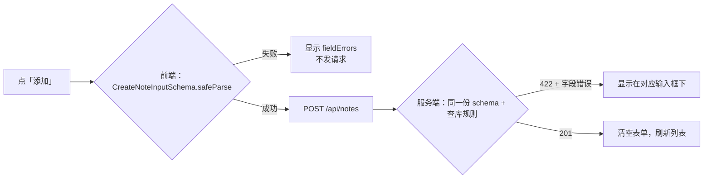
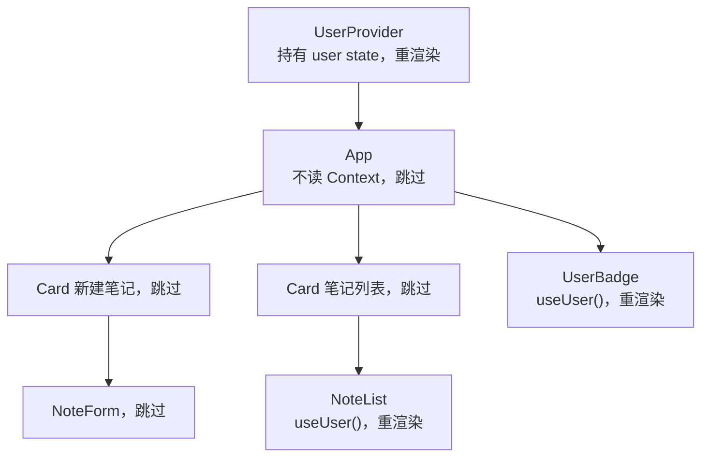
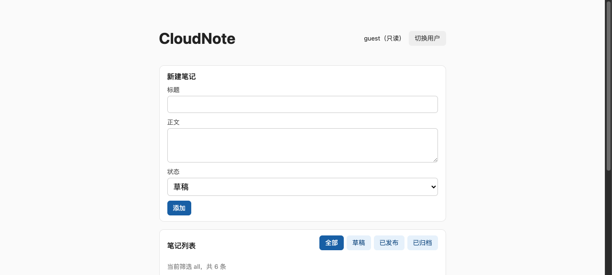
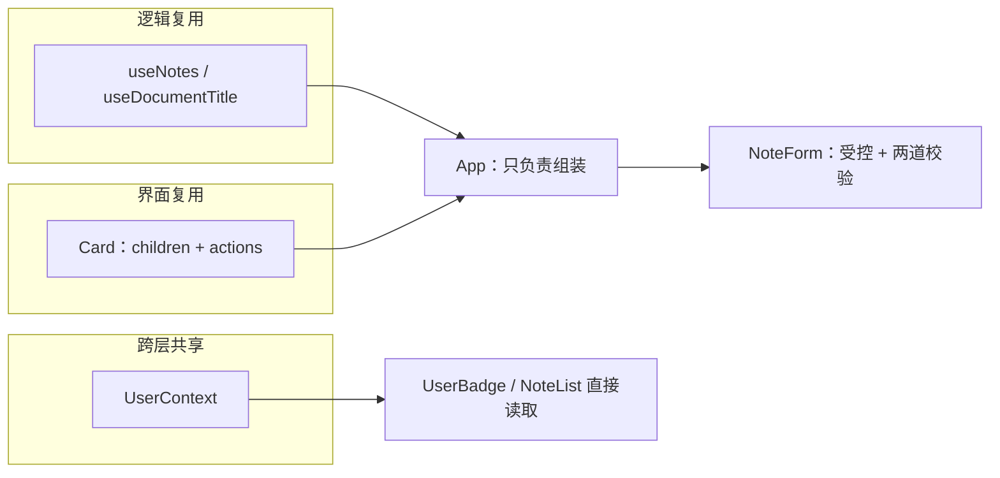

# 第 8 章　组件设计：组合、受控表单、自定义 Hook

> **本章导读**
>
> - 建议用时：150 分钟（阅读 60 分钟 + 实战 90 分钟）
> - 前置知识：第 4 章（Zod、fieldErrors）、第 6 章（父渲染子跟随）、第 7 章（Effect 拉数据、API 层）
> - 读完你能回答：
>   1. 组件太胖了，按什么原则拆？「逻辑」和「界面」分别怎么复用？
>   2. 自定义 Hook 是什么？两个组件调用同一个 Hook，会共享数据吗？
>   3. 为什么推荐用 `children` 组合，而不是不停地给组件加 props？
>   4. 受控表单怎么同时显示前端校验错误和服务端返回的字段错误？
>   5. Context 适合放什么？怎么避免它让整棵树重渲染？

---

## 【积木 8-1】胖组件的病根：一个函数干了四件事

第 7 章结束时，`App` 长这样：7 个 state、2 个 Effect、1 个 mutate 函数、一大段 JSX，外加竞态实验室。它同时负责：

| 职责 | 第 7 章的写法 |
|---|---|
| 拉数据（异步逻辑） | 3 个 state + AbortController + Effect，直接写在 App 里 |
| 处理写操作 | mutate 函数 |
| 页面布局与样式 | 一层层 `<section className="...">` |
| 表单输入与校验 | `NoteForm` 只有一个输入框，没有字段级错误 |

后端同学对这个问题不陌生：一个 2000 行的 handler 里既查库、又拼业务规则、又格式化响应。解法也一样——**按职责拆，每块只做一件事**。React 里对应三种拆法：

| 想复用的东西 | 工具 | 本章例子 |
|---|---|---|
| **有状态的逻辑**（state + Effect） | 自定义 Hook | `useNotes(filter)`、`useDocumentTitle(title)` |
| **界面结构**（外框、布局） | 组件 + `children` 组合 | `Card` |
| **跨层级共享的数据** | Context | `UserContext`（当前用户） |

拆完之后，`App` 的职责只剩一件：把这些零件拼起来。

---

## 【积木 8-2】自定义 Hook：复用逻辑，而不是复用数据

**Hook** 就是以 `use` 开头的函数，`useState`、`useEffect` 是 React 内置的 Hook。**自定义 Hook** 是你自己写的、内部调用了其它 Hook 的普通函数。

把第 7 章 App 里拉列表的那一坨原样剪切出来，就是一个自定义 Hook：

```ts
// src/hooks/useNotes.ts
export function useNotes(filter: StatusFilter) {
  const [notes, setNotes] = useState<Note[]>([])
  const [loading, setLoading] = useState(true)
  const [error, setError] = useState('')
  const [version, setVersion] = useState(0)

  useEffect(() => {
    const controller = new AbortController()
    // ……和第 7 章一字不差……
    return () => controller.abort()
  }, [filter, version])

  return { notes, loading, error, refresh: () => setVersion((v) => v + 1) }
}
```

```tsx
// App.tsx：7 行变 1 行
const { notes, loading, error, refresh } = useNotes(filter)
```

对后端同学，最贴切的类比是**把一段逻辑抽成函数并定义好返回值**：调用方只看到 `notes / loading / error / refresh` 这个「接口」，看不到 `version` 计数器和 `AbortController` 这些实现细节。第 9 章换成 TanStack Query 时，只要改 `useNotes` 内部，`App` 一行不动。

### 一个高频误解：两个组件调用同一个 Hook，会共享 state 吗？

**不会。** 每次调用 `useNotes`，都会创建一套全新、独立的 state 和 Effect。两个组件各调一次，就是两套数据、发两次请求。Hook 复用的是「怎么管理状态」这段**逻辑**，不是状态本身。想共享同一份数据，要么把 state 提升到公共祖先再通过 props / Context 传下去，要么用第 9 章 TanStack Query 那种组件外的缓存。

### Hook 的两条规则

| 规则 | 原因 |
|---|---|
| 只在组件或其它 Hook 的**顶层**调用，不放进 if、循环、提前 return 之后 | React 靠「调用顺序」把每次渲染的 Hook 和上一次对上号。顺序一变，state 就串了 |
| 只在 React 函数组件或自定义 Hook 里调用，不在普通函数里调用 | 普通函数没有「组件实例」，Hook 无处存放状态 |

命名必须以 `use` 开头，lint 和 React Compiler 都靠这个前缀识别 Hook 并检查规则。唯一的例外是 React 19 的 `use()`，它允许写在条件里（积木 8-6）。

最小的自定义 Hook 可以只有几行：

```ts
export function useDocumentTitle(title: string): void {
  useEffect(() => {
    document.title = title
  }, [title])
}
```

---

## 【积木 8-3】组合：用 children 代替无穷的 props

页面上好几块区域都有同样的外框：圆角、边框、标题栏、右侧可能有操作按钮。最直觉的写法是做一个「万能」组件，需要什么就加一个 prop：

```tsx
// 反例：props 越加越多
<Panel title="笔记列表" showFilter filterValue={filter} onFilterChange={setFilter}
       showError error={error} notes={notes} onDelete={...} ... />
```

每加一个场景，`Panel` 就多几个 prop 和几个 if。更好的办法是**让外框只管外框，里面放什么由调用方决定**：

```tsx
// src/components/Card.tsx
type CardProps = {
  title: ReactNode
  actions?: ReactNode
  children: ReactNode
}

export function Card({ title, actions, children }: CardProps) {
  return (
    <section className="card">
      <header className="card-header">
        <h2>{title}</h2>
        {actions}
      </header>
      {children}
    </section>
  )
}
```

```tsx
// App.tsx
<Card title="新建笔记">
  <NoteForm onCreate={handleCreate} />
</Card>

<Card title="笔记列表" actions={<StatusFilterBar value={filter} onChange={setFilter} />}>
  <p data-testid="status">...</p>
  <NoteList ... />
</Card>
```

| 概念 | 说明 |
|---|---|
| `children` | 写在 `<Card>` 和 `</Card>` 之间的内容，React 自动作为名为 `children` 的 prop 传入 |
| 具名插槽 | `title`、`actions` 也是 `ReactNode` 类型的普通 prop，可以塞任何 JSX |
| `ReactNode` | 「能被渲染的东西」：JSX、字符串、数字、null、数组 |

`Card` 对 `NoteForm`、`StatusFilterBar` 一无所知，所以它永远不用改。这正是 Go 里「小接口 + 组合优于继承」的思路——React 没有组件继承，组合就是唯一的复用界面的方式。第 10 章的 shadcn/ui 组件库几乎全部是这种风格（`<Card><CardHeader>...</CardHeader><CardContent>...</CardContent></Card>`）。

漏写 children，tsc 会提醒：

```
error TS2741: Property 'children' is missing in type '{ title: string; }' but required in type 'CardProps'.
```

### 组合还能解决「props 层层透传」

如果数据只是要穿过中间几层组件才被用到（中间层自己不用），先试试组合：在最上层就把用数据的组件建好，作为 children 传下去，中间层只负责摆放。这样中间层根本不需要知道这份数据。只有组合解决不了时，才考虑 Context（积木 8-6）。

---

## 【积木 8-4】受控表单：输入框只是 state 的投影

第 5 章的 `NoteForm` 只有一个输入框。本章把它扩展成标题、正文、状态三个字段的完整表单：

```tsx
type FormValues = Required<CreateNoteInput>
const EMPTY: FormValues = { title: '', content: '', status: 'draft' }

const [values, setValues] = useState<FormValues>(EMPTY)

<input id="note-title" value={values.title} onChange={(e) => update('title', e.target.value)} />
```

**受控**（controlled）的意思是：输入框显示什么，完全由 state 决定；用户每敲一个字，`onChange` 把新值写回 state，React 再用新 state 渲染输入框。输入框本身不保存任何东西，它只是 state 的投影。

| | 受控 | 非受控 |
|---|---|---|
| 值存在哪 | React state | DOM 自己 |
| 怎么读值 | 直接读 state | 提交时从 DOM 或 `FormData` 里取 |
| 能实时校验、联动、格式化吗 | 能 | 不方便 |
| 写法 | `value` + `onChange` | `defaultValue`，或什么都不写 |

需要实时清除错误、字段联动、提交前校验的业务表单，用受控。第 13 章讲 Server Actions 时会看到非受控表单 + `FormData` 的写法，那是另一种合理选择。

### 两个 TS 细节

**一、`Required<CreateNoteInput>`。** 第 4 章讲过，`z.input` 里 `content`、`status` 是可选的（因为 schema 有 default）。但表单里每个字段都必须有值，否则输入框会从「非受控」跳到「受控」并报警告。用第 3 章的工具类型 `Required` 套一层，类型就和表单的真实需求对上了。

**二、用 keyof 泛型写一个通用的 update：**

```ts
function update<K extends keyof FormValues>(key: K, value: FormValues[K]) {
  setValues((v) => ({ ...v, [key]: value }))
  setErrors((e) => ({ ...e, [key]: undefined })) // 用户一改，这个字段的旧错误就消失
}
```

这是第 3 章 `pluck` 的同款技巧：`key` 只能是字段名，`value` 的类型跟着 key 走。拼错字段名或者给 status 传任意字符串，都会被拦下：

```
error TS2345: Argument of type '"titel"' is not assignable to parameter of type '"content" | "status" | "title"'.
error TS2345: Argument of type 'string' is not assignable to parameter of type '"archived" | "draft" | "published"'.
```

`<select>` 的 `e.target.value` 类型是 `string`，所以代码里写了 `as FormValues['status']`。这是第 3 章说的「能证明才断言」：选项只来自 `NOTE_STATUSES`，用户选不出别的值。

---

## 【积木 8-5】两道校验：前端管体验，后端管安全

第 1 章就说过「前端校验只是体验，后端校验才是安全边界」，第 4 章说过「同一份 schema 两边用」。本章终于把它落地：



```tsx
async function handleSubmit(e: FormEvent<HTMLFormElement>) {
  e.preventDefault()
  // 第 1 道：前端校验
  const parsed = CreateNoteInputSchema.safeParse(values)
  if (!parsed.success) {
    setErrors(z.flattenError(parsed.error).fieldErrors)
    return
  }
  setSubmitting(true)
  try {
    await onCreate(parsed.data)
    setValues(EMPTY)
    setErrors({})
  } catch (err) {
    // 第 2 道：服务端校验
    if (err instanceof ApiError && err.fieldErrors) setErrors(err.fieldErrors)
    else setErrors({ title: [err instanceof Error ? err.message : String(err)] })
  } finally {
    setSubmitting(false)
  }
}
```

为什么前端已经校验过，服务端还要再来一遍？两个原因：

1. **任何人都能绕过前端直接调接口**（curl、改 JS、写脚本），服务端不能相信浏览器。
2. **有些规则只有服务端能判断**。本章后端加了一条「标题不能重复」，这需要查数据库，前端无从知道：

```ts
// server/server.ts
if (db.some((n) => n.title === parsed.data.title)) {
  return sendJson(res, 422, { error: { title: ['已有同名笔记'] } })
}
```

关键在于**错误格式统一**：服务端返回的 `{ title: ['已有同名笔记'] }` 和前端 `z.flattenError(...).fieldErrors` 是同一个形状。API 层把它包进 `ApiError.fieldErrors`，表单拿到后直接 `setErrors`，显示代码完全不用区分错误来自哪一道。

还有一处配合：`App` 的 `handleCreate` **不吞错误**，直接让它抛回 `NoteForm`。错误应该由最清楚怎么展示它的组件处理——表单知道哪个字段对应哪个输入框，App 不知道。

实测（服务端日志只有两次 POST）：

| 操作 | 结果 | 发请求了吗 |
|---|---|---|
| 什么都不填直接添加 | 标题下方显示「标题不能为空」 | 没有，被前端拦下 |
| 输入任意字符 | 错误立刻消失 | — |
| 标题填「学会 TypeScript 类型系统」 | 显示「已有同名笔记」 | 有，服务端返回 422 |
| 换一个新标题、填正文、选「已发布」 | 列表变成 6 条，表单清空 | 有，201 |

无障碍的小细节：出错的输入框带 `aria-invalid`，错误文字带 `role="alert"`，读屏软件会立刻念出来；`<label htmlFor>` 和 `<input id>` 配对，点标签就能聚焦输入框。这些也是第 15 章 Playwright 定位元素最稳的方式。

---

## 【积木 8-6】Context：跨层级共享，但别滥用

「当前登录用户」几乎每个地方都可能用到：顶栏显示名字、列表决定按钮能不能点、编辑器记录修改人。通过 props 一层层传下去，中间每层都得接收再转发（叫 prop drilling，props 透传）。Context 让任意深度的组件直接读取：

```tsx
// src/auth/UserContext.tsx
const UserContext = createContext<UserContextValue | null>(null)

export function UserProvider({ children }: { children: ReactNode }) {
  const [index, setIndex] = useState(0)
  const value = { user: USERS[index]!, switchUser: () => setIndex((i) => (i + 1) % USERS.length) }
  return <UserContext value={value}>{children}</UserContext>
}

export function useUser(): UserContextValue {
  const ctx = use(UserContext)
  if (!ctx) throw new Error('useUser 必须在 <UserProvider> 内部使用')
  return ctx
}
```

```tsx
// 任何深度的组件
const { user } = useUser()
const canEdit = user.role === 'admin'
```

React 19 的两处新写法：

| 旧写法 | React 19 | 说明 |
|---|---|---|
| `<UserContext.Provider value={...}>` | `<UserContext value={...}>` | 旧写法仍可用，未来会废弃 |
| `useContext(UserContext)` | `use(UserContext)` | `use` 可以写在 if 里，也能读 Promise（第 12 章） |

`createContext` 默认值给 `null`，再在 `useUser` 里检查，好处是：忘了包 Provider 时会立刻得到一个明确的报错，而不是静默拿到一个假用户。这和第 4 章「环境变量启动时校验」是同一个思路——**尽早失败**。

### Context 的代价：所有读它的组件都会重渲染

Context 的值一变，**所有调用了 `useUser()` 的组件都会重新渲染**，不管它们用的是值里的哪个字段。所以 Context 适合放**变化不频繁、用的地方很多**的数据：

| 适合放 Context | 不适合 |
|---|---|
| 当前用户、权限 | 输入框的值（每敲一个字全树重渲染） |
| 主题（亮色 / 暗色） | 列表数据（用 TanStack Query，第 9 章） |
| 语言、时区 | 只在两三层之间传递的数据（用 props 或组合） |

### 用 children 避免整棵树重渲染

`UserProvider` 自己持有 state，切换用户时它会重新渲染。按第 6 章的规则，「父组件渲染，子组件全部跟着」——那整个 App 岂不是都要重渲染？

关键在 `main.tsx` 的写法：

```tsx
<UserProvider>
  <App />
</UserProvider>
```

`<App />` 这个元素是在 `main.tsx` 里创建的，作为 `children` 传给 `UserProvider`。`UserProvider` 重新渲染时，它拿到的 `children` 还是**同一个对象**（main.tsx 没有重新执行），React 发现这棵子树没变，就跳过它，只去更新真正读了 Context 的组件。

实测切换用户时，控制台只有这三行：

```
[render] UserProvider
[render] UserBadge
[render] NoteList
```

`App`、`NoteForm`、`Card` 都没有重渲染。只有调用了 `useUser()` 的 `UserBadge` 和 `NoteList` 更新了。



反过来，如果把 `user` state 直接写在 `App` 里，再在 `App` 的 JSX 里包 Provider，那每次切换用户 `App` 自己就重渲染了，整棵子树跟着走。**把持有 state 的 Provider 单独做成组件、业务组件通过 children 传进去**，是写 Context 的标准姿势。

另外，`value` 对象每次渲染都是新建的，严格来说会让所有消费者都认为「值变了」。本章开着 React Compiler（第 6 章），它会自动缓存这个对象；没开 Compiler 的项目里，需要用 `useMemo` 包一下 value。

### 一个高频误解：前端禁用了按钮，就等于有了权限控制

```tsx
const canEdit = user.role === 'admin'
<button disabled={!canEdit}>删除</button>
```

切到 `guest` 后删除按钮变灰了，但只要在 DevTools 里改掉 `disabled` 属性，或者直接 `curl -X DELETE`，请求照样能发出去，本章的后端也照样会执行。**前端的权限判断只是体验，真正的权限必须在服务端检查**——和积木 8-5 的校验是同一个道理。第 14 章做真实登录时，后端会对每个写接口校验身份。

---

## 【积木 8-7】拆完之后：App 只剩组装

对比第 7 章和本章的 `App`：

| | 第 7 章 | 第 8 章 |
|---|---|---|
| state 数量 | 7 个 | 3 个（filter、actionError、selectedId） |
| Effect | 2 个，直接写在组件里 | 0 个（在 `useNotes`、`useDocumentTitle` 里） |
| 布局样式 | 手写 section 和 className | `Card` |
| 当前用户 | 无 | App 完全不碰，`UserBadge`、`NoteList` 自己读 Context |
| 表单 | 一个输入框，无字段错误 | 三个字段、两道校验、字段级错误 |

拆分的判断标准不是「行数多少」，而是这几个问题：

| 信号 | 动作 |
|---|---|
| 一组 state + Effect 一起出现、一起变化 | 抽成自定义 Hook |
| 同样的外框或布局重复出现 | 抽成接收 children 的组件 |
| 一个 prop 只是为了穿过中间层 | 先试组合，不行再用 Context |
| 一个组件里有两块互不相关的 state | 拆成两个组件，各管各的（state 放得低，第 6 章） |
| 错误要显示在哪里 | 交给最清楚怎么显示它的组件 |

**AI 生成的组件常见两个极端**：要么一个 500 行的组件包办一切，要么拆出一堆只有一行、只是转发 props 的「空壳组件」。用上面这张表去审，判断哪些该合、哪些该拆。

---

## 【积木 8-8】实战：拆分第 7 章的笔记页

代码在 [`code/ch08-component-design/`](../code/ch08-component-design/)，在第 7 章基础上改动：

```
code/ch08-component-design/
├── server/server.ts            # 新增：标题重复返回 422 字段错误
└── src/
    ├── api.ts                  # ApiError 新增 fieldErrors
    ├── main.tsx                # 用 UserProvider 包住 App
    ├── App.tsx                 # 只剩组装
    ├── hooks/
    │   ├── useNotes.ts         # 从第 7 章 App 抽出的拉列表逻辑
    │   └── useDocumentTitle.ts
    ├── auth/
    │   └── UserContext.tsx     # UserProvider + useUser
    └── components/
        ├── Card.tsx            # children + 具名插槽
        ├── NoteForm.tsx        # 受控表单 + 两道校验
        ├── UserBadge.tsx       # 读 Context，切换用户
        ├── NoteList.tsx        # 读 Context 决定按钮可用性
        ├── NoteEditor.tsx
        └── StatusFilterBar.tsx
```

运行方式和第 7 章相同：

```bash
cd code/ch08-component-design
pnpm install
pnpm api     # 终端 1：后端 3000
pnpm dev     # 终端 2：前端 5173
```

生产构建（318 KB，gzip 98 KB）+ 浏览器自动化实测：

| 操作 | 结果 |
|---|---|
| 打开页面 | 「当前筛选 all，共 5 条」，顶栏「lance（管理员）」 |
| 空表单点添加 | 「标题不能为空」，后端没有收到请求 |
| 输入任意字符 | 错误消失 |
| 提交重名标题 | 「已有同名笔记」（服务端 422） |
| 提交「拆分组件与自定义 Hook」，状态选已发布 | 「共 6 条」，末行徽标「已发布」，表单清空 |
| 点「切换用户」 | 顶栏「guest（只读）」，删除按钮变灰；控制台只有 UserProvider、UserBadge、NoteList 三行渲染日志 |



### 动手练习

| 练习 | 操作 | 预期结果 |
|---|---|---|
| 1 | 把 `NoteForm` 里的 `update('title', ...)` 改成 `update('titel', ...)` | `TS2345: Argument of type '"titel"' is not assignable to parameter of type '"content" \| "status" \| "title"'.` |
| 2 | 把正文输入框的 `update('content', ...)` 改成 `update('status', ...)` | `TS2345: Argument of type 'string' is not assignable to parameter of type '"archived" \| "draft" \| "published"'.` |
| 3 | 写一个不带内容的 `<Card title="新建笔记" />` | `TS2741: Property 'children' is missing ...` |
| 4 | 在 `main.tsx` 里去掉 `<UserProvider>` | 页面白屏，控制台报「useUser 必须在 &lt;UserProvider&gt; 内部使用」 |
| 5 | 把 `user` state 挪进 `App`，在 App 的 JSX 里包 `<UserContext value>`，切换用户看控制台 | App、NoteForm 等全部重渲染了，对比积木 8-6 |
| 6 | 页面上放两个都调用 `useNotes('all')` 的组件，看 Network 面板 | 发了两次请求：Hook 不共享数据（积木 8-2） |
| 7 | 给后端加一条规则：正文不能包含「TODO」，返回 `{ content: ['正文不能包含 TODO'] }` | 前端不改一行代码，错误就显示在正文输入框下 |
| 8 | 切到 guest 后，用 curl 删一条笔记 | 删除成功——前端禁用按钮不是权限控制（积木 8-6） |
| 9 | （可用 AI）让 AI 给表单加「标题最多 100 字，实时显示剩余字数」，然后审查 | 剩余字数应该在渲染时由 `values.title.length` 派生，而不是新增 state + Effect |

练习 7 最能体现「统一错误格式」的价值；练习 8 请务必亲手做一次。

---

## 【本章小结】

三句话：

1. 按职责拆胖组件：**有状态的逻辑抽成自定义 Hook**（复用逻辑，不共享数据），**界面结构用 children 组合**（外框不关心内容），**跨层级数据用 Context**。
2. **受控表单**让输入框成为 state 的投影；同一份 Zod schema 做前端校验，服务端返回同样形状的 fieldErrors，两道校验共用一套显示逻辑，前端管体验、后端管安全。
3. Context 一变，所有消费者都重渲染，只放变化少、用处多的数据；**持有 state 的 Provider 单独成组件、业务组件作为 children 传入**，就能只更新真正读了它的组件；前端权限判断不等于权限控制。



**自测题：**

1. 胖组件通常混了哪几类职责？分别用什么工具拆？（积木 8-1）
2. 两个组件都调用 `useNotes('all')`，会共享同一份数据吗？会发几次请求？（积木 8-2）
3. 为什么 Hook 不能写在 if 里？（积木 8-2）
4. `children` 是什么？用它组合比给组件加 props 好在哪？（积木 8-3）
5. 受控和非受控输入框的区别是什么？为什么表单的值类型要用 `Required<...>`？（积木 8-4）
6. 前端已经用 Zod 校验了，服务端为什么还要校验？举一个只有服务端能判断的规则。（积木 8-5）
7. 为什么 `App.handleCreate` 不捕获错误，而是交给 `NoteForm` 处理？（积木 8-5）
8. Context 适合放什么、不适合放什么？（积木 8-6）
9. 切换用户时，为什么 `App` 没有重渲染？如果把 user state 写在 App 里会怎样？（积木 8-6）
10. guest 用户的删除按钮已经禁用了，系统就安全了吗？（积木 8-6）

---

## 【下一章预告】

第 9 章《服务端状态：TanStack Query 与缓存失效》。第 7 章积木 7-8 列了一张「手写数据拉取缺什么」的表：缓存、去重、后台刷新、重试、乐观更新、精确失效。下一章用 TanStack Query 一次补齐——只改 `useNotes` 内部，App 一行不动（这就是本章抽 Hook 的回报）。你会看到从「草稿」切回「全部」时列表瞬间出现、点「发布」后按钮立刻变化（乐观更新，失败自动回滚）、两个组件读同一份数据只发一次请求。从这一章起也正式允许 AI 生成初版代码，我们会给出一份审查数据请求代码的 prompt。

*学完本章，回到对话里说一句「继续」，我就开讲第 9 章。*
