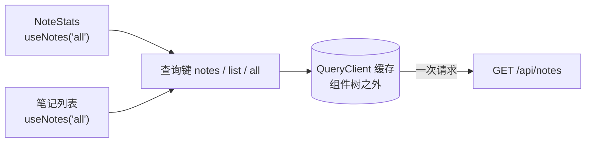
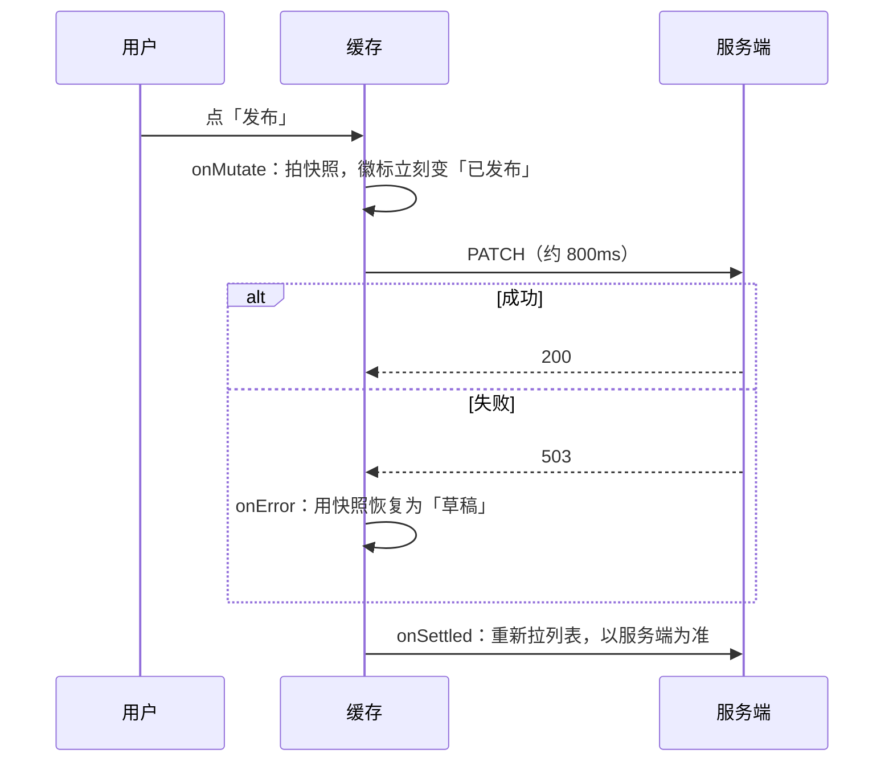
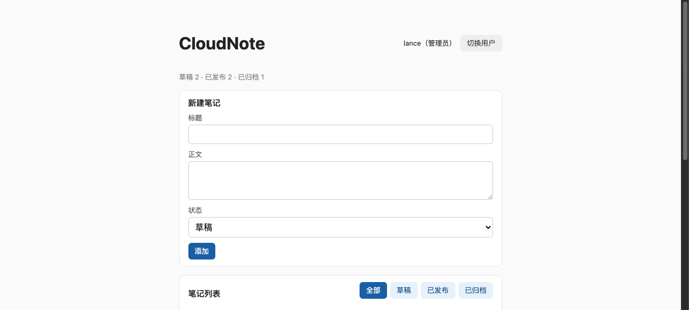
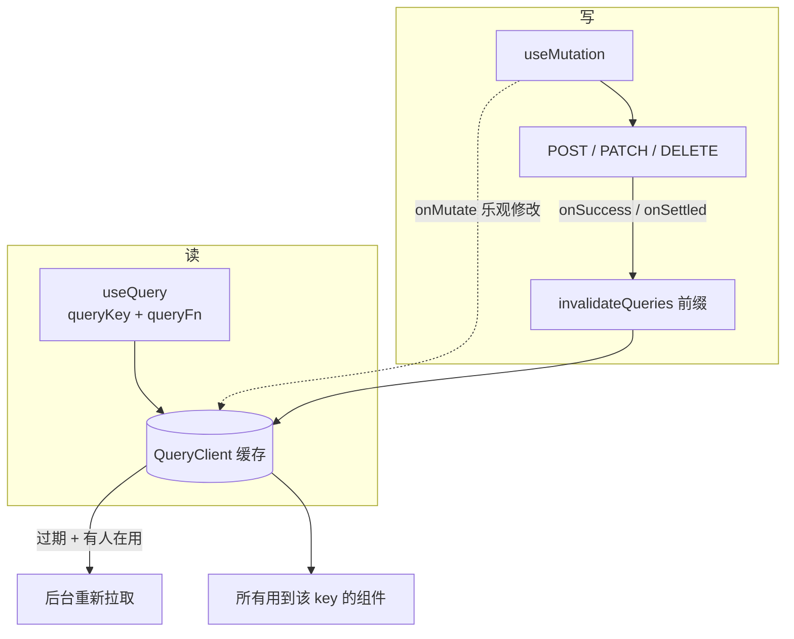

# 第 9 章　服务端状态：TanStack Query 与缓存失效

> **本章导读**
>
> - 建议用时：150 分钟（阅读 60 分钟 + 实战 90 分钟）
> - 前置知识：第 7 章（手写 Effect 拉数据、竞态、积木 7-8 的「缺什么」清单）、第 8 章（useNotes 自定义 Hook）
> - 读完你能回答：
>   1. 「服务端状态」和普通的 React state 有什么本质区别？
>   2. 查询键是什么？为什么说它是缓存的主键？
>   3. 写操作成功后，怎么让相关的列表自动刷新？
>   4. 乐观更新是什么？失败了怎么回滚？
>   5. 从这一章起可以让 AI 写初版代码，审查数据请求代码时该看哪几点？

---

## 【积木 9-1】服务端状态不是你的状态

第 6 章的决策图里有一个分支：「数据来自服务端吗？是 → 服务端状态（第 9 章）」。为什么要单独对待它？

| | 客户端状态 | 服务端状态 |
|---|---|---|
| 例子 | 输入框草稿、弹窗开关、当前筛选 | 笔记列表、用户资料、订单 |
| 真正的主人 | 浏览器里的你 | **数据库** |
| 你手里的是 | 原件 | **一份可能已经过时的副本** |
| 别人能改吗 | 不能 | 能（别的用户、别的标签页、后台任务） |
| 要关心的问题 | 放在哪 | 何时拉取、缓存多久、何时作废、失败重试、并发写冲突 |

后端同学对右边那一列应该很熟悉——这就是**缓存**问题：Redis 里的数据什么时候过期、写库之后要不要删缓存、缓存击穿怎么办。浏览器里的服务端数据本质上就是一层前端缓存，第 7 章用 `useState` 去存它，相当于自己手写了一个没有过期策略、没有失效机制的缓存。

**TanStack Query**（原名 React Query）就是一个专门管理这层缓存的库。它不是状态管理库，它是**异步数据的缓存库**。本章用的版本是 5.104（2026-10 实测）。

---

## 【积木 9-2】接入：只改 useNotes 的内部

第 8 章把拉列表的逻辑抽成了 `useNotes`，现在收回报：

```ts
// src/hooks/useNotes.ts（第 9 章）
export function useNotes(filter: StatusFilter) {
  const queryClient = useQueryClient()
  const query = useQuery({
    queryKey: noteKeys.list(filter),
    queryFn: ({ signal }) => fetchNotes(filter, signal),
  })

  return {
    notes: query.data ?? [],
    loading: query.isPending,
    fetching: query.isFetching,
    error: query.error?.message ?? '',
    refresh: () => queryClient.invalidateQueries({ queryKey: noteKeys.all }),
  }
}
```

对比第 8 章：4 个 `useState`、1 个 `useEffect`、`AbortController`、两处 `aborted` 判断，全部消失了。返回值的形状没变，所以第一步改完时我做了一个验证：

```bash
diff -q code/ch09-server-state/src/App.tsx code/ch08-component-design/src/App.tsx
# （无输出）App.tsx 与第 8 章完全相同
```

App 一行没动，页面照常工作。这就是第 8 章说的「Hook 的返回值就是它的接口」。

还需要在入口包一层 Provider：

```tsx
// src/main.tsx
<QueryClientProvider client={queryClient}>
  <UserProvider>
    <App />
  </UserProvider>
</QueryClientProvider>
```

```ts
// src/lib/queryClient.ts
export const queryClient = new QueryClient({
  defaultOptions: { queries: { staleTime: 0, retry: 1 } },
})
```

`QueryClient` 是缓存本体，**住在组件树之外**。`QueryClientProvider` 只是用第 8 章讲过的 Context 把它传给所有组件。这一点很关键：缓存不属于任何组件，组件卸载了缓存还在，所以才能做到切回来瞬间显示。

`queryFn` 收到的 `signal` 就是第 3、7 章的 AbortSignal：查询键变化或组件卸载时，TanStack Query 自动 abort 旧请求。**第 7 章花一整节处理的竞态，这里一行都不用写。**

---

## 【积木 9-3】查询键：缓存的主键

```ts
// src/hooks/queryKeys.ts
export const noteKeys = {
  all: ['notes'] as const,
  list: (filter: StatusFilter) => ['notes', 'list', filter] as const,
}
```

`queryKey` 是一个数组，TanStack Query 用它的内容（深比较，不是引用）作为缓存的键。相当于 Redis 的 key：

| 查询键 | 等价于 Redis 里 | 缓存的内容 |
|---|---|---|
| `['notes', 'list', 'all']` | `notes:list:all` | 全部笔记 |
| `['notes', 'list', 'draft']` | `notes:list:draft` | 草稿 |
| `['notes']` | `notes:*` 这个前缀 | 用来批量失效（积木 9-5） |

规则只有一条：**`queryFn` 用到的每个变量都要出现在 key 里**。`fetchNotes(filter)` 用了 filter，key 里就必须有 filter。漏了的话，切换筛选时 key 没变，TanStack Query 认为「还是那份数据」，不会重新请求。这和第 7 章「依赖数组要如实声明」是同一件事。

用工厂函数集中定义 key，而不是在各处手写数组，原因是失效时要用前缀匹配，key 的结构必须全项目一致。

### 先给缓存，再后台刷新

实测（生产构建 + 浏览器自动化）：

| 时间点 | 操作 | 页面显示 |
|---|---|---|
| 首屏 | 打开页面 | 1.2 秒后「当前筛选 all，共 5 条」 |
| — | 点「草稿」，0.1 秒时 | 「加载中...」（draft 还没有缓存） |
| — | 点回「全部」，0.1 秒时 | **「当前筛选 all，共 5 条　后台刷新中」** |

第三行是第 7 章做不到的：「全部」的数据在缓存里，**立刻显示**，同时在后台重新请求一次，拿到新数据再无声替换。这个策略叫 **stale-while-revalidate**（先用旧的，同时去验证），HTTP 缓存头里也有同名指令。

两个状态字段要分清：

| 字段 | 含义 | 本例 |
|---|---|---|
| `isPending` | **还没有任何数据** | 首次进入「草稿」 |
| `isFetching` | **正在发请求**（有没有旧数据都算） | 切回「全部」时的后台刷新 |

所以 `loading` 用 `isPending`（显示骨架屏或「加载中」），`fetching` 用 `isFetching`（显示一个不打扰的小提示）。第 7 章只有一个 `loading`，切换筛选时整个列表都会闪成「加载中」。

### 两个时间参数

| 参数 | 默认值 | 含义 |
|---|---|---|
| `staleTime` | 0 | 数据多久之后算「过期」。过期的数据仍然会显示，但下次被用到时会触发后台刷新 |
| `gcTime` | 5 分钟 | 没有任何组件在用这份缓存后，多久把它从内存里删掉 |

默认 `staleTime: 0` 的意思是「每次用到都后台验证一下」，最保守也最安全。如果数据变化很少（比如字典、配置），可以设成 `60_000`，一分钟内反复切换都不发请求。这和后端设 Redis TTL 的权衡完全一样：越长越省、越可能读到旧数据。

---

## 【积木 9-4】去重：两个组件，一次请求

第 8 章积木 8-2 说过：「两个组件调用同一个 Hook，会各发一次请求」。本章加了一个统计栏组件，它也调用 `useNotes('all')`：

```tsx
// src/components/NoteStats.tsx
export function NoteStats() {
  const { notes, loading } = useNotes('all')
  ...
  return <p>草稿 3 · 已发布 1 · 已归档 1</p>
}
```

首屏时，统计栏和列表同时挂载，同时调用了 `useNotes('all')`。后端日志实测：

```
GET /api/notes
```

**只有一次。** 两次 `useQuery` 的 key 相同，TanStack Query 发现已经有一个同 key 的请求在飞，就让第二个直接等它的结果。之后两个组件读的是缓存里**同一份**数据，任何一处让它失效，两处一起更新。

所以第 8 章那句话要补全：**Hook 本身不共享数据，但 Hook 内部如果读的是组件外的缓存，调用方之间就共享了。** 这也是你不需要把笔记列表放进 Context 的原因（第 8 章积木 8-6 的表）。



---

## 【积木 9-5】写操作：useMutation + 失效

读用 `useQuery`，写用 `useMutation`：

```ts
// src/hooks/useNoteMutations.ts
export function useCreateNote() {
  return useMutation({
    mutationFn: (data: CreateNoteData) => createNote(data),
    onSuccess: (_note, _data, _result, context) =>
      context.client.invalidateQueries({ queryKey: noteKeys.all }),
  })
}
```

```tsx
// App.tsx
const createMutation = useCreateNote()
<NoteForm onCreate={async (data) => void (await createMutation.mutateAsync(data))} />
```

`invalidateQueries({ queryKey: ['notes'] })` 做的事：把所有以 `['notes']` 开头的缓存标记为过期，**其中当前有组件在用的立刻重新拉取**，没人用的等下次用到时再拉。实测新增一条笔记后，列表变成「共 6 条」，统计栏同时变成「草稿 3 · 已发布 2 · 已归档 1」——统计栏的代码完全不知道有新增这回事。

这和后端「写库之后删缓存」（Cache-Aside 模式）是同一个思路：**不去手动更新缓存里的数据，而是宣布它作废，让下一次读取去拿权威数据。** 简单、不会出错，代价是多一次请求。

| 第 7、8 章 | 第 9 章 |
|---|---|
| `setVersion(v => v + 1)` 触发 Effect 重跑 | `invalidateQueries` 按前缀失效 |
| 只能刷新「当前这个组件」的数据 | 所有用到相关 key 的组件一起刷新 |
| 自己维护 `actionError` | 每个 mutation 自带 `error`、`isPending` |

两种触发方式：

| 方法 | 返回 | 用在哪 |
|---|---|---|
| `mutate(vars)` | 不返回 Promise，错误进 `mutation.error` | 点按钮这类「发出去就不管」的操作 |
| `mutateAsync(vars)` | 返回 Promise，失败会抛出 | 调用方要自己处理结果，比如第 8 章的表单要把 422 显示成字段错误 |

回调的第 4 个参数 `context` 里有 `client`（就是 QueryClient），这是 TanStack Query v5 较新版本的签名（本章 5.104 实测）。旧教程里常见的写法是在组件里 `const queryClient = useQueryClient()` 再在闭包里用，效果一样。

---

## 【积木 9-6】乐观更新：先变，再确认

点「发布」到徽标变化，正常流程要等一次请求往返。本章后端给所有写操作加了 800ms 延迟（模拟真实网络），等待就很明显了。**乐观更新**的做法是：假设请求会成功，先改界面；请求真失败了再改回来。

```ts
export function useToggleNote() {
  return useMutation({
    mutationFn: (note: Note) => updateNote(note.id, { status: nextStatus(note) }),

    // ① 发请求之前：改缓存
    onMutate: async (note, context) => {
      await context.client.cancelQueries({ queryKey: noteKeys.all })
      const snapshot = context.client.getQueriesData<Note[]>({ queryKey: noteKeys.all })
      context.client.setQueriesData<Note[]>({ queryKey: noteKeys.all }, (old) =>
        old?.map((n) => (n.id === note.id ? { ...n, status: nextStatus(note) } : n)),
      )
      return { snapshot }
    },

    // ② 失败：用快照恢复
    onError: (_error, _note, onMutateResult, context) => {
      onMutateResult?.snapshot.forEach(([key, data]) => context.client.setQueryData(key, data))
    },

    // ③ 无论成败：以服务端为准
    onSettled: (_data, _error, _note, _result, context) =>
      context.client.invalidateQueries({ queryKey: noteKeys.all }),
  })
}
```



每一步都有原因：

| 步骤 | 为什么 |
|---|---|
| `cancelQueries` | 如果此时有一个列表请求在飞（比如后台刷新），它晚点返回会把乐观值覆盖掉——第 7 章的竞态又来了 |
| `getQueriesData` 拍快照 | 失败时要能恢复原样。注意是 **Queries**（复数）：同一条笔记可能同时在「全部」和「草稿」两份缓存里 |
| `setQueriesData` 不可变更新 | 和 `setState` 一样必须返回新数组（第 5 章），原地修改界面不会更新 |
| `onSettled` 失效 | 乐观值只是猜测。比如在「草稿」筛选下发布一条笔记，服务端返回后它应该从草稿列表里消失 |

实测（勾选「故障实验室」后，后端对写请求返回 503）：

| 场景 | 0.1 秒时 | 稍后 |
|---|---|---|
| 正常点第 2 条「发布」 | 徽标「已发布」，统计栏「草稿 2 · 已发布 2」 | 请求成功，保持不变 |
| 故障模式点第 3 条「发布」 | 徽标「已发布」 | 1.7 秒时回滚为「草稿」，顶部「出错了：模拟服务端故障」 |




### 什么时候不该乐观

| 适合 | 不适合 |
|---|---|
| 点赞、收藏、切换状态、拖拽排序 | 支付、下单、删除账号 |
| 失败概率低、失败了用户能理解 | 失败代价高、用户需要明确知道结果 |
| 结果可以被客户端准确预测 | 结果由服务端计算（订单号、库存扣减） |

本章只对「发布 / 撤回」做了乐观更新，新增、删除、改名都是普通的「成功后失效」。**不要因为乐观更新体验好就到处用**——每一处都多一份回滚逻辑要维护。

---

## 【积木 9-7】对照第 7 章的清单

第 7 章积木 7-8 列过「手写数据拉取缺什么」，现在逐项打勾：

| 能力 | TanStack Query 怎么提供的 | 本章是否实测 |
|---|---|---|
| 竞态 | `queryFn` 收到 signal，键变化自动 abort | 是（切换筛选无错乱） |
| 缓存 | 按查询键缓存，切回来立刻显示 | 是 |
| 去重 | 同 key 并发请求合并为一次 | 是（首屏一次 GET） |
| 后台刷新 | stale-while-revalidate；窗口重新聚焦、网络恢复时自动刷新 | 是（「后台刷新中」） |
| 重试 | 默认失败重试 3 次，指数退避；本章配成 1 次 | — |
| 乐观更新 | `onMutate` / `onError` / `onSettled` | 是（含回滚） |
| 精确失效 | `invalidateQueries` 按 key 前缀 | 是（新增后统计栏同步） |

其中「窗口重新聚焦时自动刷新」值得单独说：切到别的标签页再切回来，过期的查询会自动重拉。用户在另一个标签页改了数据，回到这里就能看到最新的。这个行为可以用 `refetchOnWindowFocus: false` 关掉。

代价是包体积：生产构建从第 8 章的 318 KB 涨到 356 KB（gzip 98 KB → 108 KB），TanStack Query 约占 10 KB gzip。

开发时可以装 `@tanstack/react-query-devtools`，在页面角落挂一个面板，实时看每个查询键的缓存内容、状态和过期时间。排查「为什么没刷新」时非常有用。

---

## 【积木 9-8】从这一章起：AI 写初版，你来审

第 1 章定过规矩：第 2-8 章尽量手写，第 9 章起允许 AI 生成初版，但每一行你都要能解释。前面八章打的地基，正是为了让你现在能审 AI 的代码。

数据请求是 AI 出错的重灾区。原因之一是训练数据里大量是 TanStack Query v4 以前的写法（`useQuery(['notes'], fn)` 位置参数、`isLoading` 含义不同、`cacheTime` 已改名为 `gcTime`），以及大量 `useEffect + fetch`。下面这份 prompt 可以直接用：

```text
你是一个前端代码审查助手。请审查下面这段使用 TanStack Query v5 的代码，逐条检查：

1. queryFn 用到的每个变量是否都出现在 queryKey 里？
2. queryKey 是否来自统一的 key 工厂，而不是手写数组？
3. queryFn 是否把 signal 传给了 fetch，以便自动取消？
4. 是否用 isPending 表示「首次加载」、isFetching 表示「后台刷新」，没有混用？
5. 写操作成功后，是否用 invalidateQueries 让相关缓存失效？前缀是否覆盖了所有受影响的列表？
6. 如果有乐观更新：是否先 cancelQueries、拍了快照、onError 回滚、onSettled 失效？快照是否覆盖了所有包含该数据的缓存？
7. 是否还残留 useEffect + fetch、或者把查询结果再复制进 useState 的写法？
8. 是否使用了 v4 及以前的 API（位置参数、cacheTime、onSuccess 写在 useQuery 上）？

只列出问题、所在行和修改建议，不要直接重写代码。
```

最后一句「不要直接重写代码」很重要：让 AI 指出问题，由你判断和修改，你才会真正理解。直接让它重写，你就又回到「看不懂、只能接受」的状态了。

本章练习 9 会让你实际用一次。

---

## 【积木 9-9】实战：把数据层交给 TanStack Query

代码在 [`code/ch09-server-state/`](../code/ch09-server-state/)，在第 8 章基础上改动：

```
code/ch09-server-state/
├── server/server.ts             # 写操作延迟 800ms；X-Simulate-Failure 头返回 503
└── src/
    ├── main.tsx                 # 包 QueryClientProvider
    ├── api.ts                   # chaos 故障开关
    ├── lib/queryClient.ts       # QueryClient 默认配置
    ├── hooks/
    │   ├── queryKeys.ts         # 查询键工厂
    │   ├── useNotes.ts          # 内部换成 useQuery，返回值形状不变
    │   └── useNoteMutations.ts  # 新增 / 删除 / 改名（失效）+ 发布切换（乐观更新）
    ├── components/NoteStats.tsx # 和列表共享缓存的统计栏
    └── App.tsx                  # 用 mutation Hook 替换 mutate + refresh；故障实验室
```

```bash
cd code/ch09-server-state
pnpm install
pnpm api     # 终端 1
pnpm dev     # 终端 2
```

生产构建 + 浏览器自动化的完整实测记录（后端日志按时间顺序）：

| 操作 | 页面 | 后端日志 |
|---|---|---|
| 打开页面 | 共 5 条；统计「草稿 3 · 已发布 1 · 已归档 1」 | `GET /api/notes`（只有一次） |
| 切到「草稿」 | 0.1 秒「加载中...」 | `GET /api/notes?status=draft` |
| 切回「全部」 | 0.1 秒就显示 5 条 +「后台刷新中」 | `GET /api/notes` |
| 发布第 2 条 | 0.1 秒徽标变「已发布」，统计同步 | `PATCH /api/notes/2` → `GET /api/notes` |
| 故障模式下发布第 3 条 | 0.1 秒变「已发布」，1.7 秒回滚为「草稿」并报错 | `PATCH /api/notes/3` → `GET /api/notes` |
| 新增「交给 TanStack Query」 | 共 6 条，统计「草稿 3 · 已发布 2」 | `POST /api/notes` → `GET /api/notes` |

### 动手练习

| 练习 | 操作 | 预期结果 |
|---|---|---|
| 1 | 把 `noteKeys.list(filter)` 改成 `noteKeys.all` | 切换筛选不再生效：key 没变，缓存命中的永远是第一次的数据 |
| 2 | 把 `staleTime` 改成 `60_000`，反复切换筛选 | 一分钟内切回已看过的筛选不再发请求，也没有「后台刷新中」 |
| 3 | 切到别的浏览器标签页，用 curl 新增一条笔记，再切回来 | 列表自动出现新笔记（窗口聚焦刷新）；`refetchOnWindowFocus: false` 后不再自动出现 |
| 4 | 把 `toggleMutation.mutate(note)` 改成 `mutate(note.id)` | `TS2345: Argument of type 'number' is not assignable to parameter of type '{ id: number; title: string; ...'` |
| 5 | 删掉 `useToggleNote` 里的 `onError`，故障模式下点发布 | 徽标停在「已发布」，直到 `onSettled` 重拉才变回来——体会回滚的必要 |
| 6 | 删掉 `onMutate` 里的 `cancelQueries`，在「全部」后台刷新期间快速点发布 | 偶尔会看到徽标闪回旧值：刷新请求覆盖了乐观值 |
| 7 | 把 `useDeleteNote` 改成乐观更新（从缓存里先移除，失败放回） | 对照 `useToggleNote` 的三步写 |
| 8 | 安装 `@tanstack/react-query-devtools` 并挂到 `main.tsx` | 页面角落出现面板，能看到三个查询键及其状态 |
| 9 | （AI）让 AI 给列表加「分页（每页 2 条）」，用积木 9-8 的 prompt 审查它的代码 | 重点看第 1 条：page 有没有进 queryKey |

练习 9 是本课程第一次正式的「AI 生成 + 人工审查」流程，建议完整走一遍并记录 AI 犯了哪些错。

---

## 【本章小结】

三句话：

1. **服务端状态是数据库的一份前端缓存**，要管拉取、过期、失效、去重、重试；TanStack Query 用组件树外的 QueryClient 统一管理，第 8 章抽好的 `useNotes` 只改内部、App 一行不动。
2. **查询键是缓存的主键**，queryFn 用到的变量都要进 key；默认 stale-while-revalidate：先显示缓存、后台刷新；同 key 的并发请求自动合并，多个组件共享同一份数据。
3. **写操作成功后按前缀失效**（Cache-Aside），而不是手动改缓存；对低风险操作可以**乐观更新**：取消进行中的查询、拍快照、先改界面、失败回滚、最后以服务端为准。



**自测题：**

1. 服务端状态和客户端状态的「主人」分别是谁？为什么不该用 useState 存服务端数据？（积木 9-1）
2. 为什么第 9 章的 App.tsx 可以和第 8 章一字不差？（积木 9-2）
3. 查询键漏掉了 queryFn 用到的变量会怎样？（积木 9-3）
4. `isPending` 和 `isFetching` 分别在什么时候为 true？各自该用来显示什么？（积木 9-3）
5. `staleTime` 和 `gcTime` 有什么区别？（积木 9-3）
6. 统计栏和列表都调用 `useNotes('all')`，首屏发几次请求？为什么？（积木 9-4）
7. `invalidateQueries({ queryKey: ['notes'] })` 会影响哪些缓存？它对应后端的什么缓存模式？（积木 9-5）
8. `mutate` 和 `mutateAsync` 怎么选？（积木 9-5）
9. 乐观更新的 `onMutate` 里为什么要先 `cancelQueries`？快照为什么要用 `getQueriesData`（复数）？（积木 9-6）
10. 哪些操作不适合乐观更新？（积木 9-6）

---

## 【下一章预告】

React 篇到此结束。第 10 章《Tailwind CSS + shadcn/ui：快速搭出像样的界面》进入样式篇。到目前为止 CloudNote 用的都是一个手写的 `index.css`，看起来像 2010 年的后台。下一章用 Tailwind v4 的工具类重写样式（为什么「把样式写在 className 里」反而更好维护），再用 shadcn/ui 的 Button、Card、Input、Badge、Dialog 组件替换手写组件——你会发现 shadcn 的 Card 正是第 8 章讲的 children 组合风格。最后让 AI 按设计规范生成一个页面，并给出一份审查 UI 代码的清单。

*学完本章，回到对话里说一句「继续」，我就开讲第 10 章。*
