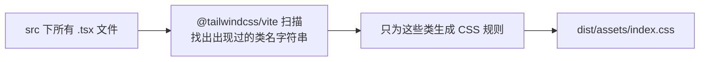
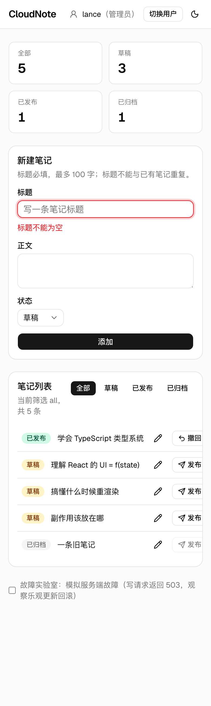
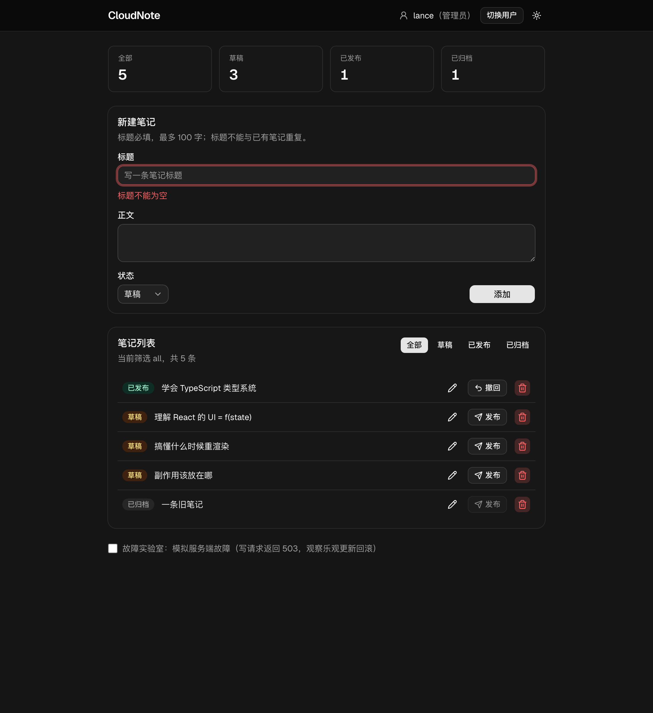
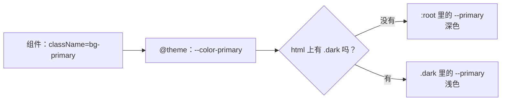
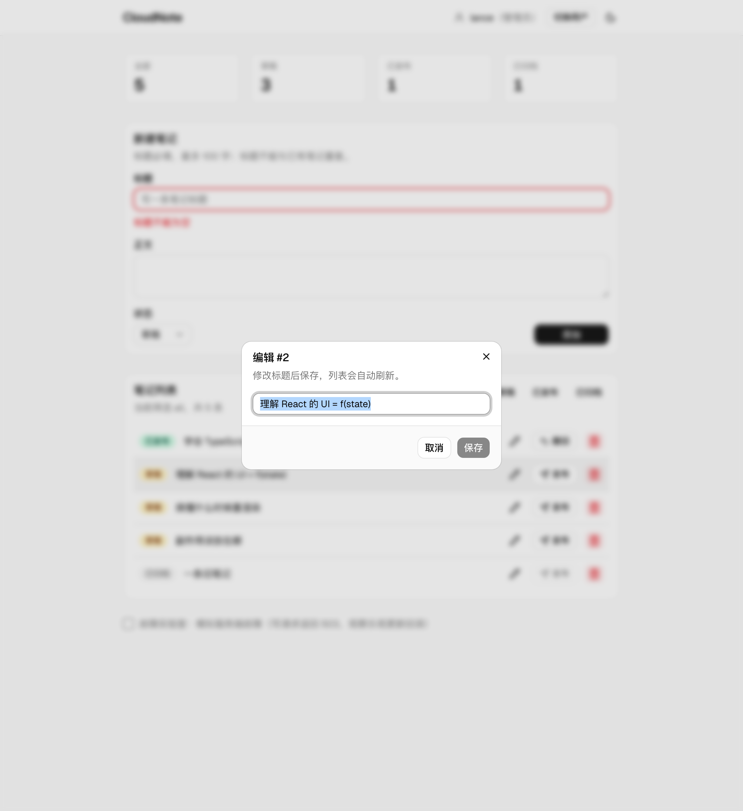
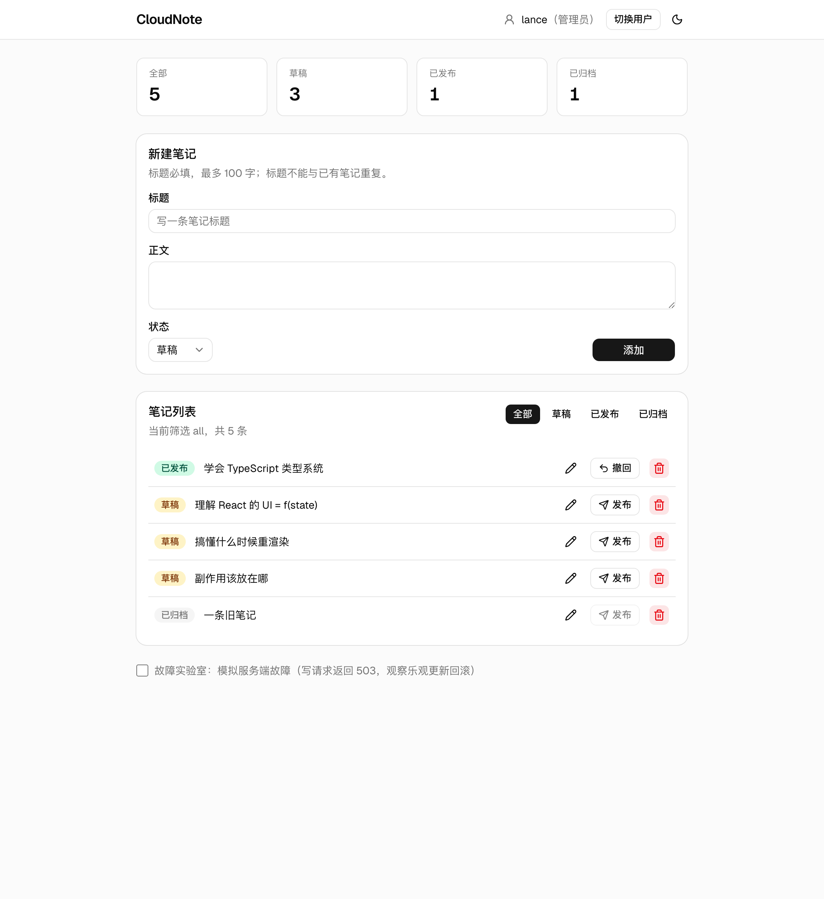
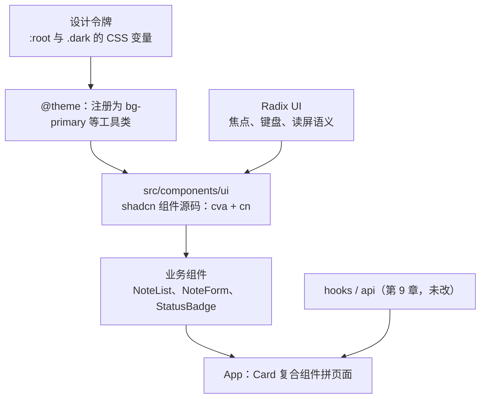

# 第 10 章　Tailwind CSS + shadcn/ui：快速搭出像样的界面

> **本章导读**
>
> - 建议用时：150 分钟（阅读 50 分钟 + 实战 100 分钟）
> - 前置知识：会一点 CSS（盒模型、flex）；第 8 章（children 组合）；第 9 章的 CloudNote 代码
> - 读完你能回答：
>   1. 把样式写在 `className` 里，为什么反而比单独写 CSS 文件好维护？
>   2. Tailwind 怎么做到「只生成用到的 CSS」？为什么不能动态拼类名？
>   3. 设计令牌（design token）是什么？`bg-primary` 背后发生了什么？暗色模式怎么做？
>   4. shadcn/ui 和 Ant Design 这类组件库有什么本质区别？
>   5. 让 AI 写界面时，该给它什么约束、怎么审查它的输出？

---

## 【积木 10-1】从手写 CSS 说起

到第 9 章为止，CloudNote 的样式全在一个 `index.css` 里，大概长这样：

```css
.item { display: flex; align-items: center; gap: 8px; padding: 8px 0; border-bottom: 1px solid #eee; }
.badge.published { background: #eaf3de; color: #27500a; }
.field input[aria-invalid=true] { border-color: #a32d2d; }
```

它能用，但随着页面变多，三个问题会越来越疼：

| 问题 | 表现 |
|---|---|
| 起名 | `.item`、`.card`、`.row` 很快撞名，于是有了 `.note-list__item--selected` 这种 BEM 长名字 |
| 不敢删 | 删一条 CSS 不知道会影响哪个页面，于是只加不删，样式文件越来越大 |
| 来回跳 | 改一个按钮要在 `.tsx` 和 `.css` 两个文件之间切换，还要对着类名找规则 |
| 数值随意 | 这里 `gap: 8px`，那里 `gap: 10px`，颜色 `#a32d2d` 和 `#a33030` 混用，界面越来越不统一 |

**Tailwind CSS** 的做法是提供一套小粒度的**工具类**（utility class），每个类只做一件事，直接写在 JSX 上：

```tsx
<li className="flex items-center gap-3 px-2 py-2.5 hover:bg-muted/50">
```

| 类名 | 等价的 CSS |
|---|---|
| `flex` | `display: flex` |
| `items-center` | `align-items: center` |
| `gap-3` | `gap: 0.75rem`（12px） |
| `px-2 py-2.5` | 左右 8px、上下 10px 内边距 |
| `hover:bg-muted/50` | 鼠标悬停时，背景用主题的 muted 色、50% 透明度 |

第一眼看上去像是「把 CSS 写回了 HTML 的 style 属性」，但它和内联样式有本质区别：

| | 内联 `style` | Tailwind 工具类 |
|---|---|---|
| 数值 | 任意写 | 来自一套**刻度**（间距 4px 一档、颜色来自调色板） |
| 悬停、聚焦、响应式 | 写不了 | `hover:`、`focus-visible:`、`sm:` 前缀 |
| 复用 | 复制粘贴 | **组件**就是复用单位（`<Button>`） |
| 删除 | — | 删掉 JSX，样式随之消失，不会留下死代码 |

最后一行是关键：**在 React 里，复用的单位本来就是组件，不是 CSS 类。** 样式跟着组件走，组件删了样式也没了，「不敢删」的问题自然消失。这和后端「代码和它的配置放在一起」是一个道理。

---

## 【积木 10-2】安装与原理：扫描源码，只生成用到的

本章用的是 **Tailwind CSS 4.3**（2026-10 实测最新）。v4 和网上大量 v3 教程差别很大，最明显的是**没有 `tailwind.config.js` 了**，配置直接写在 CSS 里。

在 Vite 项目里接入只要三步：

```bash
pnpm add -D tailwindcss @tailwindcss/vite
```

```ts
// vite.config.ts
import tailwindcss from '@tailwindcss/vite'
export default defineConfig({
  plugins: [react(), tailwindcss()],
})
```

```css
/* src/index.css */
@import "tailwindcss";
```

工作原理：



Tailwind 有成千上万个可能的类，但它**不会全部生成**。构建时插件扫描源码，看到字符串 `bg-amber-100` 就生成这条规则，没看到 `bg-pink-500` 就不生成。本章实测构建产物：

```
dist/assets/index-BVVhJdBe.css    40.18 kB │ gzip:  8.02 kB
```

在产物里搜索：`bg-amber-100`（状态徽标用了）出现 1 次，`bg-pink-500`、`text-9xl`（没用到）出现 0 次。

### 一个高频误解：类名可以动态拼

```tsx
// 错误：扫描器只认识完整的字符串，看不到 "bg-amber-100"
<span className={`bg-${color}-100`} />

// 正确：每个完整类名都要以字面量形式出现在源码里
const COLOR = { draft: 'bg-amber-100', published: 'bg-emerald-100' } as const
<span className={COLOR[status]} />
```

Tailwind 不运行你的代码，它只是**按文本扫描**。拼接出来的类名在源码里不存在，对应的 CSS 就不会生成，页面上什么效果都没有，也不会报错。这是 AI 生成 Tailwind 代码的高频错误之一。本章的 `StatusBadge` 用 `cva` 把每个状态的完整类名写死在一张表里，就是为了避开这个坑（积木 10-5）。

---

## 【积木 10-3】常用工具类速查

不用背，用到时查文档或靠编辑器补全（VS Code 装 Tailwind CSS IntelliSense，第 1 章推荐过）。但下面这些高频的最好能一眼认出来：

| 类别 | 例子 | 说明 |
|---|---|---|
| 布局 | `flex` `grid` `items-center` `justify-between` `flex-1` | flex / grid 两件套覆盖 90% 的布局 |
| 间距 | `gap-3` `p-4` `px-2` `mt-1` `space-y-2` | 数字 × 4px：`gap-3` = 12px |
| 尺寸 | `w-full` `max-w-3xl` `size-4` `min-h-svh` | `size-4` = 宽高都是 16px |
| 文字 | `text-sm` `font-semibold` `truncate` `tabular-nums` | `truncate` 超长显示省略号 |
| 颜色 | `bg-card` `text-muted-foreground` `border` | 主题色名字来自设计令牌（积木 10-5） |
| 圆角阴影 | `rounded-lg` `ring-1` `shadow-sm` | — |
| 分隔 | `divide-y` | 子元素之间加横线，列表常用 |
| 状态 | `hover:` `focus-visible:` `disabled:` `aria-invalid:` | 前缀表示「在这种状态下才生效」 |
| 透明度 | `bg-muted/50` `bg-destructive/10` | 斜杠后面是不透明度百分比 |

本章表单的一段（`NoteForm.tsx`）：

```tsx
<form className="grid gap-4">
  <div className="grid gap-2">
    <Label htmlFor="note-title">标题</Label>
    <Input id="note-title" aria-invalid={Boolean(errors.title)} ... />
    <p className="text-sm text-destructive" role="alert">标题不能为空</p>
  </div>
</form>
```

注意：没有一个 `margin`。**用父容器的 `gap` 控制子元素间距**，比给每个子元素加 margin 更不容易乱——插入、删除、重排子元素时间距都不会出错。

第 8 章给输入框加的 `aria-invalid` 现在有了视觉效果：shadcn 的 Input 里写了 `aria-invalid:border-destructive aria-invalid:ring-3`，校验失败时输入框自动变红。**无障碍属性和样式绑在一起**，既不会忘了标 aria，也不用另写一个 `.error` 类。

---

## 【积木 10-4】响应式与状态前缀

### 响应式：移动优先

```tsx
<dl className="grid grid-cols-2 gap-3 sm:grid-cols-4">
```

读作：**默认 2 列，屏幕宽度 ≥ 640px（`sm`）时 4 列**。

| 前缀 | 最小宽度 | 常见设备 |
|---|---|---|
| （无） | 0 | 手机 |
| `sm:` | 640px | 大手机横屏 |
| `md:` | 768px | 平板 |
| `lg:` | 1024px | 笔记本 |
| `xl:` | 1280px | 桌面 |

Tailwind 是**移动优先**（mobile-first）的：不带前缀的类对所有宽度生效，带前缀的类在「这个宽度及以上」覆盖它。所以先写手机布局，再用 `sm:` / `md:` 往上加。很多人反过来理解成 `sm:` 是「小屏时」，这是最常见的误会。

实测：390px 宽（iPhone）统计卡片是 2 列，1100px 宽是 4 列；表单底部的「状态 + 添加按钮」在手机上竖排、`sm` 以上横排（`flex flex-col sm:flex-row`）。



### 暗色模式

```tsx
// UserBadge.tsx：给 <html> 加上 dark 类
document.documentElement.classList.toggle('dark', !dark)
```

```css
/* index.css：dark: 前缀的触发条件 */
@custom-variant dark (&:is(.dark *));
```

点右上角的月亮图标，整页切换到暗色。实测卡片背景从 `oklch(1 0 0)`（白）变成 `oklch(0.205 0 0)`（深灰）——**组件代码一行没改**，原因在下一块。



---

## 【积木 10-5】设计令牌、cva 与 cn

### 设计令牌：颜色有名字，不再有色值

本章代码里几乎找不到 `#a32d2d` 这样的色值，取而代之的是 `bg-primary`、`text-muted-foreground`、`text-destructive`。它们在 `index.css` 里分两层定义：

```css
/* 第 1 层：设计令牌——每个语义色的实际取值 */
:root {
  --primary: oklch(0.205 0 0);
  --muted-foreground: oklch(0.556 0 0);
  --destructive: oklch(0.577 0.245 27.325);
}
.dark {
  --primary: oklch(0.922 0 0);
  --muted-foreground: oklch(0.708 0 0);
}

/* 第 2 层：注册成 Tailwind 主题色，于是有了 bg-primary、text-destructive 等类 */
@theme inline {
  --color-primary: var(--primary);
  --color-muted-foreground: var(--muted-foreground);
  --color-destructive: var(--destructive);
}
```



组件只说「我要主色」，不说「我要 #333」。主色具体是什么，由令牌决定；换主题（暗色、品牌色、节日皮肤）只改令牌，不碰组件。这就是**设计令牌**（design token）：给设计决策起名字。对后端同学来说，它就像**配置中心里的配置项**——代码读 key，值由环境决定。

`oklch(...)` 是一种比 `#rrggbb` 更符合人眼感知的颜色写法（亮度、色度、色相），Tailwind v4 的调色板全部用它。你不需要手算，知道它是颜色就行。

### cva：把「变体」写成一张表

shadcn 的 Button 有 `variant`（default / outline / ghost / destructive…）和 `size`（sm / default / icon-sm…）两个维度。它们是用 **cva**（class-variance-authority）声明的：

```ts
const buttonVariants = cva('inline-flex items-center ... disabled:opacity-50', {
  variants: {
    variant: {
      default: 'bg-primary text-primary-foreground hover:bg-primary/80',
      ghost: 'hover:bg-muted hover:text-foreground',
      destructive: 'bg-destructive/10 text-destructive hover:bg-destructive/20',
    },
    size: { sm: 'h-7 px-2.5 ...', default: 'h-8 px-2.5 ...', 'icon-sm': 'size-7' },
  },
  defaultVariants: { variant: 'default', size: 'default' },
})
```

cva 的好处不止是整洁：变体名会变成**字面量联合类型**（第 2 章）。写错了 tsc 直接报：

```
error TS2322: Type '"danger"' is not assignable to type
  '"default" | "destructive" | "ghost" | "link" | "outline" | "secondary" | null | undefined'.
```

本章的 `StatusBadge` 用同样的手法把「笔记状态 → 颜色」写成一张表，完整类名都以字面量出现，避开了积木 10-2 的动态拼接坑：

```ts
const statusBadge = cva('', {
  variants: {
    status: {
      draft: 'bg-amber-100 text-amber-900 dark:bg-amber-900/40 dark:text-amber-200',
      published: 'bg-emerald-100 text-emerald-900 dark:bg-emerald-900/40 dark:text-emerald-200',
      archived: 'bg-muted text-muted-foreground',
    },
  },
})
```

### cn：合并类名并解决冲突

```tsx
<li className={cn('flex items-center px-2 hover:bg-muted/50', note.id === selectedId && 'bg-muted')} />
<Button className="sm:w-28" />  // Button 内部：cn(buttonVariants(...), className)
```

`cn` 做两件事：

1. **条件拼接**：`false`、`undefined`、`null` 自动丢掉，所以可以写 `cond && 'bg-muted'`。
2. **冲突合并**：`cn('px-2', 'px-4')` 得到 `'px-4'`，而不是两个都保留。CSS 里两个类谁生效取决于它们在样式表里的先后顺序，而不是你在 className 里写的顺序，所以**必须由工具去掉冲突的那个**，外部传入的 `className` 才能可靠地覆盖组件默认样式。

> 版本说明：老教程里 `cn` 是项目里自己写的一个函数（`clsx` + `tailwind-merge`）。2026 年的 shadcn 改为直接依赖一个同名的 npm 包 `cn`（0.4，由 shadcn 团队发布，作为两者的替代品），组件里写 `import { cn } from "cn"`。两种写法效果一样，看到哪种都别奇怪。

---

## 【积木 10-6】shadcn/ui：复制源码，而不是安装依赖

### 和传统组件库的本质区别

| | Ant Design / MUI | shadcn/ui |
|---|---|---|
| 怎么获得 | `npm install antd` | CLI 把组件**源码复制**进你的 `src/components/ui/` |
| 代码在哪 | `node_modules` 里，你改不了 | 你的仓库里，**随便改** |
| 升级 | 升级依赖版本，可能破坏你的覆盖样式 | 不会自动变；想要新版就重新 add 并对比 |
| 定制样式 | 覆盖 CSS 变量、写 `!important`、用主题 API | 直接改组件里的 Tailwind 类 |
| 行为与无障碍 | 库自己实现 | 交给 **Radix UI**（无样式的行为库） |
| 适合 | 后台管理、表格表单极多的 ToB 页面 | 需要自定义外观的产品界面；AI 生成代码的默认选择 |

shadcn 的口号是「这不是一个组件库，而是一种构建组件库的方式」。本章 `src/components/ui/` 下的 8 个文件（button、card、input、textarea、label、badge、dialog、native-select）都是 CLI 生成后**属于你的代码**，可以打开读、可以改。

```bash
pnpm dlx shadcn@latest add button card input textarea label badge dialog native-select
# ✔ Created 8 files:
#   - src/components/ui/button.tsx
#   - src/components/ui/card.tsx
#   ...
```

`components.json` 记录了风格（本章是 `radix-nova`）、基色、路径别名等，CLI 据此生成代码。路径别名 `@/components/ui/button` 需要在 tsconfig 和 vite.config 里各配一次：

```jsonc
// tsconfig.json（TS 7 已移除 baseUrl，paths 直接写相对路径）
"paths": { "@/*": ["./src/*"] }
```

```ts
// vite.config.ts
resolve: { alias: { '@': path.resolve(import.meta.dirname, './src') } }
```

> 环境提示：本机用 pnpm 12 跑 `shadcn init` 时，CLI 内部调用的 `pnpm add` 会因为 pnpm 12 新增的「新发布包冷却期」交互确认而卡住或报错。本章的处理是：先手动安装依赖（`radix-ui`、`class-variance-authority`、`cn`、`lucide-react`、`tw-animate-css`），再用 `shadcn add` 生成组件，主题 CSS 按官方 neutral 配色写进 `index.css`。用 npm 或设置 `CI=1` 也可以绕过交互。

### 第 8 章的组合，换了个更细的样子

第 8 章自己写的 `Card` 有 `title`、`actions`、`children` 三个插槽。shadcn 的 Card 把每个插槽拆成了独立的小组件：

```tsx
<Card>
  <CardHeader>
    <CardTitle>笔记列表</CardTitle>
    <CardDescription>当前筛选 all，共 5 条</CardDescription>
    <CardAction>
      <StatusFilterBar value={filter} onChange={setFilter} />
    </CardAction>
  </CardHeader>
  <CardContent>
    <NoteList ... />
  </CardContent>
</Card>
```

| 第 8 章手写 Card | shadcn Card |
|---|---|
| `title` prop | `<CardTitle>` |
| `actions` prop | `<CardAction>`（自动放到标题栏右侧） |
| `children` | `<CardContent>` |
| — | `<CardDescription>`、`<CardFooter>` |

这种写法叫**复合组件**（compound components）：调用方决定用哪几块、按什么顺序摆，Card 只负责每块长什么样。它还是第 8 章说的组合，只是粒度更细。

### Radix：你看不见的那一半

编辑器在第 7、8 章是页面下方的一块表单，本章改成了弹窗（`NoteEditorDialog.tsx`）：

```tsx
<Dialog open={Boolean(note)} onOpenChange={(open) => !open && onClose()}>
  <DialogContent>
    <DialogHeader>
      <DialogTitle>编辑 #{note.id}</DialogTitle>
      <DialogDescription>修改标题后保存，列表会自动刷新。</DialogDescription>
    </DialogHeader>
    ...
  </DialogContent>
</Dialog>
```



一个「合格」的弹窗要处理的东西远比看上去多，这些全由 shadcn 底下的 **Radix UI** 完成。本章实测：

| 行为 | 实测结果 |
|---|---|
| 读屏器语义 | 元素带 `role="dialog"`，标题「编辑 #2」与之关联 |
| 打开时焦点 | 自动落在第一个可聚焦元素（「编辑标题」输入框） |
| 按 Esc | 弹窗关闭，页面上 `role=dialog` 元素数量变为 0 |
| 焦点锁定 | 连按 Tab，焦点在「编辑标题 → 取消 → Close → 编辑标题」之间循环（「保存」未修改时禁用，被跳过），不会跑到背后的页面 |
| 背景 | 遮罩 + 背景模糊，点遮罩关闭 |
| 关闭后焦点 | **回到了 `<body>`，而不是「编辑」按钮**——见下面的高频误解 |

`open` + `onOpenChange` 是第 8 章「受控」概念的又一次出现：弹窗开不开由父组件的 `selectedId` 决定，Radix 只负责在用户按 Esc、点遮罩、点 X 时通知你「用户想关」。

**自己手写弹窗几乎一定会漏掉上表的一半。** 这正是「用组件库」最大的价值——不是省那几行样式，而是拿到这些经过大量用户验证的交互细节。

### 一个高频误解：用了组件库，无障碍就自动全对了

上表最后一行是实测时发现的。Radix 的规则是「关闭后把焦点还给 `DialogTrigger`」，但本章的弹窗是**受控打开**的（点列表里的编辑按钮改 `selectedId`），根本没有用 `DialogTrigger`，Radix 不知道该还给谁，焦点就掉回了 `<body>`。键盘用户关掉弹窗后得从页面顶部重新 Tab 一遍。

另外，右上角关闭按钮的读屏文字是 shadcn 源码里写死的英文 `Close`。

两个问题都不报错、视觉上也看不出来，只有用键盘或读屏器才能发现。修法也都很直接——因为代码在你手里：给 `DialogContent` 传 `onCloseAutoFocus` 把焦点放回对应的编辑按钮，把 `dialog.tsx` 里的 `Close` 改成「关闭」（练习 10）。**组件库替你解决了大部分问题，剩下的要靠你验证。**

### 其它组件的选择

本章「状态」下拉用的是 `NativeSelect`（包了一层原生 `<select>`），而不是 shadcn 那个完全自定义的 `Select`。原生 select 在手机上会弹出系统选择器，体验更好，代码也更简单；只有需要搜索、分组、自定义选项外观时，才值得用自定义 Select。**能用原生元素就用原生元素**，这条规则对 AI 生成的 UI 尤其有用。

---

## 【积木 10-7】让 AI 写界面：先给规范，再审输出

UI 是 AI 最擅长、也最容易「看起来对但细节全错」的领域。两条原则：

**一、先给约束，再让它写。** 不要只说「帮我做一个好看的笔记页面」，而是把项目已有的规范喂给它：

```text
你在一个 React 19 + TypeScript + Tailwind CSS v4 + shadcn/ui（radix-nova 风格）项目里工作。

约束：
1. 只使用 src/components/ui/ 下已有的组件：Button、Card 系列、Input、Textarea、Label、Badge、Dialog、NativeSelect。需要新组件先告诉我，不要自己手写替代品。
2. 颜色只用主题令牌（bg-primary、text-muted-foreground、text-destructive、bg-muted 等），禁止写十六进制色值和 bg-[#xxx] 任意值。
3. 间距用父容器的 gap，不要给子元素逐个加 margin。
4. 移动优先：先写手机布局，再用 sm:/md: 向上适配。
5. 类名必须是完整字面量，禁止字符串拼接类名。
6. 所有可交互元素要能用键盘操作；纯图标按钮必须有 aria-label；表单字段用 Label 的 htmlFor 关联。
7. 只改界面，不要改 hooks/ 和 api.ts 里的数据逻辑。

需求：给笔记列表加一个「按标题搜索」输入框，放在 CardAction 里筛选按钮的左边。
先输出你打算改哪些文件、每个文件改什么，等我确认后再写代码。
```

最后一句沿用第 9 章的做法：先方案、后代码，你确认了再动手。

**二、用清单审查输出。** AI 写完后，逐条过一遍：

| 检查项 | 常见错误 |
|---|---|
| 有没有硬编码颜色 | `text-[#666]`、`style={{ color: 'red' }}`——暗色模式下会出问题 |
| 有没有动态拼类名 | `` `text-${size}` ``——构建后样式丢失，且不报错 |
| 有没有重复造轮子 | 自己写了一个 `div` 弹窗、一个带样式的 `button`，没用现成组件 |
| 交互元素是不是对的标签 | 用 `div onClick` 做按钮（键盘按不了、读屏器不认） |
| 图标按钮有没有 aria-label | 只有一个垃圾桶图标，读屏器念出来是「按钮」 |
| 表单有没有 Label 关联 | 只有 placeholder 没有 label，点文字聚焦不到输入框 |
| 窄屏下会不会溢出 | 没有 `truncate`、`flex-wrap`，长标题把按钮挤出屏幕 |
| 有没有顺手改了数据逻辑 | 「优化」了 hooks，把第 9 章的乐观更新弄坏了 |
| 加载、空、错误三态 | 只画了有数据的样子（第 7 章的老问题） |

AI 生成的 UI 代码里出现频率最高的是第 1、4、5 项。练习 9 会让你实际走一遍。

---

## 【积木 10-8】实战：给 CloudNote 换上新界面

代码在 [`code/ch10-tailwind-shadcn/`](../code/ch10-tailwind-shadcn/)。**数据层（`hooks/`、`api.ts`、`server/`）与第 9 章完全相同**，只重写了「长什么样」：

```
code/ch10-tailwind-shadcn/
├── components.json                 # shadcn 配置：radix-nova 风格、neutral 基色、路径别名
├── vite.config.ts                  # + tailwindcss() 插件、@ 别名
├── tsconfig.json                   # + paths
└── src/
    ├── index.css                   # Tailwind 入口 + 设计令牌（亮色 / 暗色）
    ├── App.tsx                     # 页面布局改用 Tailwind + shadcn Card
    └── components/
        ├── ui/                     # shadcn 生成的 8 个组件（你的代码，可以改）
        ├── StatusBadge.tsx         # 新增：cva 声明状态颜色
        ├── NoteEditorDialog.tsx    # 新增：编辑器改为弹窗（替代 NoteEditor）
        ├── NoteStats.tsx           # 改为响应式统计卡片
        ├── NoteList.tsx            # Button + lucide 图标
        ├── NoteForm.tsx            # 逻辑不变，换 Label / Input / Textarea / NativeSelect
        ├── StatusFilterBar.tsx
        └── UserBadge.tsx           # + 暗色模式切换
```

本章依赖（2026-10 实测）：

| 包 | 版本 | 作用 |
|---|---|---|
| tailwindcss / @tailwindcss/vite | 4.3.3 | 样式引擎 |
| shadcn | 4.21.4 | CLI + 组件依赖的 `shadcn/tailwind.css` |
| radix-ui | 1.7.0 | Dialog 等组件的行为与无障碍（统一包，不再是一堆 @radix-ui/react-xxx） |
| class-variance-authority | 0.7.1 | cva 变体 |
| cn | 0.4.0 | 类名合并 |
| lucide-react | 1.54.0 | 图标 |
| tw-animate-css | 1.4.0 | 弹窗淡入淡出等动画 |

```bash
cd code/ch10-tailwind-shadcn
pnpm install
pnpm api     # 终端 1
pnpm dev     # 终端 2
```



生产构建 + 无头浏览器实测：

| 检查 | 结果 |
|---|---|
| 首屏 | 统计「全部 5 · 草稿 3 · 已发布 1 · 已归档 1」，字体为 Geist |
| 空表单提交 | 「标题不能为空」，输入框 `aria-invalid=true` 并变红 |
| 点第 2 条的编辑图标 | 弹窗标题「编辑 #2」，焦点在「编辑标题」输入框 |
| 按 Esc | 弹窗关闭 |
| 弹窗内连按 Tab | 焦点在弹窗内循环；关闭后焦点落回 body（练习 10 修复） |
| 切换暗色 | `<html class="dark">`，卡片背景 `oklch(1 0 0)` → `oklch(0.205 0 0)` |
| 390px 宽 | 统计卡片 2 列；1100px 宽 4 列 |
| 点「发布」 | 0.1 秒徽标变「已发布」——第 9 章的乐观更新原样工作 |

构建体积：

| | 第 9 章 | 第 10 章 |
|---|---|---|
| JS | 356 KB（gzip 108 KB） | 444 KB（gzip 138 KB） |
| CSS | 1.6 KB | 40 KB（gzip 8 KB） |
| 字体 | 无 | Geist 按语言子集拆分的 woff2，浏览器只下载用到的 |

JS 多出的约 30 KB（gzip）主要是 Radix Dialog 和图标。第 12 章讲服务端渲染时会回来讨论首屏体积。

### 动手练习

| 练习 | 操作 | 预期结果 |
|---|---|---|
| 1 | 把删除按钮的 `variant="destructive"` 改成 `variant="danger"` | `TS2322: Type '"danger"' is not assignable to type '"default" \| "destructive" \| "ghost" \| ...'` |
| 2 | 把筛选按钮的 `size="sm"` 改成 `size="small"` | `TS2322: Type '"small"' is not assignable to type '"default" \| "icon" \| ... \| "sm" \| "xs" ...'` |
| 3 | 在 `StatusBadge` 里改用 `` `bg-${color}-100` `` 动态拼类名 | 类型检查通过，但徽标没有背景色——扫描器看不到完整类名 |
| 4 | 修改 `index.css` 里 `:root` 的 `--primary` 为 `oklch(0.55 0.2 260)` | 所有主按钮、选中的筛选按钮一起变成蓝色，组件代码不用改 |
| 5 | 把 `NoteStats` 的 `sm:grid-cols-4` 改成 `md:grid-cols-4`，拖动浏览器宽度 | 640～767px 之间仍是 2 列，理解断点「从这个宽度起」的含义 |
| 6 | 打开 `src/components/ui/button.tsx`，给 `variant` 加一个 `success` 变体 | 改的是你自己的代码，不涉及任何依赖升级 |
| 7 | 打开编辑弹窗后连按 Tab | 焦点只在输入框、取消、保存、关闭之间循环 |
| 8 | 把编辑图标按钮的 `aria-label` 删掉，用 VS Code 或浏览器的无障碍面板查看 | 按钮没有可读名称；这也是第 15 章 Playwright 用 `getByRole('button', { name: '编辑' })` 定位不到它的原因 |
| 9 | （AI）把积木 10-7 的 prompt 发给 AI，让它做「按标题搜索」，再用审查清单逐条检查 | 记录它违反了哪几条；搜索结果应当在渲染时派生（第 5 章） |
| 10 | 修复积木 10-6 发现的两个无障碍问题：关闭弹窗后焦点回到对应的编辑按钮；关闭按钮读作「关闭」 | 提示：在 `NoteList` 的编辑按钮上加 `data-note-id`，`onCloseAutoFocus` 里 `preventDefault()` 后手动 `focus()` |

---

## 【本章小结】

三句话：

1. **Tailwind 把样式写在组件上**：复用单位是组件而不是 CSS 类，删组件样式随之消失；构建时按文本扫描源码只生成用到的类，所以类名必须是完整字面量；移动优先，`sm:` 表示「从 640px 起」。
2. **设计令牌让组件只说语义**：`bg-primary` 指向 CSS 变量，`:root` 和 `.dark` 各给一套取值，换肤不改组件；`cva` 把变体写成有类型的表，`cn` 负责条件拼接和冲突合并。
3. **shadcn/ui 是复制进项目的源码**，外观用 Tailwind、行为与无障碍交给 Radix；复合组件延续了第 8 章的组合思想。让 AI 写 UI 要先给规范、先出方案，再用清单审查硬编码颜色、拼接类名、重复造轮子和无障碍问题。



**自测题：**

1. Tailwind 工具类和内联 `style` 有哪些本质区别？（积木 10-1）
2. 为什么说在 React 里「不敢删 CSS」的问题会消失？（积木 10-1）
3. Tailwind 怎么知道要生成哪些 CSS？`` `bg-${color}-100` `` 为什么不行？（积木 10-2）
4. 为什么推荐用父容器的 `gap` 而不是子元素的 margin？（积木 10-3）
5. `grid-cols-2 sm:grid-cols-4` 在 500px 和 800px 宽时各是几列？（积木 10-4）
6. 设计令牌是什么？切换暗色模式时，组件代码为什么不用改？（积木 10-5）
7. `cn('px-2', 'px-4')` 的结果是什么？为什么需要它？（积木 10-5）
8. shadcn/ui 和 Ant Design 最大的区别是什么？升级时各自会发生什么？（积木 10-6）
9. 一个合格的弹窗要处理哪些交互细节？谁替你做了？（积木 10-6）
10. 让 AI 写界面前，至少该给它哪几条约束？（积木 10-7）

---

## 【下一章预告】

样式篇结束，下一章进入 Next.js 篇。第 11 章《Next.js App Router：路由、布局与约定》。到目前为止 CloudNote 只有一个页面，前后端还是两个进程（Vite + Node http）。Next.js 把它们合进一个项目：用文件夹定义路由（`app/notes/[id]/page.tsx` 就是笔记详情页），用 `layout.tsx` 共享顶栏，把第 6 章说的「筛选条件应该放进 URL」真正落地为 `?status=draft`。你会看到 Next.js 和 React 的关系就像第 1 章说的 Gin 和 `net/http`：本章的组件、Tailwind、shadcn 全部原样搬过去。

*学完本章，回到对话里说一句「继续」，我就开讲第 11 章。*
