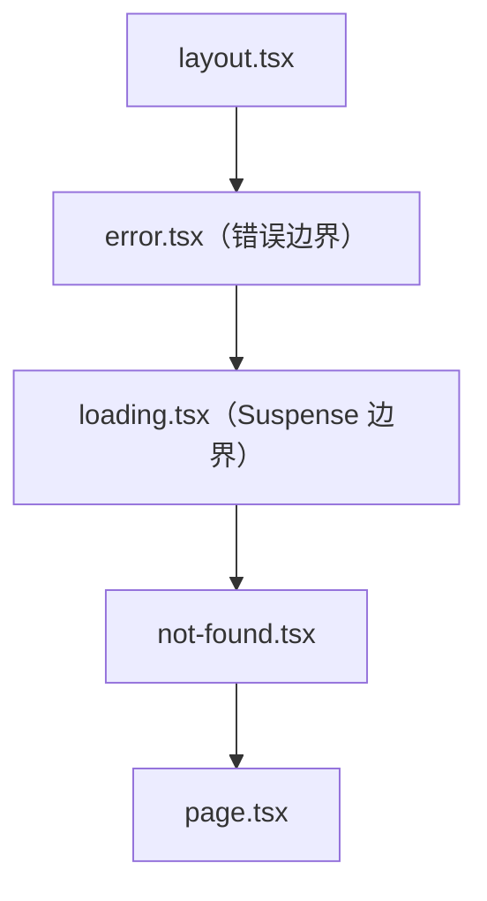
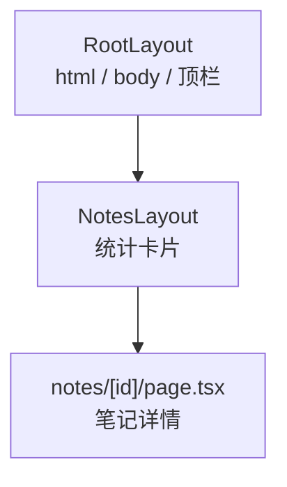
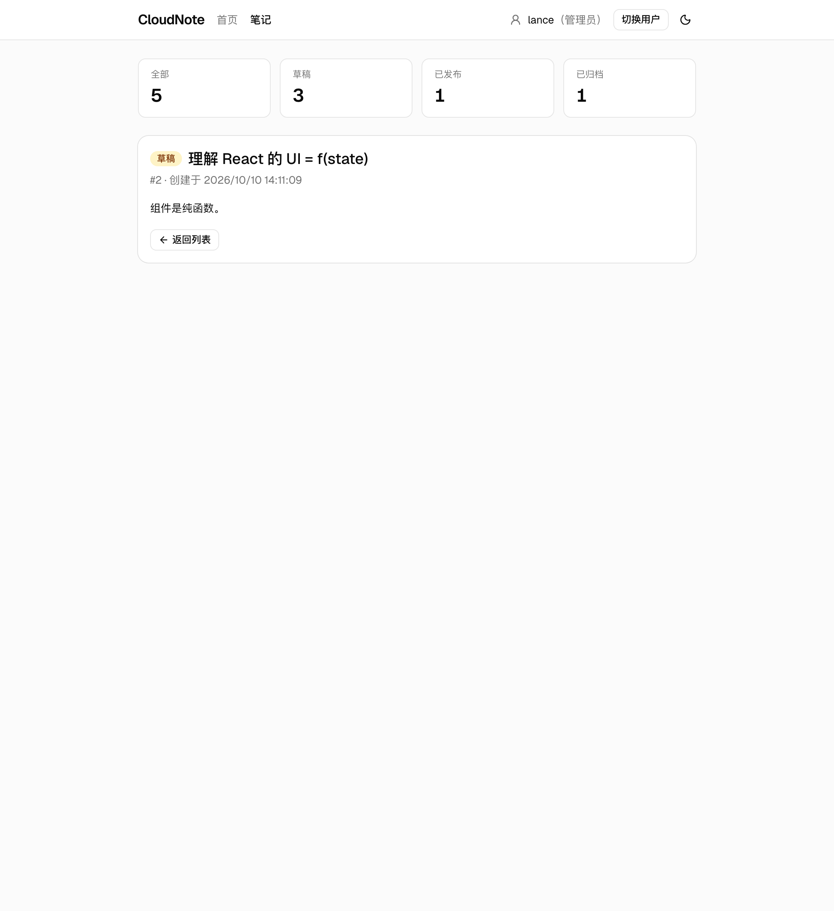
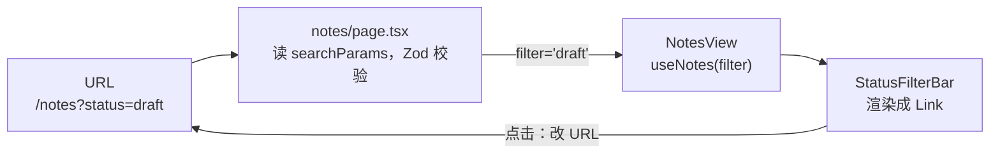
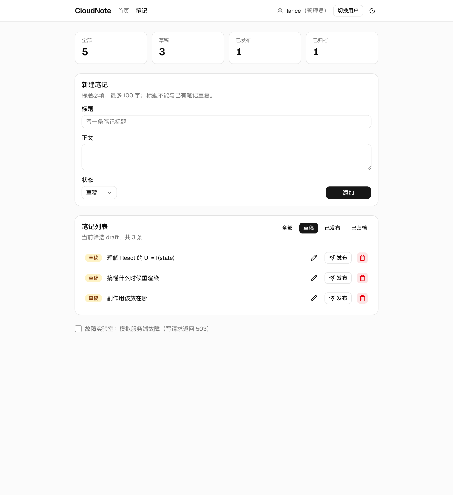
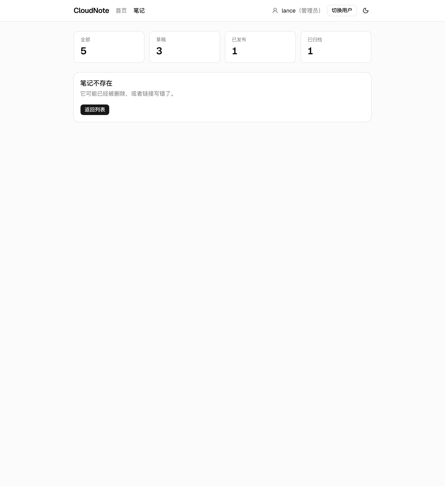
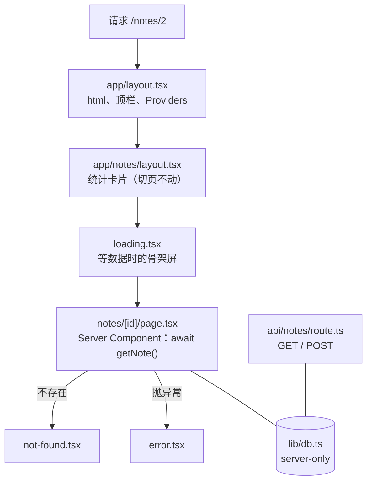

# 第 11 章　Next.js App Router：路由、布局与约定

> **本章导读**
>
> - 建议用时：150 分钟（阅读 60 分钟 + 实战 90 分钟）
> - 前置知识：第 1 章（React 与 Next.js 的关系）、第 6 章（状态放置决策图里的「URL 状态」）、第 10 章的 CloudNote 代码
> - 读完你能回答：
>   1. 已经有 React + Vite 了，为什么还要 Next.js？它补上了哪几块？
>   2. 「文件夹就是路由」是什么意思？`page`、`layout`、`loading`、`error`、`not-found`、`route` 各管什么？
>   3. 布局为什么在页面切换时「不动」？这带来什么好处？
>   4. 筛选条件放进 URL 之后，组件代码要怎么改？
>   5. 为什么有些文件开头写着 `'use client'`？

---

## 【积木 11-1】Vite 单页应用还缺什么

第 5～10 章的 CloudNote 是一个 **单页应用**（SPA）：浏览器先下载一个几乎空白的 HTML 和一大包 JS，然后由 React 在浏览器里把整个界面画出来。它能用，但有几块明显的缺口：

| 缺口 | 第 10 章的现状 |
|---|---|
| 路由 | 只有一个页面；想要「笔记详情页」就得再引入 React Router 之类的库 |
| URL 状态 | 第 6 章说筛选条件应该放进 URL，但一直放在 `useState` 里，刷新就丢 |
| 后端 | 前端（Vite，5173）和后端（Node http，3000）是两个进程，靠代理拼起来 |
| 首屏 | 用户先看到白屏，等 JS 下载执行完才有内容；搜索引擎抓到的也是空 HTML |
| 约定 | 加载态、错误页、404、页面标题，每个项目都要自己发明一套 |

**Next.js** 是建在 React 之上的全栈框架，把这些全补上了。第 1 章的类比在这里正式兑现：

| Go | JavaScript |
|---|---|
| `net/http`：只给你处理请求的原语 | **React**：只管「状态 → 界面」 |
| Gin / Echo：路由、中间件、参数绑定、约定 | **Next.js**：路由、布局、服务端渲染、接口、约定 |

本章用的是 **Next.js 16.4**（2026-10 实测最新），使用它的 **App Router**（`app/` 目录）。网上还有大量 Pages Router（`pages/` 目录）的老教程，两者写法差别很大，看到 `getServerSideProps`、`_app.tsx` 就说明是旧写法。

这一章最重要的体验是：**第 10 章写的组件、hooks、Tailwind、shadcn 几乎原封不动搬过来**。框架换了，React 知识一点没浪费。

---

## 【积木 11-2】文件夹就是路由

从本章起，CloudNote 的主线代码放在 [`code/cloudnote/`](../code/cloudnote/)，之后每章在它上面演进。它的 `src/app/` 目录：

```
src/app/
├── layout.tsx              # 根布局：<html>、<body>、顶栏
├── page.tsx                # /
├── not-found.tsx           # 全站 404
├── error.tsx               # 全站错误边界
├── globals.css             # 第 10 章的 index.css
├── providers.tsx           # TanStack Query + 用户 Context
├── notes/
│   ├── layout.tsx          # /notes 下所有页面共用：统计卡片
│   ├── page.tsx            # /notes（?status=draft）
│   ├── NotesView.tsx       # 普通组件，不是路由
│   └── [id]/
│       ├── page.tsx        # /notes/2
│       ├── loading.tsx     # 详情加载中
│       └── not-found.tsx   # 笔记不存在
└── api/notes/
    ├── route.ts            # GET / POST /api/notes
    └── [id]/route.ts       # PATCH / DELETE /api/notes/2
```

规则只有两条：

1. **文件夹决定 URL 路径**。`app/notes/[id]/` 对应 `/notes/任意值`。
2. **特定文件名决定这一段路径「是什么」**。只有名叫 `page.tsx` 或 `route.ts` 的文件才会成为可访问的地址；同目录下的其它文件（比如 `NotesView.tsx`）只是普通模块，访问不到。

| 文件名 | 作用 | 本章用在 |
|---|---|---|
| `page.tsx` | 这个路径的页面内容 | `/`、`/notes`、`/notes/[id]` |
| `layout.tsx` | 包住本段及所有子段的外壳，切换页面时**保持不变** | 根布局、notes 布局 |
| `loading.tsx` | 本段数据没准备好时显示的界面 | 详情页骨架屏 |
| `error.tsx` | 本段抛出异常时显示的界面 | 全站 |
| `not-found.tsx` | 调用 `notFound()` 或路径不存在时显示 | 全站、笔记详情 |
| `route.ts` | HTTP 接口，导出 `GET`、`POST` 等函数 | `/api/notes` |

页面文件必须 `export default` 一个组件——第 4 章说过本课程只用具名导出，这里是框架约定的例外。

这几个文件嵌套的顺序是固定的（同一段路径内由外到内）：



所以 `error.tsx` 能接住 `page.tsx` 的异常，但接不住同一层 `layout.tsx` 的异常（那要靠上一层的 `error.tsx`）。

---

## 【积木 11-3】布局：切换页面时不动的那部分

```tsx
// src/app/layout.tsx
export const metadata: Metadata = {
  title: { default: 'CloudNote', template: '%s · CloudNote' },
}

export default function RootLayout({ children }: { children: ReactNode }) {
  return (
    <html lang="zh-CN">
      <body>
        <Providers>
          <header>…<MainNav /><UserBadge /></header>
          <main>{children}</main>
        </Providers>
      </body>
    </html>
  )
}
```

```tsx
// src/app/notes/layout.tsx
export default function NotesLayout({ children }: { children: ReactNode }) {
  return (
    <div className="grid gap-6">
      <NoteStats />
      {children}
    </div>
  )
}
```

访问 `/notes/2` 时，组件树是这样套起来的：



`children` 就是第 8 章讲的组合：布局只管外壳，里面放哪个页面由路由决定。

**关键特性：在同一个布局下切换页面，布局不会重新挂载。** 实测：在列表页给统计卡片的 DOM 节点打一个标记 `data-mark="kept"`，再在 `window` 上挂一个变量，然后点标题进入详情页——标记和变量都还在。说明：

- 浏览器没有整页刷新（`window` 上的变量没丢）
- 统计卡片是同一个 DOM 节点，没有被销毁重建（组件内部 state 也就不会丢）

这对用户体验很重要：顶栏的下拉菜单、侧边栏的展开状态、正在播放的视频，切页面时都不会被打断。

`metadata` 替代了第 7 章手写的 `document.title` Effect。`template: '%s · CloudNote'` 表示子页面只要给出自己的标题，就会自动拼成「笔记列表 · CloudNote」。实测列表页标签栏显示的正是这串文字。

---

## 【积木 11-4】动态路由：/notes/[id]

文件夹名用方括号包起来，就是一个**动态段**，相当于 Gin 的 `/notes/:id`：

| Gin | Next.js |
|---|---|
| `r.GET("/notes/:id", handler)` | `app/notes/[id]/page.tsx` |
| `c.Param("id")` | `const { id } = await props.params` |
| `/files/*path` | `app/files/[...path]/page.tsx`（`path` 是数组） |

```tsx
// src/app/notes/[id]/page.tsx
const IdSchema = z.coerce.number().int().positive()

async function loadNote(rawId: string) {
  const id = IdSchema.safeParse(rawId)
  const note = id.success ? await getNote(id.data) : undefined
  if (!note) notFound()
  return note
}

export default async function NoteDetailPage(props: PageProps<'/notes/[id]'>) {
  const { id } = await props.params
  const note = await loadNote(id)
  return <Card>…{note.title}…</Card>
}
```

几个要点：

**一、`params` 是 Promise。** 从 Next.js 15 起，`params` 和 `searchParams` 都要 `await`。网上很多 14 版本以前的代码直接 `params.id`，那是旧写法。

**二、`PageProps<'/notes/[id]'>` 是自动生成的全局类型。** `next dev`、`next build` 或 `next typegen` 会扫描 `app/` 目录，为每个路由生成参数类型，不需要 import。写错参数名会被拦下：

```
error TS2339: Property 'noteId' does not exist on type '{ id: string; }'.
```

**三、参数永远是字符串，而且是外部输入。** `/notes/abc`、`/notes/-1`、`/notes/1.5` 都可能被访问到。第 4 章说过，所有外部输入都要过 schema——这里用 `z.coerce.number().int().positive()` 转换并校验，不合法就 `notFound()`。

**四、页面函数是 `async` 的，可以直接 `await getNote(...)` 读数据。** 没有 `useEffect`、没有 `useQuery`、没有 API 请求。这是因为这个组件**在服务端运行**（它是 Server Component），可以直接访问服务端的数据。这是 Next.js 和第 5～10 章最大的不同，第 12 章专门讲。

`generateMetadata` 让每篇笔记有自己的标题。实测详情页标签栏显示「理解 React 的 UI = f(state) · CloudNote」。它和页面函数都调用了 `getNote`，第 13 章会讲怎么让两次调用只查一次数据库。

---

## 【积木 11-5】loading、error、not-found：约定好的三种状态

第 7 章说过，异步数据至少有加载中、成功、失败三种状态，AI 生成的代码最常漏掉后两种。Next.js 把它们变成了**文件约定**：只要放一个对应名字的文件，框架就会在对的时机显示它。

| 文件 | 何时显示 | 本章内容 |
|---|---|---|
| `loading.tsx` | 页面的 async 函数还没返回时 | 灰色骨架屏 |
| `error.tsx` | 渲染过程中抛出了没被捕获的异常 | 「页面出错了」+ 重试按钮 |
| `not-found.tsx` | 调用了 `notFound()`，或路径根本不存在 | 「笔记不存在」/ 全站 404 |

实测从列表点进详情：120 毫秒时页面上已经是骨架屏（`getNote` 故意延迟了 400ms），同时上方统计卡片保持不动；约 1 秒后骨架屏被真正的详情替换。访问 `/notes/999` 显示「笔记不存在」，而且仍在 notes 布局里，统计卡片还在。



`error.tsx` 必须是客户端组件（开头写 `'use client'`），因为它要提供一个可点击的「重试」按钮。生产环境下 `error.message` 会被替换成通用文字，只留一个 `digest` 编号，避免把服务端的错误细节（比如 SQL）泄露给浏览器——这和后端「对外返回错误码、细节只写日志」是一个思路。

### 一个高频误解：notFound() 一定返回 HTTP 404

用 curl 实测：

| 地址 | HTTP 状态码 | 页面内容 |
|---|---|---|
| `/abc`（路由不存在） | **404** | 全站 404 |
| `/notes/999`（路由存在，笔记不存在） | **200** | 「笔记不存在」，HTML 里带 `<meta name="robots" content="noindex"/>` |
| `/notes/abc` | **200** | 同上 |

Next.js 官方文档的说明是：**流式输出开始之前调用 `notFound()`，返回 404；开始之后，状态码只能保持 200**，但会注入 `noindex` 告诉搜索引擎别收录。本章的详情页外面套着两层布局，它们在页面数据准备好之前就已经开始往浏览器发送了（这就是第 12 章要讲的流式渲染），HTTP 状态行早已发出，没法再改。我也试过去掉 `loading.tsx` 和 `generateMetadata`，结果仍然是 200。

对后端同学来说这一点值得记住：**页面路由的状态码是给浏览器和搜索引擎的「提示」，接口的状态码才是契约。** 前端代码、监控、第三方调用方要判断「存在与否」，应该看 `/api/notes/:id` 这类接口返回的真 404，而不是页面的状态码。

---

## 【积木 11-6】导航：Link 与类型化路由

```tsx
import Link from 'next/link'

<Link href={`/notes/${note.id}`}>{note.title}</Link>
```

`<Link>` 最终渲染成普通的 `<a>`，但点击时 Next.js 会拦截，只请求新页面需要的那部分内容，然后在浏览器里替换——**不整页刷新**。积木 11-3 里 `window` 上的变量能存活，靠的就是它。

| | `<a href>` | `<Link href>` |
|---|---|---|
| 点击后 | 整页刷新，JS 重新下载执行 | 只替换变化的部分 |
| 布局、Context、TanStack Query 缓存 | 全部丢失 | 保留 |
| 预取 | 无 | 链接出现在视口内时，生产环境会提前预取目标页面 |

本章 `next.config.ts` 开启了 `typedRoutes: true`。之后 `href` 写错路由，编译时就会报错，还会给出建议：

```
error TS2820: Type '"/note"' is not assignable to type 'UrlObject | RouteImpl<"/note">'. Did you mean '"/notes"'?
```

这对重构特别有用：把 `/notes` 改名成 `/memos`，所有还指向旧地址的链接都会被 tsc 找出来。

导航栏需要知道「当前在哪个页面」来高亮，用 `usePathname()`：

```tsx
'use client'
import { usePathname } from 'next/navigation'

const pathname = usePathname() // '/notes/2'
const active = pathname.startsWith('/notes')
<Link aria-current={active ? 'page' : undefined} …>
```

`aria-current="page"` 是无障碍标准写法，读屏器会念出「当前页」。

---

## 【积木 11-7】把筛选条件搬进 URL

第 6 章的状态放置决策图问过：「刷新页面或分享链接后要保留吗？要 → URL 状态（第 11 章）」。现在兑现。

**改动前（第 10 章）：**

```tsx
const [filter, setFilter] = useState<StatusFilter>('all')
<StatusFilterBar value={filter} onChange={setFilter} />
```

**改动后：**

```tsx
// src/app/notes/page.tsx —— 服务端读 URL、校验
export default async function NotesPage(props: PageProps<'/notes'>) {
  const { status } = await props.searchParams
  const parsed = NoteStatusSchema.safeParse(status)
  const filter: StatusFilter = parsed.success ? parsed.data : 'all'
  return <NotesView filter={filter} />
}
```

```tsx
// src/components/StatusFilterBar.tsx —— 按钮变成链接
<Button asChild size="sm" variant={opt.value === value ? 'default' : 'ghost'}>
  <Link href={{ pathname: '/notes', query: { status: opt.value } }} scroll={false}>
    {opt.label}
  </Link>
</Button>
```



**URL 成了这份状态唯一的主人**，和第 5 章「每份数据只有一个主人」完全一致。筛选栏不再「改状态」，只是「换一个地址」；页面读地址、算出 filter、往下传。

| 能力 | useState 版 | URL 版（实测） |
|---|---|---|
| 刷新页面 | 回到「全部」 | 直接打开 `/notes?status=published`，显示「当前筛选 published，共 1 条」 |
| 浏览器后退 | 离开页面 | 从 `?status=draft` 后退回 `/notes`，显示「当前筛选 all，共 5 条」 |
| 复制链接发给同事 | 对方看到全部 | 对方看到同样的筛选结果 |
| 非法值 `?status=bogus` | — | 校验失败回退为 all，页面不崩 |
| 点击切换 | 无刷新 | 仍然无刷新（`window` 变量存活） |

几个细节：

- **`asChild`**：第 10 章 shadcn 的 Button 默认渲染 `<button>`。加上 `asChild` 后，它把自己的样式「交给」唯一的子元素，最终渲染出来的是一个带按钮样式的 `<a>`。链接就该是 `<a>`（可以右键在新标签打开、可以被搜索引擎跟踪），只是长得像按钮。
- **`scroll={false}`**：默认切换页面会滚动到顶部，筛选时不需要。
- **`searchParams` 的值可能是数组**：`?status=a&status=b` 会得到 `['a', 'b']`。用 Zod 校验就自动挡掉了这种情况。
- **`StatusFilterBar` 现在没有任何 hook**，它开头的 `'use client'` 被去掉了（下一块解释这意味着什么）。

`NotesView` 里调用的仍然是第 9 章的 `useNotes(filter)`——查询键里有 filter，URL 一变，key 就变，TanStack Query 自动去拉新数据。数据层一行没改。

---

## 【积木 11-8】初见 'use client'

把第 10 章的组件搬过来时，有几个文件开头加了一行 `'use client'`。这是 Next.js App Router 引入的新概念，第 12 章会彻底讲清楚，这里先建立直觉：

**在 App Router 里，组件默认是 Server Component**：它只在服务端运行，生成 HTML 发给浏览器，自己的代码不会被下载到浏览器。所以它可以直接读数据库（积木 11-4），但不能用 `useState`、`useEffect`、`onClick` 这些需要在浏览器里运行的东西。

**`'use client'` 标记一个文件为客户端组件的入口**：它和它导入的组件会被打包发送到浏览器，可以使用所有 hooks 和事件。

本章的划分：

| 文件 | 类型 | 原因 |
|---|---|---|
| `app/page.tsx`（首页） | Server | 纯展示，没有交互 |
| `app/notes/page.tsx` | Server | 读 searchParams、校验，然后交给 NotesView |
| `app/notes/[id]/page.tsx` | Server | 直接 `await getNote()` |
| `StatusFilterBar` | Server | 只渲染链接，没有 hook |
| `NotesView`、`NoteForm`、`NoteList`、`NoteEditorDialog` | Client | 有 state、事件、TanStack Query |
| `MainNav` | Client | 用了 `usePathname()` |
| `UserBadge`、`UserContext` | Client | state + Context |
| `providers.tsx` | Client | QueryClientProvider 和 UserProvider 都依赖 Context |

`providers.tsx` 是一个常见模式：根布局本身是 Server Component，不能直接使用 Context，于是把所有需要 Context 的 Provider 收进一个 `'use client'` 文件，再在布局里包住 `children`。

### 一个高频误解：客户端组件只在浏览器里运行

不是。客户端组件**也会在服务端运行一次**，生成首屏 HTML，到了浏览器再「接管」（第 12 章讲的 hydration）。所以客户端组件在**渲染过程中**同样不能访问 `document`、`window`、`localStorage`。

第 10 章 `UserBadge` 有这样一行：

```tsx
const [dark, setDark] = useState(() => document.documentElement.classList.contains('dark'))
```

在 Vite 里没问题（只在浏览器运行），搬到 Next.js 后在服务端执行时会报 `document is not defined`。本章改成了 `useState(false)`，`document` 只在点击事件里访问——事件处理函数只会在浏览器里执行。用 curl 请求 `/notes/2`，返回的 HTML 里直接就有「理解 React 的 UI = f(state)」这段文字，这就是服务端渲染的证据。

### 后端去哪了

第 4～10 章的 `server/server.ts` 被拆成了两部分：

- 内存数据和读写函数 → `src/lib/db.ts`（开头 `import 'server-only'`，如果哪个客户端组件不小心导入它，构建直接报错）
- HTTP 路由 → `src/app/api/notes/route.ts` 和 `src/app/api/notes/[id]/route.ts`

```ts
// src/app/api/notes/route.ts
export async function GET(request: Request) { … return Response.json({ records, total }) }
export async function POST(request: Request) { … }
```

导出的函数名就是 HTTP 方法，用的是 Web 标准的 `Request` / `Response`。因为路径还是 `/api/notes`，第 7 章写的 `api.ts`、第 9 章写的 mutation Hook **一行不用改**。也不需要 Vite 代理了——页面和接口在同一个服务、同一个端口。Route Handler 和比它更方便的 Server Actions 在第 13 章展开。

---

## 【积木 11-9】实战：CloudNote 迁移到 Next.js

```bash
cd code/cloudnote
pnpm install
pnpm dev          # 开发模式，http://localhost:3000
pnpm build        # 生产构建
pnpm start        # 运行生产构建
pnpm typecheck    # next typegen && tsc --noEmit
```

只需要一个终端：页面和 `/api/notes` 都由 Next.js 提供。

关键配置（2026-10 实测版本：next 16.4.0、React 19.3、Tailwind 4.3、TypeScript 7.0）：

```ts
// next.config.ts
const nextConfig: NextConfig = {
  reactCompiler: true, // 第 6 章的 React Compiler，Next.js 里一行开启（需安装 babel-plugin-react-compiler）
  typedRoutes: true,
}
```

```js
// postcss.config.mjs —— Next.js 通过 PostCSS 接入 Tailwind（对应第 10 章的 @tailwindcss/vite）
export default { plugins: { '@tailwindcss/postcss': {} } }
```

第一次 `next build` 时，Next.js 会自动修改 `tsconfig.json`（加上 `allowJs`、`esModuleInterop`、`.next/types` 等），这是正常的，提交即可。构建过程中的类型检查在 TypeScript 7（Go 原生版）下实测通过。

构建输出：

```
Route (app)
┌ ○ /
├ ○ /_not-found
├ ƒ /api/notes
├ ƒ /api/notes/[id]
├ ƒ /notes
└ ƒ /notes/[id]

○  (Static)   prerendered as static content
ƒ  (Dynamic)  server-rendered on demand
```

首页是 `○` 静态的——构建时就生成好了 HTML，访问时直接返回文件；`/notes` 因为读了 `searchParams`、详情页因为每次要查数据，都是 `ƒ` 动态的。这两种渲染方式的区别是第 12 章的主题。



生产构建 + 无头浏览器 + curl 的完整实测：

| 操作 | 结果 |
|---|---|
| curl `/` 和 `/notes/2` | 都是 200；`/notes/2` 的 HTML 里直接包含笔记标题 |
| curl `/api/notes?status=draft` | 返回 JSON，接口照常工作 |
| 打开 `/notes` | 「当前筛选 all，共 5 条」 |
| 点「草稿」 | 地址变为 `/notes?status=draft`，「共 3 条」，没有整页刷新，标签栏「笔记列表 · CloudNote」 |
| 浏览器后退 | 回到 `/notes`，「共 5 条」 |
| 点第 2 条标题 | 120ms 时显示骨架屏，统计卡片保持不动；随后显示详情，标签栏是笔记标题 |
| 直接打开 `/notes?status=published` | 「共 1 条」 |
| 打开 `/notes?status=bogus` | 回退为「共 5 条」 |
| 打开 `/notes/999` | 「笔记不存在」，HTTP 200 + noindex |
| 打开 `/abc` | 全站 404，HTTP 404 |



### 动手练习

| 练习 | 操作 | 预期结果 |
|---|---|---|
| 1 | 把首页的 `<Link href="/notes">` 改成 `href="/note"`，跑 `pnpm typecheck` | `TS2820: Type '"/note"' is not assignable to type 'UrlObject \| RouteImpl<"/note">'. Did you mean '"/notes"'?` |
| 2 | 在详情页把 `const { id } = await props.params` 改成 `const { noteId } = …` | `TS2339: Property 'noteId' does not exist on type '{ id: string; }'.` |
| 3 | 去掉 `const note = await loadNote(id)` 里的 `await` | 后续每处 `note.title` 都报 `Property 'title' does not exist on type 'Promise<…>'`（第 3 章的老朋友） |
| 4 | 在 `NoteList` 里把标题的 `<Link>` 换成 `<a>`，在列表页的 `window` 上挂个变量，点标题再看 | 变量消失、统计卡片重新加载：整页刷新了 |
| 5 | 新建 `app/about/page.tsx`，导出一个组件，再在 `MainNav` 的 `LINKS` 里加上 `/about` | 不用注册路由，`/about` 直接可访问；`pnpm build` 后它是 `○` 静态页 |
| 6 | 在 `app/notes/[id]/page.tsx` 里 `throw new Error('数据库连不上')` | 显示 `error.tsx` 的「页面出错了」；生产构建下只显示错误编号 |
| 7 | 删掉 `UserBadge` 里的修复，恢复 `useState(() => document…)`，运行 `pnpm dev` 打开页面 | 服务端报 `document is not defined`（积木 11-8） |
| 8 | 在 `NoteList.tsx` 里 `import { listNotes } from '@/lib/db'` | 构建失败：`You're importing a module that depends on "server-only". This API is only available in Server Components ...`（报错链路里标着 `Client Component Browser`） |
| 9 | 给列表加「按标题搜索」，搜索词放进 URL `?q=react`（可以让 AI 写初版） | 审查：搜索词有没有进 queryKey？非法输入有没有校验？输入时是否每个字都触发一次跳转（考虑防抖或提交时才改 URL） |

练习 9 结合了第 7 章（防抖）、第 9 章（查询键）和本章（URL 状态），是一次小型综合练习。

---

## 【本章小结】

三句话：

1. **Next.js 之于 React，就像 Gin 之于 net/http**：App Router 用**文件夹定义路由**，`page`、`layout`、`loading`、`error`、`not-found`、`route` 这些约定文件名决定每一段路径的页面、外壳、三态和接口；第 10 章的组件和数据层几乎原样复用。
2. **布局在页面切换时保持不变**，`<Link>` 做无刷新导航，`typedRoutes` 和 `PageProps` 让路由和参数拼错就编译报错；动态段参数是外部输入，要用 Zod 校验；`notFound()` 在流式输出开始后只能返回 200 + noindex。
3. **筛选条件搬进 URL**：页面读 `searchParams` 并校验，筛选栏变成链接，URL 成为唯一的主人，于是刷新、后退、分享都正确；组件默认是 Server Component，需要 state 和事件的文件才加 `'use client'`，而客户端组件在服务端也会渲染一次。



**自测题：**

1. Vite 单页应用相比 Next.js 缺了哪几块？（积木 11-1）
2. `app/notes/NotesView.tsx` 能被访问到吗？为什么？（积木 11-2）
3. 同一段路径里，`error.tsx` 能接住同层 `layout.tsx` 的异常吗？（积木 11-2）
4. 从列表进入详情时，为什么统计卡片的 state 不会丢？（积木 11-3）
5. `/notes/[id]` 对应 Gin 的什么写法？`params` 为什么要 `await`？（积木 11-4）
6. 动态段参数为什么要用 Zod 校验？（积木 11-4）
7. 访问 `/notes/999` 返回什么 HTTP 状态码？为什么？（积木 11-5）
8. `<Link>` 和 `<a>` 的区别是什么？`typedRoutes` 能防止什么错误？（积木 11-6）
9. 筛选条件放进 URL 之后，刷新、后退、分享分别有什么变化？筛选栏为什么用 `asChild` 渲染成链接？（积木 11-7）
10. 哪些组件需要 `'use client'`？客户端组件为什么在渲染时也不能访问 `document`？（积木 11-8）

---

## 【下一章预告】

第 12 章《渲染模式：CSR / SSR / SSG / RSC 与 hydration》。本章留下了好几个「第 12 章细讲」：为什么首页是 `○` 静态、详情页是 `ƒ` 动态？Server Component 为什么能直接读数据库，它的代码到底会不会发到浏览器？客户端组件「在服务端渲染一次、到浏览器再接管」是怎么回事——这个「接管」就是 **hydration**，它出错时控制台那句让无数人头疼的 `Hydration failed because the server rendered HTML didn't match the client`。下一章会亲手制造一次 hydration 错误再修好它，并用浏览器的「禁用 JavaScript」对比四种渲染模式下用户分别看到什么。

*学完本章，回到对话里说一句「继续」，我就开讲第 12 章。*
