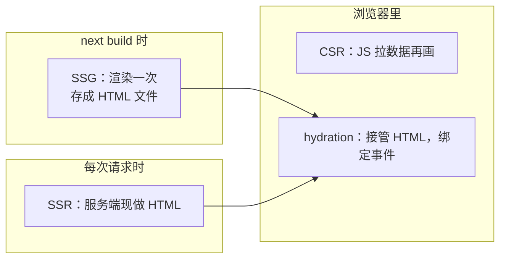
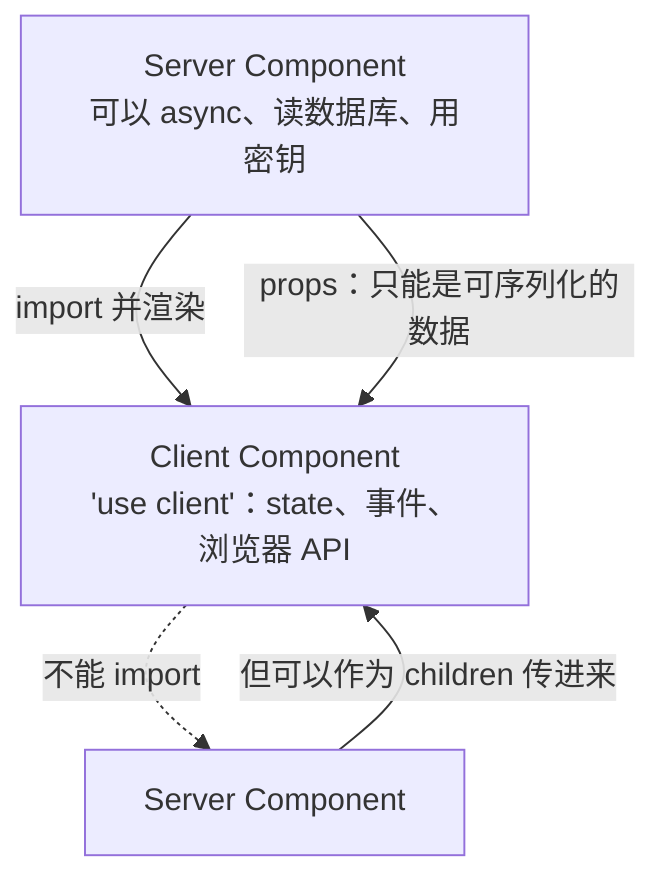
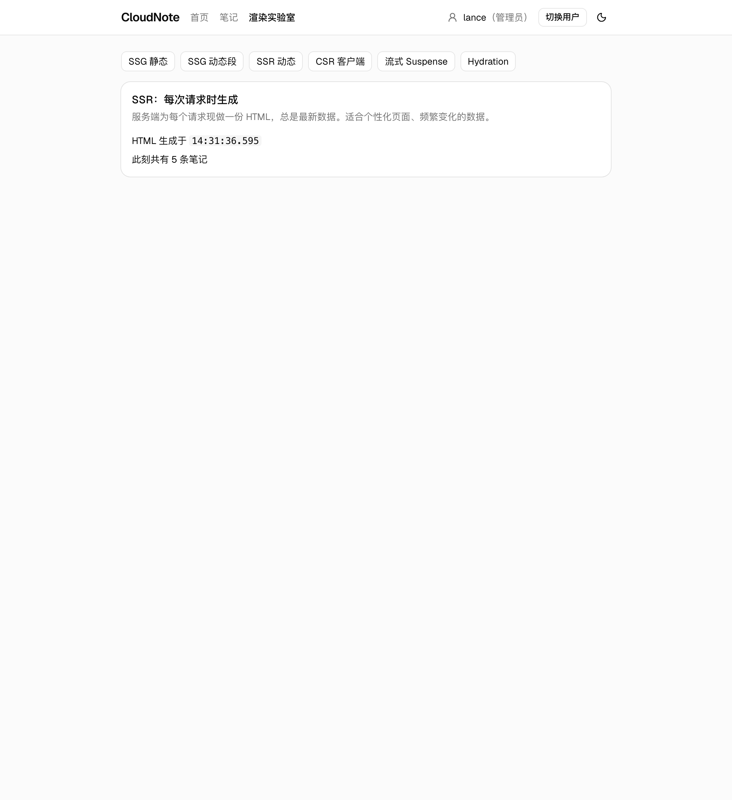
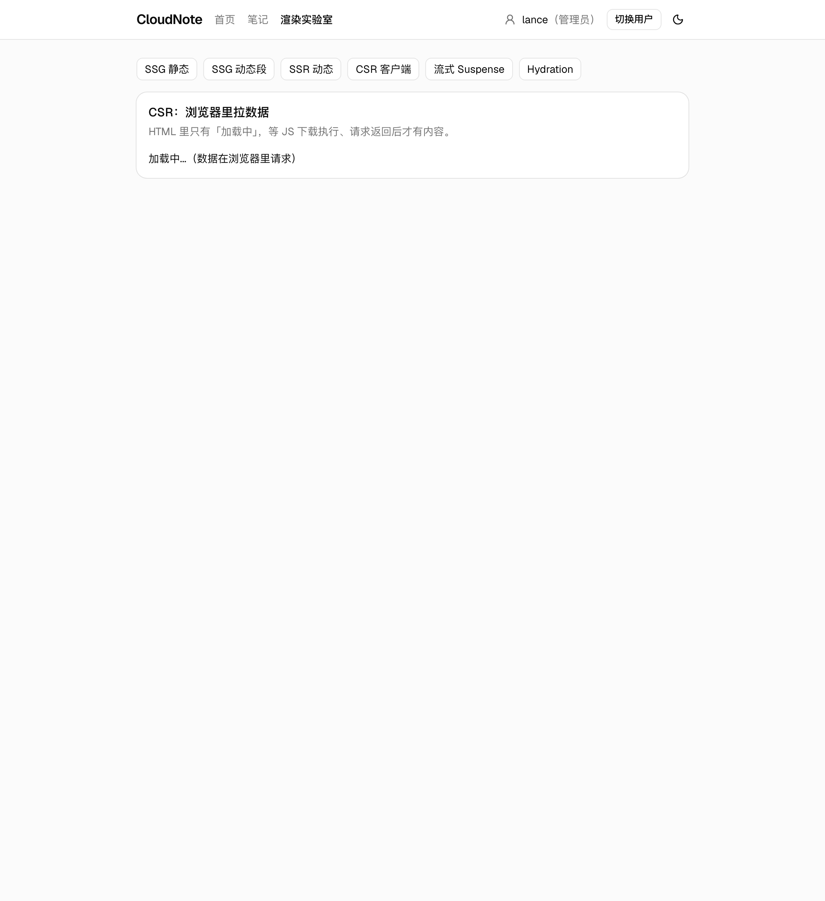
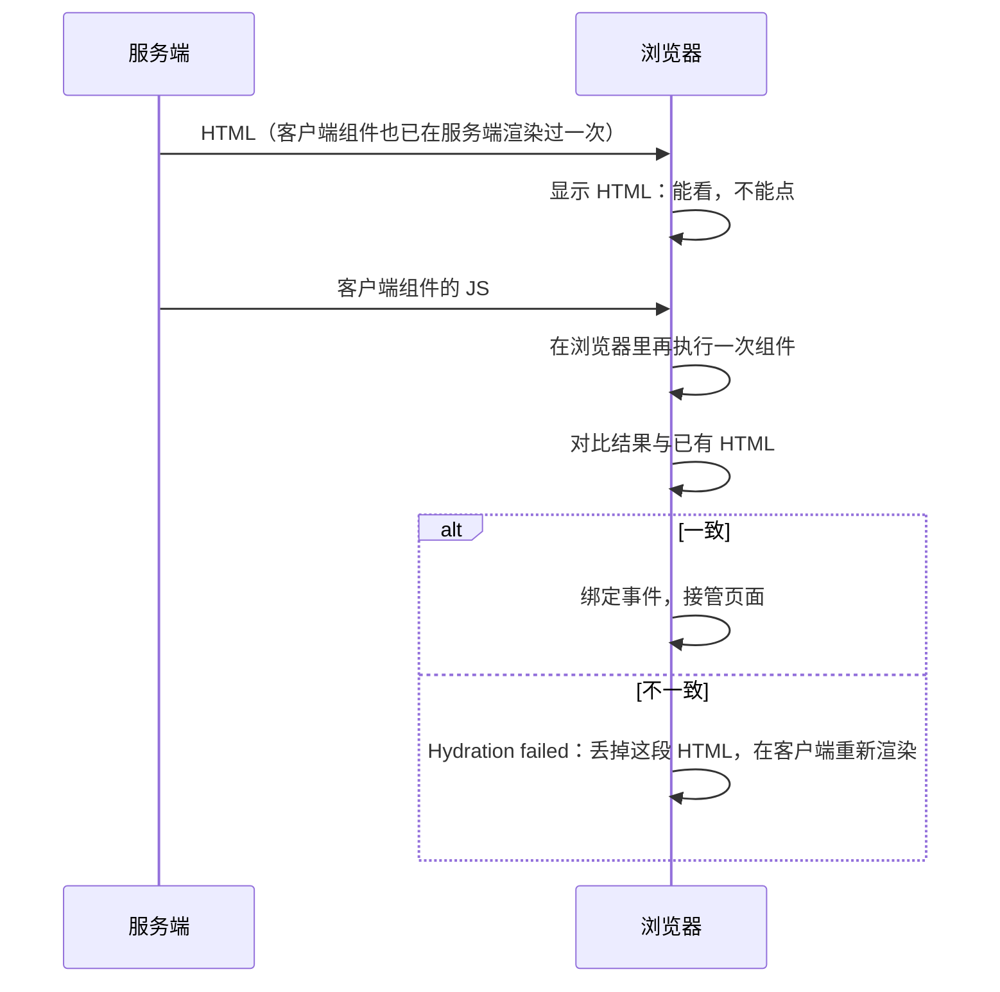
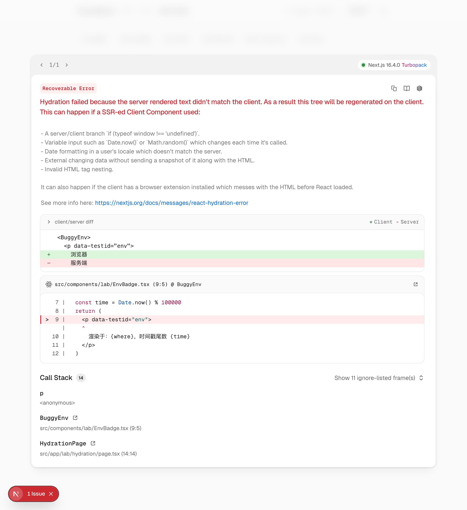
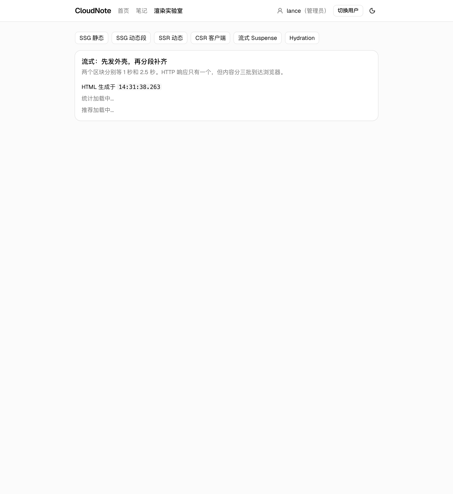
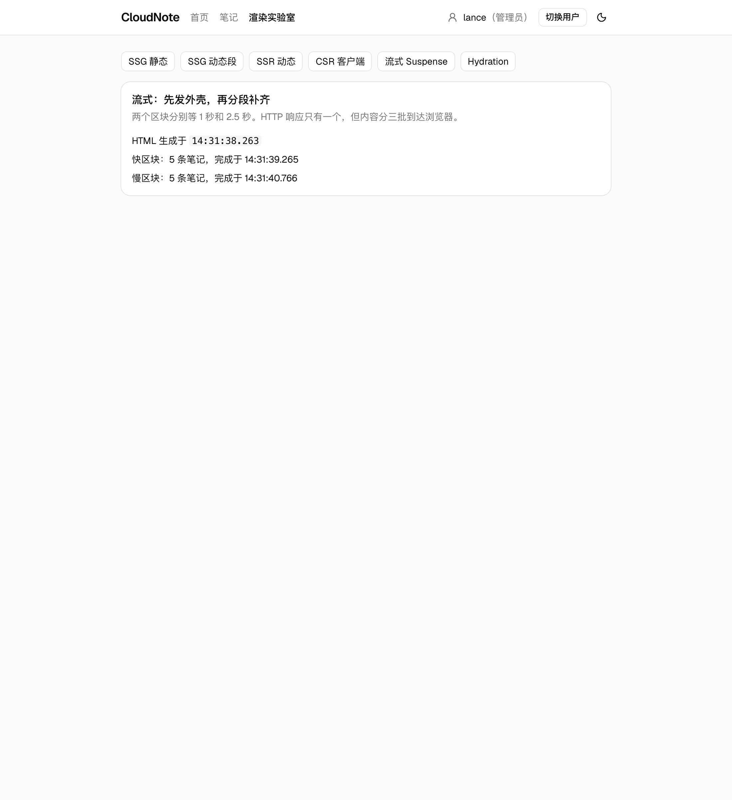
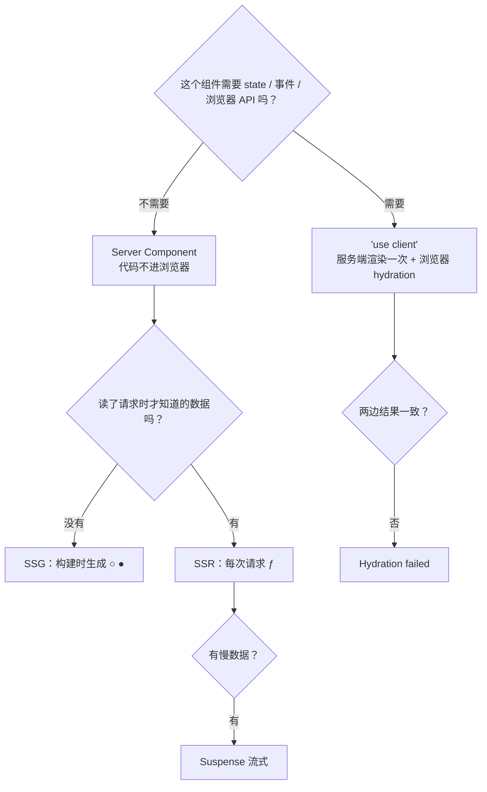

# 第 12 章　渲染模式：CSR / SSR / SSG / RSC 与 hydration

> **本章导读**
>
> - 建议用时：150 分钟（阅读 70 分钟 + 实战 80 分钟）
> - 前置知识：第 5 章（组件是函数、渲染）、第 9 章（useQuery）、第 11 章（App Router、`'use client'`、`○` 和 `ƒ`）
> - 读完你能回答：
>   1. CSR、SSR、SSG 的区别是什么？HTML 分别是**在哪里、什么时候**生成的？
>   2. Next.js 根据什么决定一个路由是 `○` 静态还是 `ƒ` 动态？
>   3. Server Component 的代码会不会发到浏览器？它和 `'use client'` 组件之间有哪些规矩？
>   4. hydration 是什么？`Hydration failed` 是怎么产生的，怎么修？
>   5. 流式渲染和 `<Suspense>` 是怎么让页面「分批到达」的？

---

## 【积木 12-1】一张表看懂四个缩写

第 11 章的构建输出里，有的路由是 `○`，有的是 `ƒ`，本章还会出现 `●`。它们回答的都是同一个问题：**用户看到的那份 HTML，是在哪里、什么时候生成的？**

| 模式 | 全称 | HTML 在哪生成 | 什么时候 | 构建输出符号 | 典型场景 |
|---|---|---|---|---|---|
| **CSR** | Client-Side Rendering | 浏览器 | 每次打开页面，JS 执行后 | — | 第 5～10 章的 Vite 应用；登录后的后台 |
| **SSR** | Server-Side Rendering | 服务端 | **每次请求** | `ƒ` | 个性化页面、实时数据 |
| **SSG** | Static Site Generation | 服务端（构建机器） | **`next build` 时一次** | `○` / `●` | 文档、博客、营销页 |
| **RSC** | React Server Components | 服务端 | 配合 SSR 或 SSG | — | 一种组件类型，不是独立模式 |



前三个是「HTML 什么时候生成」的选择；**RSC 是另一个维度**——它说的是「这个组件的代码在哪里运行」。一个 Server Component 可以在构建时运行（SSG），也可以在每次请求时运行（SSR）。

后端同学可以这样类比：

| 前端 | 后端 |
|---|---|
| SSG | 定时任务把报表渲染成静态文件放到 CDN / Nginx |
| SSR | 每个请求进 handler，查库、套模板、返回 HTML（Go 的 `html/template`） |
| CSR | 后端只给 JSON 接口，页面由浏览器自己拼 |

本章在主线项目里加了一个「渲染实验室」（`/lab/*`），同一份笔记数据，用五种方式渲染，每页都显示「这份 HTML 生成于几点几分」。

---

## 【积木 12-2】SSG：构建时生成，之后只读文件

```tsx
// src/app/lab/ssg/page.tsx
export default function SsgPage() {
  const notes = listNotes()
  return (
    <RenderInfo mode="SSG：构建时生成" renderedAt={formatTime(new Date())}>
      <p>构建时共有 {notes.length} 条笔记</p>
    </RenderInfo>
  )
}
```

这个页面没有读 URL、没有读 cookie、没有任何「请求到来才知道」的东西，所以 Next.js 在 `next build` 时就执行它，把结果存成 HTML 文件。实测：

| 请求 | 「HTML 生成于」 | 笔记数 |
|---|---|---|
| 第 1 次 | 14:24:36.119 | 5 |
| 1.2 秒后第 2 次 | **14:24:36.119** | 5 |
| 通过接口新增一条笔记后 | **14:24:36.119** | **5** |

时间戳是**构建那一刻**，之后无论刷新多少次都不变；新增的笔记也看不到——它渲染的是构建时的数据。这就是 SSG 的本质：**一次计算，无数次读取**。服务端只需要返回一个文件，可以直接放 CDN，速度最快、成本最低。

### 动态段也能静态生成

```tsx
// src/app/lab/ssg/[id]/page.tsx
export function generateStaticParams() {
  return [{ id: '1' }, { id: '2' }]
}
```

`generateStaticParams` 告诉 Next「构建时先把这些 id 生成好」。构建输出里它变成了 `●`：

```
├   /lab/ssg/[id]
│ ├ ● /lab/ssg/1
│ └ ● /lab/ssg/2
```

不在列表里的 `/lab/ssg/3` 怎么办？默认第一次访问时按需渲染，然后**缓存起来**。实测 `/lab/ssg/3` 两次请求的生成时间都是 14:25:51.048（首次访问的时刻），这就是 **ISR**（Incremental Static Regeneration，增量静态生成）的基础：静态页可以在部署后逐步补齐。

---

## 【积木 12-3】SSR：每个请求现做一份

```tsx
// src/app/lab/ssr/page.tsx
import { connection } from 'next/server'

export default async function SsrPage() {
  await connection()
  const notes = listNotes()
  return <RenderInfo mode="SSR：每次请求时生成" renderedAt={formatTime(new Date())}>…</RenderInfo>
}
```

| 请求 | 「HTML 生成于」 | 笔记数 |
|---|---|---|
| 第 1 次 | 14:25:46.284 | 5 |
| 1.2 秒后第 2 次 | **14:25:47.623** | 5 |
| 新增一条笔记后 | 14:25:53.294 | **6** |

每次都是新的时间、最新的数据。代价是每个请求都要占用服务端的计算。

### Next.js 怎么判断该用 SSG 还是 SSR

**默认先尝试静态生成**。构建时执行页面，只要碰到了「只有请求来了才知道」的东西，这个路由就标记为动态 `ƒ`：

| 使用了 | 为什么必须等请求 | CloudNote 里的例子 |
|---|---|---|
| `searchParams` | 查询串每个请求都不同 | `/notes?status=draft` |
| `params`（且不在 `generateStaticParams` 里） | 不知道会被访问哪些 id | `/notes/[id]` |
| `cookies()`、`headers()` | 每个用户不同 | 第 14 章的登录态 |
| `connection()` | 明确声明「等请求」 | `/lab/ssr`、`/lab/streaming` |

现在回头看第 11 章的构建输出就全明白了：首页 `/` 什么都没读，是 `○`；`/notes` 读了 `searchParams`，是 `ƒ`；`/notes/[id]` 用了 `params` 又没有 `generateStaticParams`，是 `ƒ`；`/lab/csr` 页面本身没读任何请求数据（数据是浏览器拉的），所以也是 `○`。

`connection()` 适合这种情况：页面没读 cookie、URL，但内容必须每次不同（比如用了 `new Date()`、`Math.random()`、或者同步读数据库）。不加它，`/lab/ssr` 会被当成静态页，时间永远停在构建时刻。

---

## 【积木 12-4】RSC：组件的代码留在服务端

第 11 章说过，App Router 里组件**默认是 Server Component**。这一块回答它最重要的特性：**Server Component 的代码不会发送到浏览器。**

实验方法：在 `/lab/ssg` 这个 Server Component 里写一行只有服务端才会执行的日志，构建后去产物里搜：

```tsx
console.log('[server-only-marker] 渲染 /lab/ssg')
```

| 搜索位置 | 含义 | 命中文件数 |
|---|---|---|
| `.next/server/` | 服务端运行的代码 | **2** |
| `.next/static/` | 发给浏览器的 JS | **0** |
| `.next/static/` 中搜 NoteForm 的校验文案「至少要修改一个字段」 | 客户端组件用到的 schema | **1** |

而且这行日志只在 `next build` 的输出里出现过一次（构建时渲染了这个 SSG 页），浏览器控制台里永远看不到它。

这意味着：

- **Server Component 里用的库不增加浏览器包体积**。在服务端用一个几百 KB 的 Markdown 渲染库，浏览器一个字节都不用下载。
- **Server Component 可以安全地使用密钥、直接查数据库**——代码根本不出服务器。第 11 章的 `lib/db.ts` 开头的 `import 'server-only'` 就是为了让「不小心被客户端导入」变成构建错误。
- **但它渲染出来的结果会发给浏览器**。不要在 Server Component 里把密码哈希渲染进 JSX——那就进了 HTML。

### 浏览器收到的是什么

Server Component 不是在服务端拼一段 HTML 字符串那么简单。它会产出一种叫 **RSC Payload** 的序列化格式，描述「这棵组件树长什么样，哪些地方是客户端组件、它们的 props 是什么」。首次访问时，Next 把它和 HTML 一起发给浏览器（HTML 里那些 `self.__next_f.push(...)` 脚本就是它）；之后用 `<Link>` 跳转时，只请求新页面的 RSC Payload，不再要完整 HTML——这就是第 11 章「切页不整页刷新」的底层机制。

### 包体积：省的是你自己那一部分

实测三个页面在浏览器里下载的 JS（`performance` 接口里脚本资源的 `encodedBodySize` 之和，即实际传输体积，包含 Next 和 React 运行时）：

| 页面 | 页面本身 | 下载的 JS |
|---|---|---|
| `/lab/ssg` | 纯 Server Component | 192 KB / 9 个脚本 |
| `/lab/csr` | 一个小客户端组件 | 192 KB / 9 个脚本 |
| `/notes` | 表单、列表、弹窗、TanStack Query | 213 KB / 10 个脚本 |

纯 Server Component 页面并不是 0 KB。原因是**根布局里的客户端组件**（`Providers` 里的 TanStack Query、`MainNav`、`UserBadge`）每个页面都要用，再加上 React 和 Next 的运行时，构成了约 192 KB 的基线。Server Component 省掉的是**它自己子树**的代码：`/notes` 比基线多出的约 21 KB 就是笔记页那些交互组件。

所以控制包体积的思路是：**让 `'use client'` 尽量往叶子节点推**，布局和页面骨架保持是 Server Component，只有真正需要交互的小部件才是客户端组件。

### 服务端和客户端之间的三条规矩



| 规矩 | 说明 | 违反时 |
|---|---|---|
| ① Server 可以 import Client，反过来不行 | 客户端组件的代码要发到浏览器，它 import 的东西也会被打包；服务端模块进不了浏览器 | `server-only` 报构建错误（第 11 章练习 8） |
| ② Server 传给 Client 的 props 必须**可序列化** | props 要经过 RSC Payload 跨网络传输：字符串、数字、数组、普通对象、Date 都行，**函数不行** | 见下方实测 |
| ③ 想在客户端组件里放服务端内容，用 `children` | 第 8 章的组合：Server 先渲染好，作为 `children` 交给 Client 摆放 | — |

规矩 ② 实测：在 Server Component 里给客户端组件传一个箭头函数 `onDone={() => console.log(1)}`，`next build` 直接失败：

```
Error occurred prerendering page "/lab/ssg".
Error: Event handlers cannot be passed to Client Component props.
  {onDone: function onDone}
           ^^^^^^^^^^^^^^^
If you need interactivity, consider converting part of this to a Client Component.
```

函数无法序列化——它可能闭包引用了服务端的变量，没办法搬到浏览器。（唯一的例外是第 13 章的 Server Actions：它传过去的不是函数本身，而是一个「调用服务端的引用」。）

规矩 ③ 的典型就是第 11 章的 `providers.tsx`：`Providers` 是客户端组件，但它的 `children`（各个页面）可以是 Server Component。

---

## 【积木 12-5】CSR：在 Next.js 里也能用，但要知道代价

```tsx
// src/app/lab/csr/page.tsx（Server Component，只是个壳）
export default function CsrPage() {
  return <RenderInfo mode="CSR：浏览器里拉数据"><CsrNoteCount /></RenderInfo>
}

// src/components/lab/CsrNoteCount.tsx
'use client'
export function CsrNoteCount() {
  const { notes, loading } = useNotes('all')
  return <p>{loading ? '加载中...（数据在浏览器里请求）' : `浏览器拉到 ${notes.length} 条笔记`}</p>
}
```

这就是第 5～10 章的工作方式：服务端只给一个壳，数据在浏览器里通过 `useQuery` 请求。用 curl（相当于不执行 JS 的客户端）请求两个页面，看 HTML 里有什么：

| 页面 | curl 拿到的 HTML 中 |
|---|---|
| `/lab/ssr` | 「此刻共有 5 条笔记」 |
| `/lab/csr` | 「加载中...（数据在浏览器里请求）」 |

在浏览器里**禁用 JavaScript** 后打开，差别一目了然：





| | SSR / SSG | CSR |
|---|---|---|
| 首屏有没有内容 | HTML 里就有 | 等 JS 下载、执行、请求返回 |
| 搜索引擎、链接预览（微信、Slack 卡片） | 能抓到内容 | 只能抓到「加载中」 |
| 弱网、低端手机 | 先看到内容，交互稍后可用 | 白屏时间长 |
| 服务端压力 | SSR 每请求计算一次 | 只提供接口 |

CSR 并没有错。登录之后的后台、编辑器这类「不需要被搜索、用户愿意等一下」的页面，CSR 简单直接，`/notes` 列表本身就是由 `useQuery` 在浏览器里拉数据的（第 13 章会讨论把它改成服务端先给数据）。问题在于**不加思考地全用 CSR**——第 1 章说过，AI 生成的 React 代码绝大多数都是 `useEffect + fetch`，放到 Next.js 里就白白丢掉了服务端渲染。

---

## 【积木 12-6】hydration：服务端画、浏览器接管

SSR 和 SSG 给浏览器的是一份**静态 HTML**：能看，但按钮点了没反应——事件处理函数还没绑上。接下来浏览器下载客户端组件的 JS，**在浏览器里把这些组件再执行一遍**，把结果和已有的 HTML 一一对上，然后挂上事件、接管后续更新。这个过程叫 **hydration**（注水：给干燥的 HTML 注入交互能力）。



关键在最后一步：**同一个组件在服务端和浏览器各执行一次，两次的结果必须一模一样。** 第 11 章 `UserBadge` 在渲染时读 `document` 会报错，就是因为服务端那次执行根本没有 `document`。

### 亲手制造一次 hydration 错误

```tsx
// src/components/lab/EnvBadge.tsx
'use client'
export function BuggyEnv() {
  const where = typeof window === 'undefined' ? '服务端' : '浏览器'
  const time = Date.now() % 100000
  return <p>渲染于：{where}，时间戳尾数 {time}</p>
}
```

这段代码在两个环境里的结果天然不同：服务端算出「服务端」，浏览器算出「浏览器」；`Date.now()` 两次执行也不可能相同。打开 `/lab/hydration?bug=1`，开发模式下 Next 弹出错误面板：



控制台里的完整信息（实测）：

```
Error: Hydration failed because the server rendered text didn't match the client.
As a result this tree will be regenerated on the client.
This can happen if a SSR-ed Client Component used:

- A server/client branch `if (typeof window !== 'undefined')`.
- Variable input such as `Date.now()` or `Math.random()` which changes each time it's called.
- Date formatting in a user's locale which doesn't match the server.
- External changing data without sending a snapshot of it along with the HTML.
- Invalid HTML tag nesting.

It can also happen if the client has a browser extension installed which messes with the HTML before React loaded.
```

面板里的 diff 还直接标出了不一致的地方：`+ 浏览器`（客户端）/ `- 服务端`（服务端）。这段错误信息本身就是一张很好的排查清单，值得逐条记住。

生产构建下，同样的页面控制台只有一行压缩过的错误：

```
Error: Minified React error #418; visit https://react.dev/errors/418?args[]=text&args[]= ...
```

用 curl 看服务端 HTML，确实是「渲染于：服务端，时间戳尾数 78821」；浏览器里最终显示的却是「渲染于：浏览器，时间戳尾数 81974」——React 放弃了服务端那份 HTML，在客户端整段重新渲染。用户可能看到内容闪一下，SSR 的好处在这一块也白费了。

### 一个高频误解：加个 typeof window 判断就能区分环境

这正是上面的错误写法。`typeof window` 判断会让同一个组件在两个环境里**渲染出不同的东西**，一定会导致 hydration 不一致。AI 生成的代码里非常常见，因为它在 Vite 这类纯 CSR 项目里完全没问题。

### 四种修法

| 场景 | 修法 |
|---|---|
| 内容确实依赖浏览器（窗口宽度、localStorage、是否在线） | `useSyncExternalStore` 给出「服务端快照」，hydration 时先用它，接管后再切换（本章 `FixedEnv`） |
| 只是想在挂载后显示 | `useEffect` 里 `setMounted(true)`，渲染时先显示占位，挂载后再显示真实内容 |
| 当前时间、随机数 | 在 **Server Component** 里算好，作为 props 传给客户端组件——两边拿到的是同一个值 |
| 日期格式化 | 显式指定时区和语言（第 11 章详情页的 `toLocaleString('zh-CN', { timeZone: 'Asia/Shanghai' })`），否则服务器在 UTC、用户在东八区，格式化结果不同 |

正确写法（`FixedEnv`）：

```tsx
const subscribe = () => () => {}
export function FixedEnv() {
  const where = useSyncExternalStore(
    subscribe,
    () => '浏览器', // 客户端快照
    () => '服务端', // 服务端快照：服务端渲染和 hydration 时都用它
  )
  return <p>当前显示：{where}</p>
}
```

打开 `/lab/hydration`（不带 `?bug=1`）：控制台没有任何错误，页面最终显示「当前显示：浏览器」。过程是：服务端渲染出「服务端」→ hydration 时 React 也用服务端快照算出「服务端」，与 HTML 一致，接管成功 → 接管完成后切到客户端快照，重新渲染成「浏览器」。

还有一个逃生舱 `suppressHydrationWarning`：加在元素上，React 就不再报告这个元素**文本内容**的不一致。只适合「时间戳这种确定会不同、也无所谓」的单个文本节点，不要用它来掩盖逻辑问题。

---

## 【积木 12-7】流式渲染：先给外壳，慢的稍后补上

SSR 有一个天然的短板：页面里只要有一个慢查询，整个 HTML 都得等它。流式渲染把一个响应拆成多批发送：

```tsx
// src/app/lab/streaming/page.tsx
export default async function StreamingPage() {
  await connection()
  return (
    <RenderInfo mode="流式：先发外壳，再分段补齐" renderedAt={formatTime(new Date())}>
      <Suspense fallback={<p>统计加载中...</p>}>
        <SlowSection label="快区块" delay={1000} />
      </Suspense>
      <Suspense fallback={<p>推荐加载中...</p>}>
        <SlowSection label="慢区块" delay={2500} />
      </Suspense>
    </RenderInfo>
  )
}
```

`SlowSection` 是一个 async Server Component，分别等 1 秒和 2.5 秒。用一个小脚本记录响应里每个数据块的到达时间（实测）：

```
+38ms    收到响应头 HTTP 200 transfer-encoding=chunked
+40ms    第 1 块 7406B 含: 页面外壳, fallback-1000, fallback-2500
+1034ms  第 4 块 185B  含: 快区块
+2536ms  第 6 块 185B  含: 慢区块
+2540ms  响应结束，共 8 块
```

**一个 HTTP 响应，三批内容**：40 毫秒时浏览器已经拿到了带两个「加载中」占位的完整外壳；1 秒时快区块到达，替换掉第一个占位；2.5 秒时慢区块到达。整个页面总耗时取决于最慢的那块，但**用户感知的首屏时间是 40 毫秒**，而不是 2.5 秒。





底层用的是 HTTP/1.1 的分块传输（`Transfer-Encoding: chunked`）：服务端先写一部分、flush，再写下一部分，连接一直开着直到全部写完。Go 里用 `http.Flusher` 做的事情是一样的。后到的区块是一小段 HTML 加一个脚本，脚本负责把它挪到对应占位的位置。

两个联系：

- **第 11 章的 `loading.tsx` 就是 `<Suspense>`**。Next 自动用 `loading.tsx` 作为 fallback，把 `page.tsx` 包进一个 Suspense 边界。本章是把同样的事情做得更细——一个页面里可以有多个独立的边界。
- **第 11 章 `/notes/999` 返回 200 的原因就在这里**。响应头在第 1 块之前就发出去了，等到页面里判断「笔记不存在」、调用 `notFound()` 时，状态码早已是 200，只能在后续块里补上 not-found 的界面和 noindex。

`<Suspense>` 的边界放在哪，是一个产品决策：**互不依赖的慢数据各自包一个边界**，谁先好谁先显示；**必须一起出现的内容放在同一个边界里**，避免页面跳来跳去。

---

## 【积木 12-8】新模型预告：Cache Components

以上讲的是 Next.js 默认的渲染模型：**以路由为单位**决定静态还是动态。读了一次 `searchParams`，整个页面就变成 `ƒ`。

Next.js 16 提供了一个需要手动开启的新模型 **Cache Components**（`next.config.ts` 里设置 `cacheComponents: true`，官方文档建议同时设置 `partialPrefetching`）。核心变化是：

| | 默认模型（本课程目前使用） | Cache Components |
|---|---|---|
| 静态 / 动态的粒度 | 整个路由 | 组件级 |
| 读了 `searchParams` 或 `cookies` | 整个页面变动态 | 只有这部分在请求时流式补上，其余部分进入「静态外壳」 |
| 想缓存一段数据 | 路由级配置（`revalidate` 等） | 在函数或组件开头写 `'use cache'` |
| 渲染方式 | SSG 或 SSR 二选一 | **PPR**（Partial Prerendering，部分预渲染）：静态外壳 + 流式动态洞 |

官方文档表示，这两项在下一个大版本会默认开启。它本质上是把本章的流式渲染推到极致：每个页面都有一份可以放 CDN 的静态外壳，动态部分用 `<Suspense>` 包起来按需补齐。第 13 章讲数据层时，我们会在 CloudNote 上开启它，并用 `'use cache'` 加失效来解决「详情页和 `generateMetadata` 查两次数据库」的问题。

---

## 【积木 12-9】怎么选，以及怎么审 AI 的代码

一张决策表：

| 问题 | 答案 → 选择 |
|---|---|
| 内容所有人都一样、不常变？ | 是 → **SSG**（文档、博客、首页、帮助中心） |
| 内容按用户或请求不同、或必须实时？ | 是 → **SSR**（个人主页、订单详情） |
| 有一部分很慢？ | 用 `<Suspense>` **流式**拆开 |
| 需要高频交互、不需要被搜索？ | 局部用 **CSR**（客户端组件 + useQuery） |
| 这个组件需要 state、事件、浏览器 API 吗？ | 需要 → `'use client'`；不需要 → 保持 Server Component |

审查 AI 生成的 Next.js 代码时，下面这几条最常出问题：

| 检查项 | 常见错误 |
|---|---|
| `'use client'` 是否贴得过高 | 在 `page.tsx` 甚至 `layout.tsx` 顶部写 `'use client'`，整棵树都变成客户端组件，RSC 的好处全没了 |
| 能在服务端拿的数据是否在浏览器里拉 | Server Component 能直接 `await` 的数据，写成了 `useEffect + fetch` |
| 渲染时是否区分环境 | `typeof window`、`Date.now()`、`Math.random()`、没指定时区的 `toLocaleString` |
| 是否给客户端组件传了函数 props | 构建报 `Event handlers cannot be passed to Client Component props` |
| 客户端组件是否 import 了服务端模块 | 数据库客户端、读环境变量里的密钥 |
| 慢数据有没有 Suspense 边界 | 一个慢查询拖住整页 |
| 静态页是否意外变动态 | 在根布局里读 `cookies()`，所有页面都变成 `ƒ` |

最后一条很隐蔽：**在布局里读请求数据，会让它下面的每个页面都变成动态**。每次改完代码看一眼 `next build` 输出的 `○` / `●` / `ƒ`，是最便宜的回归检查。

---

## 【积木 12-10】实战：渲染实验室

代码在主线项目 [`code/cloudnote/`](../code/cloudnote/)，本章新增：

```
src/app/lab/
├── layout.tsx               # 实验室导航
├── ssg/page.tsx             # ○ 构建时生成
├── ssg/[id]/page.tsx        # ● generateStaticParams + 按需生成
├── ssr/page.tsx             # ƒ connection()
├── csr/page.tsx             # ○ 壳 + 浏览器拉数据
├── streaming/page.tsx       # ƒ 两个 Suspense 边界
└── hydration/page.tsx       # ƒ ?bug=1 制造 hydration 错误
src/components/lab/
├── RenderInfo.tsx           # 公用信息卡（Server Component）
├── CsrNoteCount.tsx         # 'use client' + useNotes
└── EnvBadge.tsx             # BuggyEnv / FixedEnv
```

```bash
cd code/cloudnote
pnpm build      # 看构建输出里的 ○ ● ƒ
pnpm start      # 打开 http://localhost:3000/lab/ssg
pnpm dev        # 开发模式，看 hydration 错误面板
```

本章构建输出：

```
Route (app)
┌ ○ /
├ ○ /_not-found
├ ƒ /api/notes
├ ƒ /api/notes/[id]
├ ○ /lab/csr
├ ƒ /lab/hydration
├ ○ /lab/ssg
├   /lab/ssg/[id]
│ ├ ● /lab/ssg/1
│ └ ● /lab/ssg/2
├ ƒ /lab/ssr
├ ƒ /lab/streaming
├ ƒ /notes
└ ƒ /notes/[id]

○  (Static)   prerendered as static content
●  (SSG)      prerendered as static HTML (uses generateStaticParams)
ƒ  (Dynamic)  server-rendered on demand
```

本章全部实测结果汇总：

| 实验 | 结果 |
|---|---|
| `/lab/ssg` 请求两次 + 新增笔记后再请求 | 时间都是构建时刻 14:24:36.119，笔记数一直是 5 |
| `/lab/ssr` 同样操作 | 每次时间不同，新增后变成 6 条 |
| `/lab/ssg/3`（不在 generateStaticParams 里）请求两次 | 两次时间相同：首次按需生成后被缓存 |
| curl `/lab/csr` | HTML 里只有「加载中」 |
| 产物中搜 Server Component 日志 | `.next/server` 2 个文件，`.next/static` 0 个 |
| 各页 JS | 纯 Server 页 192 KB，`/notes` 213 KB |
| Server 给 Client 传函数 | 构建失败：`Event handlers cannot be passed to Client Component props` |
| `/lab/hydration?bug=1` | 开发：`Hydration failed ...`；生产：`Minified React error #418` |
| `/lab/hydration` | 无错误，最终显示「浏览器」 |
| `/lab/streaming` 分块计时 | 40ms 外壳 → 1034ms 快区块 → 2536ms 慢区块 |

> 写本章时顺便抓到了一个自己的 bug：给顶栏加「渲染实验室」链接时脚本执行了两次，`LINKS` 里出现两条相同的 `/lab/ssg`，开发模式控制台报 `Encountered two children with the same key`（第 5 章积木 5-7 的 key 警告）。生产构建不会报这个警告，**开发模式的控制台值得每次扫一眼**。

### 动手练习

| 练习 | 操作 | 预期结果 |
|---|---|---|
| 1 | 删掉 `/lab/ssr` 里的 `await connection()`，重新 `pnpm build` | 它变成 `○`，生成时间停在构建时刻 |
| 2 | 在 `src/app/layout.tsx` 里调用 `await cookies()`（`import { cookies } from 'next/headers'`） | 首页、`/lab/ssg`、`/lab/csr` 全部变成 `ƒ`（积木 12-9 最后一条） |
| 3 | 把 `generateStaticParams` 改成返回全部 5 个 id | 构建输出出现 5 个 `●` |
| 4 | 在 Server Component 里给客户端组件传一个函数 prop | `Event handlers cannot be passed to Client Component props.` |
| 5 | `pnpm dev` 打开 `/lab/hydration?bug=1`，阅读错误面板的 diff | 能指出是哪一行、哪两个值不一致 |
| 6 | 用积木 12-6 表格里的「Server Component 算好再传」修法，让当前时间在两边一致 | 在 page 里算 `Date.now()` 传给客户端组件，错误消失 |
| 7 | 把 `/lab/streaming` 的两个 `<Suspense>` 合并成一个 | 快区块也要等 2.5 秒才出现 |
| 8 | 浏览器 DevTools → Settings → Debugger → Disable JavaScript，依次打开 `/notes`、`/notes/2`、`/lab/csr` | `/notes/2` 内容完整，`/notes` 和 `/lab/csr` 的列表停在「加载中」。思考：列表页值不值得改成服务端先给数据（第 13 章） |
| 9 | （AI）让 AI 写一个「显示用户本地时间的时钟」组件，用积木 12-9 的清单审查 | 大概率出现 `new Date()` 直接渲染导致 hydration 错误 |

---

## 【本章小结】

三句话：

1. 四个缩写回答的是「HTML 在哪、何时生成」：**SSG** 构建时一次（`○` / `●`），**SSR** 每次请求（`ƒ`），**CSR** 在浏览器里；Next 默认先尝试静态，碰到 `searchParams`、`params`、`cookies`、`connection()` 等请求时数据才变动态。**RSC** 是另一个维度——组件代码留在服务端、不进浏览器包，只能给客户端组件传可序列化的 props。
2. **hydration** 是浏览器把客户端组件再执行一遍并接管服务端 HTML，两次结果必须一致；`typeof window`、`Date.now()`、无时区的日期格式化是三大元凶，用 `useSyncExternalStore`、挂载后再显示、或在服务端算好传下去来修。
3. **流式渲染**用 `<Suspense>` 把一个响应拆成多批：外壳先到，慢的部分后补，首屏时间由最快的部分决定；`loading.tsx` 就是一个 Suspense 边界，流式开始后状态码无法再改。Cache Components 把这一思路推到组件级，第 13 章开启。



**自测题：**

1. CSR、SSR、SSG 的 HTML 分别在哪里、什么时候生成？RSC 为什么说是「另一个维度」？（积木 12-1）
2. `/lab/ssg` 刷新多次、新增笔记后，显示的时间和条数为什么都不变？（积木 12-2）
3. `generateStaticParams` 没列出的 id 被访问时会怎样？（积木 12-2）
4. 列举三种会让路由变成 `ƒ` 的写法。首页为什么是 `○`？（积木 12-3）
5. 怎么证明 Server Component 的代码没有发到浏览器？纯 Server Component 页面为什么仍有 192 KB 的 JS？（积木 12-4）
6. Server 给 Client 传函数为什么会报错？想在客户端组件里放服务端内容该怎么做？（积木 12-4）
7. 禁用 JavaScript 后，SSR 页面和 CSR 页面分别显示什么？（积木 12-5）
8. hydration 是什么？为什么 `typeof window === 'undefined' ? A : B` 会导致错误？（积木 12-6）
9. 说出两种修复 hydration 不一致的方法。（积木 12-6）
10. 流式渲染时，用户感知的首屏时间由什么决定？它和 `/notes/999` 返回 200 有什么关系？（积木 12-7）

---

## 【下一章预告】

第 13 章《数据层：Server Actions、Route Handlers 与 PostgreSQL》。CloudNote 的数据还躺在内存数组里，重启就没了；列表页的数据还在浏览器里拉，禁用 JS 就是一片「加载中」。下一章：用 Docker 起一个 PostgreSQL，用 Drizzle ORM 写类型安全的查询（你会发现它和 Go 的 sqlc 思路很像）；用 **Server Actions** 替代一部分 Route Handler——表单直接调用服务端函数，不用写 fetch、不用写接口；开启 Cache Components，用 `'use cache'` 和失效解决详情页查两次库的问题；最后讨论列表页该不该改成服务端先给数据、再交给 TanStack Query 接管。

*学完本章，回到对话里说一句「继续」，我就开讲第 13 章。*
